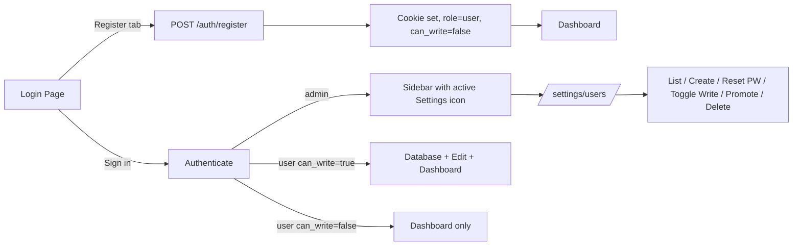

## Locked-in decisions (recap)

- **Auth model**: Closed. `AuthService.authenticate` no longer auto-creates users. Login requires an existing username + valid password.
- **Admin bootstrap**: On startup, if no admin row exists, seed one from `settings.admin_secret` (bcrypt-hashing it if it looks like plaintext). After that, the DB row is the only source of truth — `admin_secret` is never consulted at login time again.
- **Self-registration**: New `POST /auth/register` plus a Register tab on the login page. Auto-approved as `role="user", can_write=FALSE`, immediately logged in.
- **Per-user permissions**: New `can_write BOOLEAN` column on `users`. Two independent controls in the table — a `Role` dropdown (User/Admin) and a `Write access` toggle. Admin rows have the write toggle forced ON and disabled.
- **Write scope**: write users get everything functional EXCEPT (a) the entire `/settings/users` surface, and (b) the per-version Status field gate on `/database/edit`. Both stay admin-only.
- **Password column**: masked dots + a per-row "Reset password" dialog. Admin's own row also exposes "Change my password" (asks for current password).
- **Notification dot**: small dot on the admin's Settings sidebar icon when new self-registered users have appeared since admin's `last_settings_visit_at`. Dot clears when admin opens the page.
- **Sidebar placement**: new Settings icon is the LAST item inside `<SidebarContent>`, sitting visually just above the existing `<SidebarFooter>` `border-t` separator (i.e. above the Info/Changelog icon). Visible to everyone but disabled + grayed for non-admins, with tooltip "Admin only".
- **Read-only sidebar gating**: for read-only users, `Database` and `Edit Filters` nav items become disabled (50% opacity, tooltip "Read-only access — contact admin"); routes additionally `router.replace('/dashboard')` if visited directly.

## High-level flow



## Schema migration (`server/storage/database.py`, `_init_schema`)

Extend the existing CREATE TABLE block (lines 232-241) and add an idempotent ALTER for already-deployed DBs:

```python
ALTER TABLE users ADD COLUMN IF NOT EXISTS can_write BOOLEAN DEFAULT FALSE
ALTER TABLE users ADD COLUMN IF NOT EXISTS last_settings_visit_at TIMESTAMP
UPDATE users SET can_write = TRUE WHERE role = 'admin' AND can_write IS NULL
```

Update `docs/database-schema.txt` to match.

## Backend changes

### New `UserService` (SOLID — split user lifecycle out of AuthService)

New file [server/services/user.py](server/services/user.py):

- `bootstrap_admin()` — called on startup. If no admin row, hashes `settings.admin_secret` (or stores it as-is if already bcrypt) and inserts admin with `can_write=TRUE`.
- `list_users()` / `get_user(id)` / `delete_user(id)` (admin can never delete themselves).
- `create_user(username, password, role, can_write)` — used by both admin-create and self-register paths.
- `update_user(id, role?, can_write?)` — when role flips to admin, force `can_write=TRUE`.
- `set_password(id, new_password)` and `change_own_password(id, old_password, new_password)`.
- `get_pending_count(admin_id)` — `SELECT COUNT(*) FROM users WHERE created_at > admin.last_settings_visit_at AND id != admin.id`.
- `mark_settings_visited(admin_id)` — sets `last_settings_visit_at = CURRENT_TIMESTAMP`.

`AuthService.authenticate` in [server/services/auth.py](server/services/auth.py) shrinks to: look up by username, verify bcrypt password against `users.password_hash`, return user or raise `AuthenticationError`. The `_authenticate_admin` plus auto-create branches are removed; both are now handled by `bootstrap_admin()` once at startup.

### Models (`server/models/auth.py`, new `server/models/user.py`)

- `LoginRequest`: `password` becomes required (`min_length=8`).
- `RegisterRequest` (username + password, same validators as login).
- `ChangeMyPasswordRequest` (current_password, new_password).
- `CurrentUserResponse` adds `can_write: bool`.
- `UserListItem`, `CreateUserRequest`, `UpdateUserRequest`, `ResetPasswordRequest` in a new `server/models/user.py`.

### Routers

- [server/routers/auth.py](server/routers/auth.py): add `POST /auth/register` (public, strict rate limit) and `POST /auth/change-password` (authenticated).
- New [server/routers/admin_users.py](server/routers/admin_users.py): `GET/POST /admin/users`, `PATCH/DELETE /admin/users/{id}`, `POST /admin/users/{id}/reset-password`, `GET /admin/users/pending-count`, `POST /admin/users/mark-visited`. All gated by `require_admin`.
- [server/main.py](server/main.py): include the new router; call `UserService(...).bootstrap_admin()` from the lifespan startup hook.

### New permission dependency (`server/dependencies.py`)

```python
async def require_write_or_admin(user: AuthenticatedUserDep) -> AuthenticatedUser:
    if user["role"] == "admin" or user.get("can_write"):
        return user
    raise HTTPException(status_code=403, detail="Write access required")
```

`AuthenticatedUser` TypedDict (lines 115-119) gains `can_write: bool`. Apply `require_write_or_admin` to the upload, custom-field, and dataset-mutation endpoints in `server/routers/upload.py` and `server/routers/dashboard.py` that are currently `require_admin`. The Status-field write path stays `require_admin` (it's the per-version status update — keep current admin gate intact).

### Rate limiting

[server/middleware/rate_limiter.py](server/middleware/rate_limiter.py): add `register` category (stricter than `login`, e.g. 3 / 15 min / IP) and apply on `POST /auth/register`.

## Frontend changes

### Types & auth store

- [client/src/lib/api/auth.ts](client/src/lib/api/auth.ts): `CurrentUser` gains `can_write: boolean`. Add `register(payload)` and `changePassword(payload)` to `authApi`.
- [client/src/stores/auth-store.ts](client/src/stores/auth-store.ts): add `register` action; expose derived selectors `isAdmin` and `canWrite` (computed: `role === 'admin' || can_write === true`).
- New [client/src/lib/api/users.ts](client/src/lib/api/users.ts) — `usersApi` with `list`, `create`, `update`, `remove`, `resetPassword`, `pendingCount`, `markVisited`. Re-export from `client/src/lib/api/index.ts`.
- New [client/src/types/user.ts](client/src/types/user.ts) for `User`, `CreateUserPayload`, etc.

### Sidebar

- [client/src/types/layout.ts](client/src/types/layout.ts): extend `NavigationItem` with `requirePermission?: 'write' | 'admin'`.
- [client/src/config/sidebar-config.ts](client/src/config/sidebar-config.ts): tag `Database` and `Edit Filters` entries with `requirePermission: 'write'`.
- [client/src/components/layout/NavMain.tsx](client/src/components/layout/NavMain.tsx): when an item's `requirePermission` is unmet, render the `SidebarMenuButton` with `disabled` (uses existing `disabled:opacity-50` styles in [client/src/components/ui/sidebar.tsx](client/src/components/ui/sidebar.tsx) line 420), swap tooltip to "Read-only access — contact admin", and replace `<Link>` with `<button type="button">` so it's not navigable.
- [client/src/components/layout/AppSidebar.tsx](client/src/components/layout/AppSidebar.tsx): add a new `<SidebarMenuItem>` at the END of `<SidebarContent>` (above the existing footer separator) with the `Settings` Lucide icon and tooltip "Admin settings" / "Admin only" depending on role. For admin, overlay a small absolute-positioned dot (`bg-destructive` 8px) when `pendingCount > 0`; clicking the icon navigates to `/settings/users` AND fires `usersApi.markVisited()` which triggers a `pendingCount` refetch.

### Login page

[client/src/app/login/page.tsx](client/src/app/login/page.tsx): wrap the existing form in shadcn `<Tabs>` with `Sign in` and `Register` tabs. Register form has `username`, `password`, `confirm password`. On success it calls `authStore.register(...)` which sets cookie and redirects to `/dashboard`.

### Settings page

New [client/src/app/settings/users/page.tsx](client/src/app/settings/users/page.tsx):

- Layout: `section.mx-auto.w-full.max-w-5xl.px-6.py-8` (matches changelog shell). Page guard redirects non-admins to `/dashboard`.
- Top: small `<Card>` "Change my password" with current/new fields (admin only, but cheap to enable for all logged-in users via the same `/auth/change-password` endpoint — see open question below).
- "Create user" button (top-right) → opens dialog with username + password + role + write toggle.
- shadcn `<Table>` columns: **Username** | **Password** (`••••••••` + "Reset" button → dialog with single new-password field) | **Role** (`<Select>` User/Admin) | **Write access** (`<Switch>`, forced ON & disabled when role = Admin) | **Actions** (`<DropdownMenu>` with Delete — confirmation via existing `<AlertDialog>`).
- Admin's own row hides Delete and disables Role/Write (can't demote/lock yourself out). Self-registered rows whose `created_at > last_settings_visit_at` get a subtle muted "New" badge until next page load.
- Calls `usersApi.markVisited()` on mount.
- Styling stays monochrome via existing tokens (`bg-card`, `border-border`, `text-muted-foreground`, `bg-muted/50` for table header).

### Route guards

- [client/src/app/database/page.tsx](client/src/app/database/page.tsx) and [client/src/app/database/edit/page.tsx](client/src/app/database/edit/page.tsx): existing unauthenticated redirect (lines 82-90 and 220-224) gains a sibling `if (!isAdmin && !canWrite) router.replace('/dashboard')`.
- The Status field gate inside `/database/edit` (lines 1031-1057) is unchanged — already keyed on `isAdmin`.

### shadcn primitives to add (via `npx shadcn@latest add`)

Currently missing from [client/src/components/ui/](client/src/components/ui/): `dialog`, `label`, `badge`, `switch`, `tabs` (verify — `tabs` exists already per audit; confirm before adding). `form` is optional — plain controlled inputs are sufficient at this scope.

## Open question worth flagging (not blocking)

You said admin can change *their own* password. The `/auth/change-password` endpoint is by nature available to any authenticated user. I will keep it that way (lets self-registered users change their own password from a small affordance later) but only wire the UI for admin in the Settings page in this round. Push back if you want it server-locked to admin only.

## Docs updates (mandatory per AGENTS.md)

- [docs/master-build-plan.md](docs/master-build-plan.md): add new task IDs (P12-01 … P12-08) for each todo below, mark IN PROGRESS as work starts, DONE on completion.
- [docs/decisions/log.md](docs/decisions/log.md): append entries for (1) closed-registration shift, (2) admin DB-only password after bootstrap, (3) `can_write` column + new permission tier.
- [docs/database-schema.txt](docs/database-schema.txt): document `can_write` and `last_settings_visit_at`.
- New [docs/tasks/P12-01.md](docs/tasks/P12-01.md) … per-task notes for the non-trivial pieces.

## Test coverage

- Server: extend `tests/server/services/` and `tests/server/routers/` — closed-login rejects unknown user, register creates read-only user, admin bootstrap is idempotent, `require_write_or_admin` allows admin and write users only, password reset by admin works without knowing old password, `change-password` requires correct current password.
- Client: smoke-typecheck only (no e2e in scope unless you want it).