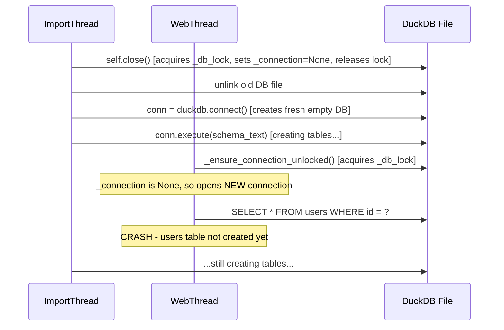

# Fix import concurrency: "Table users does not exist"

## Root cause

The race in `[import_from_parquet](Dashboard/server/storage/database.py)` (line ~1572):




`self.close()` acquires and releases `_db_lock`, setting `self._connection = None`. But the rest of the import (delete file, create DB, execute schema DDL, COPY data) runs **without holding the lock**. So a concurrent request sees `_connection is None`, reconnects, and hits a half-created database.

## Fix

Wrap the entire critical section of `import_from_parquet` -- from `self.close()` through `self._init_schema()` and `self.update_schema_metadata()` -- under `self._db_lock`.

Since `_db_lock` is an `RLock`, the same thread can re-acquire it inside `close()`, `_init_schema()`, and `write_connection()` without deadlocking.

This blocks all concurrent reads/writes during import, which is correct: the database is being fully replaced, so any concurrent query would return garbage anyway.

### In `[Dashboard/server/storage/database.py](Dashboard/server/storage/database.py)`, `import_from_parquet` (~line 1590):

Before:

```python
self.close()

backup_path = self.db_path.with_suffix(".db.bak")
# ...rest of import runs without lock...

self._connection = None
self._init_schema()
```

After:

```python
with self._db_lock:
    self.close()

    backup_path = self.db_path.with_suffix(".db.bak")
    # ...entire import under lock...

    self._connection = None
    self._init_schema()
    self.update_schema_metadata()
```

The `event_count` query at the end can stay outside the lock since by that point the DB is fully ready and `_init_schema` has reopened the connection.