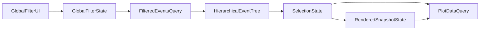

# Global Filters Refactor Options

## Current State (What Is Causing Complexity)

- Global filters in `[/data/home/tkodippili/Desktop/localTest_Analysis_DashboardV3/Dashboard/client/src/components/dashboard/side-panel/GlobalFilters.tsx](/data/home/tkodippili/Desktop/localTest_Analysis_DashboardV3/Dashboard/client/src/components/dashboard/side-panel/GlobalFilters.tsx)` currently mutate `selected_event_ids` (selection state) instead of owning `global_filters` (filter criteria state).
- Session/filter abstractions in `[/data/home/tkodippili/Desktop/localTest_Analysis_DashboardV3/Dashboard/client/src/hooks/use-filter-state.ts](/data/home/tkodippili/Desktop/localTest_Analysis_DashboardV3/Dashboard/client/src/hooks/use-filter-state.ts)` already support `setGlobalFilters`, but this path is not the primary one used by the global filter UI.
- Multiple hooks already support API-driven global filtering (`useEvents`, `useProgramIds`, `useVersions`), but the UI’s local event-matching logic duplicates and bypasses that architecture.
- Result: performance overhead from repeated scans + UX confusion because filter toggles behave like bulk selection toggles.

## Option A: Incremental Optimization (Low Risk, Keep Current Behavior)

### What Changes

- Keep current semantics (global filters continue to add/remove selected events).
- Optimize the hot paths in `GlobalFilters`:
  - Build precomputed inverted index maps once per dataset (field+value -> event IDs for baseline/new_data).
  - Replace repeated `getMatchingEvents()` scans with O(1) map lookups.
  - Use `Set` operations for add/remove instead of repeated `includes`/array filters.
  - Memoize counts from index instead of recomputing per render.
- Keep partition-state derivation but centralize logic in reusable utility from `[/data/home/tkodippili/Desktop/localTest_Analysis_DashboardV3/Dashboard/client/src/lib/utils/partition-sync.ts](/data/home/tkodippili/Desktop/localTest_Analysis_DashboardV3/Dashboard/client/src/lib/utils/partition-sync.ts)`.

### Pros

- Fastest to deliver.
- Minimal behavior change and lowest regression risk.
- Immediate performance gains in side-panel interactions.

### Cons

- Architectural gap remains (filters still coupled to selection).
- UI confusion persists (checked filter values still derived from selected events).
- Keeps duplicated logic and limits long-term maintainability.

## Option B: Hybrid Refactor (Medium Risk, Transitional)

### What Changes

- Introduce true `global_filters` ownership in `GlobalFilters` UI while temporarily syncing selection for backward compatibility.
- Add a compatibility layer/hook (`useGlobalFilterController`) that:
  - updates `global_filters` as source of truth,
  - derives filtered event IDs for existing rendering flows,
  - optionally mirrors into `selected_event_ids` during transition.
- Start shifting side panel copy/controls to distinguish “Filter” vs “Selection”.
- Add explicit “Apply filters to selection” action to reduce accidental bulk selection updates.

### Pros

- Reduces confusion while avoiding a big-bang rewrite.
- Lets team migrate dependent components gradually.
- Creates clearer boundaries and improves testability.

### Cons

- Temporary complexity (dual-path logic during migration).
- Requires careful deprecation plan to avoid drift.
- Some performance wins delayed until final cleanup.

## Option C: Full Architectural Refactor (Recommended for Your Goal)

### What Changes

- Make `global_filters` the only source of truth for filtering semantics.
- Keep global filters optional: when `global_filters` is empty, dataset remains unfiltered and users can manually select via Historical/New Program trees.
- Make `selected_event_ids` selection-only (user picks events from currently filtered tree).
- Enforce `prune-immediately`: when filter criteria changes, remove selected events that no longer match.
- Remove client-side event matching loops in `GlobalFilters`; component updates only criteria state.
- Use API-driven filtering everywhere:
  - `useEvents` consumes partition constraints + `global_filters`.
  - `useProgramIds`/`useVersions` already support global filters and become primary for list narrowing.
- Introduce dedicated domain hooks/services:
  - `useGlobalFilterState` (criteria state + operations).
  - `useFilteredEventCatalog` (query + normalization for UI).
  - `useSelectionState` (selection operations independent of filtering).
- Decompose `GlobalFilters.tsx` into focused units:
  - `GlobalFilterPanel`, `FilterGroupAccordion`, `FilterOptionRow`, `FilterSummaryBar`.
- Remove dead/legacy coupling logic and update docs to codify semantics.

### Pros

- Resolves architectural gap cleanly.
- Preserves user flexibility (manual selection still works fully when filters are unused).
- Strong SOLID alignment:
  - SRP: filter criteria, selection, rendering separated.
  - OCP: easier to add new filter fields/ops.
  - DIP: UI depends on hooks/interfaces, not matching internals.
- Leaner mental model and lower long-term maintenance cost.
- Most robust path for performance + UX + scalability.

### Cons

- Highest implementation effort.
- Requires migration/testing across side panel, event queries, and render workflow.
- Needs disciplined rollout to prevent behavior regressions.
- `prune-immediately` can surprise users unless clearly explained in UI copy.

## UI/UX Improvement Options

### UX Option 1: Improve Current UX Without Semantic Change

- Relabel section to “Bulk Select by Attributes”.
- Replace ambiguous checkboxes with explicit add/remove chips or buttons.
- Separate “Clear filters” and “Clear selection” actions (today they are conflated).
- Keep all accordions collapsed by default except last-used section.

Pros:

- Quick clarity improvement.
- Minimal engineering risk.

Cons:

- Still conceptually mixed filtering/selection model.

### UX Option 2: Proper Filter UX (Recommended with Option C)

- Keep global filters as criteria controls only.
- Add helper copy: “No filters selected = all events shown; selections outside active filters are removed.”
- Show active filter chips summary at top (`Field: Value`), with per-chip remove and clear-all criteria.
- Show contextual counts:
  - per option count based on current filtered subset,
  - result count summary (“N matching events”).
- Add search box inside each large filter group.
- Add tri-state/group indicators only where semantics are clear.

Pros:

- Predictable, standard filtering behavior.
- Better discoverability and reduced accidental actions.

Cons:

- Requires data-flow changes and additional UI state.

## Recommended Path (Large Refactor, Clean/SOLID)

### Phase 1: Domain Separation Foundations

- Introduce explicit interfaces/hooks for:
  - filter criteria state,
  - filtered data query,
  - selection state.
- Wire `GlobalFilters` UI to `setGlobalFilters` from `[/data/home/tkodippili/Desktop/localTest_Analysis_DashboardV3/Dashboard/client/src/hooks/use-filter-state.ts](/data/home/tkodippili/Desktop/localTest_Analysis_DashboardV3/Dashboard/client/src/hooks/use-filter-state.ts)` and stop mutating selection in toggle handlers.
- Implement selection-validity guard in state flow: after each filter change, prune non-matching selected IDs in both partitions.

### Phase 2: Query + Data Flow Consolidation

- Standardize data loading for filterable lists via API-driven filtered results.
- Remove “fetch-all then local match” for global filtering responsibilities in `[/data/home/tkodippili/Desktop/localTest_Analysis_DashboardV3/Dashboard/client/src/components/dashboard/side-panel/GlobalFilters.tsx](/data/home/tkodippili/Desktop/localTest_Analysis_DashboardV3/Dashboard/client/src/components/dashboard/side-panel/GlobalFilters.tsx)`.
- Keep optional client indexes only for display-only counts if needed.
- Preserve manual tree-driven selection flow when `global_filters` is empty (unfiltered baseline/new_data view).

### Phase 3: Component Decomposition + UX Refresh

- Split `GlobalFilters` into focused presentational/container components.
- Add active-filter summary chips, search-in-options, and clear affordances separated by intent.
- Align wording in UI copy (“Filters” vs “Selections”).

### Phase 4: Cleanup + Hardening

- Remove transitional code paths and duplicated helper logic.
- Add targeted tests:
  - semantics (OR within field, AND across fields),
  - filter/selection independence,
  - clear actions behavior,
  - render snapshot behavior.
- Update docs in `[/data/home/tkodippili/Desktop/localTest_Analysis_DashboardV3/Dashboard/docs/theory/filtering.md](/data/home/tkodippili/Desktop/localTest_Analysis_DashboardV3/Dashboard/docs/theory/filtering.md)` to match final implementation.

## Target Architecture (Recommended)

- `GlobalFilterState` controls criteria only (`{}` means no filtering).
- `SelectionState` controls user-picked event IDs only, with strict validity against the currently filtered dataset.
- On criteria change, selection is pruned immediately if IDs no longer match.
- `RenderedSnapshotState` tracks last rendered IDs only.
- Users can still drive selection from Historical/New Program trees even when they do not use global filters.
- Each layer has one responsibility, clear contracts, and minimal coupling.

