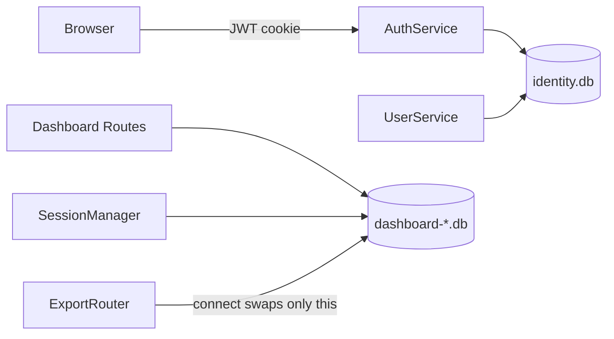

# Host-Local Identity Store Plan

## Target Architecture

Auth becomes host-local and stable across active dashboard database switches. Dataset databases continue to hold engineering data and dataset-scoped state.

## Decisions Locked In

- Use a new host-local identity database at `settings.data_root / "identity.db"`.
- Make only users/auth global: credentials, roles, `can_write`, token versions, login timestamps, settings notification timestamp.
- Keep `sessions`, `saved_filters`, `audit_log`, `event_access_log`, `custom_field_definitions`, and dataset ownership columns in dashboard DBs.
- On first startup after the change, merge users from all managed `dashboard*.db` files.
- If the same username exists in multiple files, the currently active `dashboard.db` wins for password, role, and write permission.
- Rewrite known per-database user ID references to the selected global IDs across all managed DBs.

## Implementation Steps

1. Add an identity store module.
   - Create `[server/storage/identity.py](server/storage/identity.py)` with a small `IdentityStore` that owns a DuckDB connection, creates the `users` table/index, and exposes the same user methods currently delegated by `[server/storage/database.py](server/storage/database.py)`.
   - Reuse `[server/storage/repositories/users_repository.py](server/storage/repositories/users_repository.py)` where possible instead of duplicating user SQL.
   - Add `Settings.identity_database_path` to `[server/config.py](server/config.py)` as `data_root / "identity.db"`.

2. Move auth/user DI to identity storage.
   - Add `app.state.identity_db` during lifespan startup in `[server/main.py](server/main.py)`.
   - Add `get_identity_store()` in `[server/dependencies.py](server/dependencies.py)`.
   - Change `get_auth_service()` and `get_user_service()` to inject `IdentityStore`, while `get_database()`, `QueryService`, `IngestionService`, and `SessionManager` stay on the active dashboard `UnifiedStore`.
   - Update `[server/services/auth.py](server/services/auth.py)` and `[server/services/user.py](server/services/user.py)` type expectations from `UnifiedStore` to the narrower identity user-store surface.

3. Replace per-dashboard admin bootstrap.
   - Run `UserService(app.state.identity_db, settings).bootstrap_admin()` once during process startup.
   - Remove the `UserService(store, settings).bootstrap_admin()` call from `_initialize_store()` in `[server/routers/export.py](server/routers/export.py)` so creating/connecting dashboard DB files does not create per-file accounts.
   - Keep DB switch behavior limited to `app.state.db`, `app.state.session_manager`, health checks, and cache clearing.

4. Add a one-time identity migration/backfill.
   - On startup, if `identity.db` has no migrated marker, scan managed dashboard DBs under `data_root`.
   - Read each legacy `users` table if present, dedupe by username, and insert into `identity.db`.
   - Process the active `settings.database_path` first so active DB conflicts win.
   - Build old-user-id to global-user-id mappings per source DB.
   - Rewrite known references in every managed DB where columns exist: `sessions.user_id`, `upload_tasks.created_by_user_id`, `saved_filters.user_id`, `dim_event.uploaded_by_user_id`, `dim_event.last_updated_by_user_id`, `audit_log.user_id`, `event_access_log.user_id`, `custom_field_definitions.created_by_user_id`, and `user_preferences.user_id` if present.
   - Store a schema/migration marker in `identity.db` so the merge is idempotent.

5. Keep dashboard schema compatible but stop treating dashboard `users` as runtime identity.
   - Leave the `users` table definition in `[server/schema.yaml](server/schema.yaml)` for one release to avoid destructive migration churn and to allow legacy files to open cleanly.
   - Update docs to mark dashboard `users` as deprecated legacy identity data and `identity.db.users` as the source of truth.
   - Keep portability semantics unchanged: load-data transfer still does not carry auth users.

6. Update tests around the new boundary.
   - Add identity-store unit tests for bootstrap, CRUD, token version, and duplicate username behavior.
   - Update auth/admin user router fixtures so auth uses `identity.db` while session/query data uses the active test dashboard DB.
   - Add a regression test: login, create/connect another managed DB, call `/api/v1/auth/me`, and verify the same cookie remains valid.
   - Add migration tests for merging users from multiple DBs, active DB conflict precedence, and user-id remapping in representative tables.

7. Update project docs required by repo rules.
   - Update `[docs/database-schema.txt](docs/database-schema.txt)` with the new `identity.db` source of truth and cross-file logical references.
   - Append a decision to `[docs/decisions/log.md](docs/decisions/log.md)` documenting host-local identity versus per-dashboard users.
   - Add a task note under `[docs/tasks/](docs/tasks/)` and mark the chosen task done/in-progress in `[docs/master-build-plan.md](docs/master-build-plan.md)` once implemented.

## Success Criteria

- Switching active databases no longer logs the user out.
- User management shows one host-wide roster regardless of the active dashboard DB.
- Creating a new dashboard DB does not require re-adding users.
- Existing sessions/saved filters/ownership links continue to resolve after user-id remap.
- Load-data import/export semantics remain unchanged and do not move auth users between hosts.
- Tests prove auth survives DB switch and migration is idempotent.