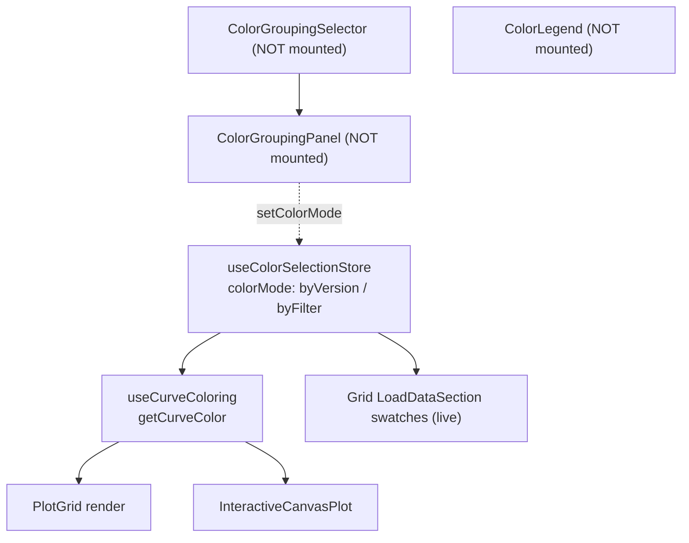

## Goal

In the interactive plot side panel, show the same right-hand color swatches that the grid panel shows on `program > version` rows, so users can immediately tell which curves belong to which version. While we're there, remove two dead/redundant color subsystems so the swatch in the panel is *guaranteed* to match the curve color on the chart.

## Why this is also a cleanup, not just a feature

There are currently two parallel coloring systems and only one is actually wired to live UI:




- `ColorGroupingPanel`, `ColorGroupingSelector`, and `ColorLegend` have **zero JSX call sites** in the live UI.
- Therefore `colorMode === 'byFilter'`, `focusFilter`, `filterValueColors`, the legacy `versionColors`/`eventColors`/`historicalColor` paths, and the `program_version`/`filter_category` `ColorLegend` machinery are unreachable through any UI today.
- Removing them eliminates the "swatch may lie when colorMode is byFilter" caveat entirely. After cleanup, `getCurveColor(eventId) = eventOverrideColors[id] ?? getProgramVersionColor(...)`. The side-panel swatch is the chart color (modulo per-event override, which is itself constrained to pinned events — see below).

## Constraint the user added

> Per-event color overrides must only apply while the event is pinned.

Currently `eventOverrideColors` outlive unpinning via two paths:

- [client/src/components/charts/InteractiveCanvasPlot.tsx](client/src/components/charts/InteractiveCanvasPlot.tsx) line 300 — click-curve `togglePin`
- [client/src/components/dashboard/interactive-viewer/CurveSelector.tsx](client/src/components/dashboard/interactive-viewer/CurveSelector.tsx) line 64 — X button `onUnpinEvent`

Only [client/src/components/dashboard/interactive-viewer/PinnedEventsOverlay.tsx](client/src/components/dashboard/interactive-viewer/PinnedEventsOverlay.tsx) line 102-104 currently resets the override on unpin.

Fix: centralize the rule inside `usePinnedEventsStore` so any unpin transition (`togglePin` toward unpinned, `unpinEvent`, `clearAllPinned`) clears the matching `eventOverrideColors` entries via `useColorSelectionStore.getState().resetEventOverrideColor(...)`. Single source of truth, no call-site duplication.

---

## Phase 1 — Swatch parity in the interactive `CurveSelector`

Goal: same UI as grid panel.

- Extract a shared hook `useEventTreeColorProps()` (new file: `client/src/hooks/use-event-tree-color-props.ts`) that returns the color-related `HierarchicalEventTreeProps` slice (`showColorSwatches`, `getProgramColor`, `onProgramColorChange`, `onProgramColorReset`, `isProgramColorCustomized`, `getVersionColor`, `onVersionColorChange`, `onVersionColorReset`, `isVersionColorCustomized`). DRY — currently the wiring is inlined in [LoadDataSection.tsx](client/src/components/dashboard/side-panel/LoadDataSection.tsx) lines 31-65, 146-165.
- Call it from both [LoadDataSection.tsx](client/src/components/dashboard/side-panel/LoadDataSection.tsx) and [CurveSelector.tsx](client/src/components/dashboard/interactive-viewer/CurveSelector.tsx); spread its result into `<HierarchicalEventTree {...colorProps} />`.

Verify: in interactive mode, every version row shows a clickable color picker; program rows show the reset button; changing a color updates the chart immediately and persists across reload.

## Phase 2 — Tighten `eventOverrideColors` to pinned-only

Edit [client/src/stores/pinned-events-store.ts](client/src/stores/pinned-events-store.ts):

```ts
import { useColorSelectionStore } from './color-selection-store';

togglePin: (eventId) =>
  set((state) => {
    const wasPinned = state.pinnedEventIds.includes(eventId);
    if (wasPinned) {
      useColorSelectionStore.getState().resetEventOverrideColor(eventId);
    }
    return {
      pinnedEventIds: wasPinned
        ? state.pinnedEventIds.filter((id) => id !== eventId)
        : [...state.pinnedEventIds, eventId],
    };
  }),

unpinEvent: (eventId) => {
  useColorSelectionStore.getState().resetEventOverrideColor(eventId);
  set((state) => ({ pinnedEventIds: state.pinnedEventIds.filter((id) => id !== eventId) }));
},

clearAllPinned: () => {
  useColorSelectionStore.getState().resetAllEventOverrideColors();
  set({ pinnedEventIds: [], isPinnedModeActive: false });
},
```

This collapses the cross-store rule to one place; remove the now-redundant `resetEventOverrideColor` call inside `PinnedEventsOverlay`'s unpin button.

Cross-store imports between Zustand stores are fine here — the dependency is one-way (`pinned-events` -> `color-selection`) and the rule is a real domain invariant, not an accidental coupling.

## Phase 3 — Delete redundant System A (`colorMode === 'byFilter'` and legacy palettes)

Delete files:

- [client/src/components/dashboard/shared/ColorGroupingPanel.tsx](client/src/components/dashboard/shared/ColorGroupingPanel.tsx)
- [client/src/components/dashboard/side-panel/ColorGroupingSelector.tsx](client/src/components/dashboard/side-panel/ColorGroupingSelector.tsx)
- Update [client/src/components/dashboard/shared/index.ts](client/src/components/dashboard/shared/index.ts) and [client/src/components/dashboard/side-panel/index.ts](client/src/components/dashboard/side-panel/index.ts) to drop the exports.

Trim [client/src/stores/color-selection-store.ts](client/src/stores/color-selection-store.ts):

- Remove fields/actions: `colorMode`, `setColorMode`, `_cachedVersionColors`, `_cachedEventColors`, `focusFilter`, `focusColor`, `otherColor`, `filterValueColors`, `setFocusFilter`, `setFocusColor`, `setOtherColor`, `setFilterValueColor`, `resetFilterValueColor`, `resetFilterMode`, `getFilterValueColor`, `syncFilterValueColors`.
- Remove legacy non-program-scoped: `versionColors`, `setVersionColor`, `resetVersionColor`, `resetAllVersionColors`, `getVersionColor`, `syncVersionColors`.
- Remove unused: `eventColors`, `setEventColor`, `resetEventColor`, `resetAllEventColors`, `getEventColor`, `syncEventColors`.
- Remove `historicalColor`, `setHistoricalColor`, `resetHistorical`. Inline the constant in [client/src/components/dashboard/interactive-viewer/InteractiveViewer.tsx](client/src/components/dashboard/interactive-viewer/InteractiveViewer.tsx) lines 30, 102 (or move `DEFAULT_HISTORICAL_COLOR` into [client/src/config/constants.ts](client/src/config/constants.ts)).
- Remove constants `DEFAULT_FOCUS_COLOR`, `DEFAULT_OTHER_COLOR`, `GREY_PALETTE`, `FILTER_CONFIG`, helpers `generateGreyShade`, `generateFilterValueShade`, `generateVersionColor` (the last is still used by `getProgramColor` — keep that one).
- Update `partialize` to drop removed keys.
- Add a `version: 2` + `migrate` to the `persist` config that drops legacy persisted keys, so returning users don't crash on rehydrate.

Simplify [client/src/hooks/use-curve-coloring.ts](client/src/hooks/use-curve-coloring.ts):

```ts
const getCurveColor = useCallback(
  (eventId: string): string => {
    const override = eventOverrideColors[eventId];
    if (override) return override;
    const meta = eventMetaMap[eventId];
    return meta
      ? getProgramVersionColor(meta.programId, meta.version, globalSortedProgramIds, versionsByProgramId[meta.programId])
      : '#000000';
  },
  [eventOverrideColors, eventMetaMap, getProgramVersionColor, globalSortedProgramIds, versionsByProgramId],
);
```

Drop `colorMode`, `focusFilter`, `otherColor`, `getFilterValueColor`, `syncFilterValueColors`, `eventFilterValueMap`, `selectedFilterValues`, the `getEventFilterValue` helper, and the second `useEffect`. Trim the returned shape — verify [PlotGrid.tsx](client/src/components/dashboard/plot-grid/PlotGrid.tsx) and [InteractiveViewer.tsx](client/src/components/dashboard/interactive-viewer/InteractiveViewer.tsx) only consume `getCurveColor` and `eventVersionMap` (already true per grep).

## Phase 4 — Delete redundant System B (`ColorLegend`)

Delete files / dirs:

- [client/src/components/dashboard/color-legend/ColorLegend.tsx](client/src/components/dashboard/color-legend/ColorLegend.tsx)
- [client/src/components/dashboard/color-legend/index.ts](client/src/components/dashboard/color-legend/index.ts)
- The directory `client/src/components/dashboard/color-legend/`.

Update:

- Remove `ColorLegend` export in [client/src/components/dashboard/index.ts](client/src/components/dashboard/index.ts) line 5.
- Remove `colorLegendPanel`, `setColorLegend*`, `dockColorLegend`, `undockColorLegend`, `DEFAULT_COLOR_LEGEND_PANEL` from [client/src/stores/ui-store.ts](client/src/stores/ui-store.ts) lines 30-46, 67-110.
- Remove frontend types `ColorGroupingMode`, `ColorGroupingCategory`, `ColorGroup` from [client/src/types/session.ts](client/src/types/session.ts) lines 10-29 and the re-exports in [client/src/types/api.ts](client/src/types/api.ts) lines 5, 8 and [client/src/types/index.ts](client/src/types/index.ts) lines 18-21.

Server-side note — out of scope: `ColorGroupingConfig` in [server/models/dashboard.py](server/models/dashboard.py) and [server/services/plot_image.py](server/services/plot_image.py) remains intact (the frontend never sent these fields, so removing them is a separate decision tied to the legacy image renderer).

## Phase 5 — Docs + verify

Per [AGENTS.md](AGENTS.md):

- Append to [docs/decisions/log.md](docs/decisions/log.md): one-paragraph entry titled "Collapse dual color systems to single program/version palette" — explain why two systems existed, why both were dead in UI, and the new invariant (side-panel swatch == chart curve color, modulo pinned-event override).
- Add `docs/tasks/<id>.md` if a task ID gets assigned in `master-build-plan.md`.

Verification checklist:

- `npm run lint` and `npm run build` clean.
- Manual: open interactive plot, see version swatches on right of each version row; change one — chart updates; reload — change persists.
- Manual: pin an event from `InteractiveCanvasPlot` (click curve), recolor it in `PinnedEventsOverlay`, unpin via the X — confirm color reverts to the version palette color, not the override.
- Manual: returning user with persisted `colorMode === 'byFilter'` rehydrates without console errors and now sees `byVersion`-style chart.

## Deliberate non-goals

- No new "color picker editable on hover" UX in the interactive panel beyond the existing `ColorPicker` widget — match the grid panel exactly.
- No server-side schema removal (`ColorGroupingConfig` stays).
- No changes to `useCurveColoring`'s public return shape beyond what's strictly required.

