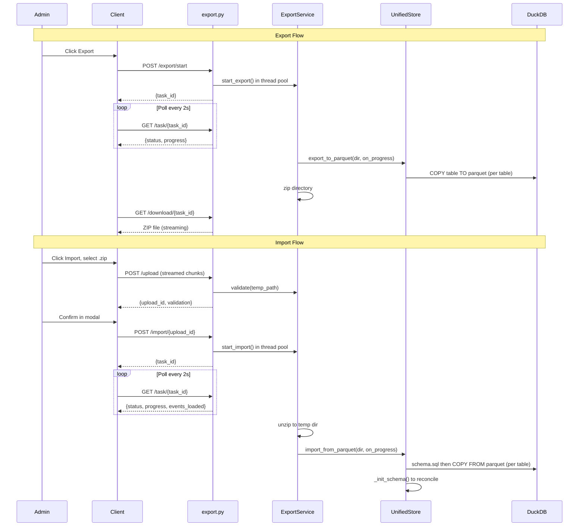

# Parquet Export/Import with Compression and Progress

## Context

The current export/import system has three critical problems at 10+ GB scale:

1. No compression -- 10 GB raw `.db` files transferred and stored as-is
2. `await file.read()` loads the entire upload into server RAM -- will OOM
3. Import uploads the file twice (once for validate, once for import) and writes two temp files

The `measurements_raw` and `measurements_lttb` tables (numeric time-series in long format) account for ~99.9% of database size. Parquet+zstd compression on columnar numeric data achieves 8-15x reduction, bringing 10 GB down to ~700 MB - 1.2 GB.

## Architecture




## API Changes

Old endpoints replaced:


| Old                                                                | New                                                                   | Purpose                          |
| ------------------------------------------------------------------ | --------------------------------------------------------------------- | -------------------------------- |
| `GET /database` (sync FileResponse)                                | `POST /database/export/start` then `GET /database/download/{task_id}` | Background export with progress  |
| `POST /database/validate` + `POST /database` (file uploaded twice) | `POST /database/upload` then `POST /database/import/{upload_id}`      | Single upload, background import |
| --                                                                 | `GET /database/task/{task_id}`                                        | Shared progress polling          |
| `GET /database/info`                                               | Unchanged                                                             | Database info                    |


## Key Design Decisions

- **Parquet+zstd only** (clean break, no legacy `.db` import support)
- **Export all tables** -- this is for backup/restore on the same system
- **Schema mismatch**: warn during validation, proceed with import, `_init_schema()` adds missing columns via `ALTER TABLE ADD COLUMN IF NOT EXISTS`
- **In-memory task store** (dict) -- admin-only, infrequent operations, single process
- **Table-level progress** -- DuckDB COPY runs per-table, report "Table 3 of 15: measurements_raw"
- **Admin-only restriction preserved** -- all new endpoints use `AdminRequiredDep`

## Files to Modify

### Server (3 files)

**[server/storage/database.py](Dashboard/server/storage/database.py)** (lines ~1385-1441)

- Replace `export_to_file()` with `export_to_parquet(export_dir, on_progress)`:
  - `CHECKPOINT`, then iterate tables via `information_schema.tables`
  - `COPY {table} TO '{dir}/{table}.parquet' (FORMAT PARQUET, COMPRESSION 'zstd')` per table
  - Call `on_progress(table_name, current, total)` after each table
- Replace `import_from_file()` with `import_from_parquet(import_dir, on_progress)`:
  - Close connections, backup existing `.db`
  - Create fresh `.db`, execute `schema.sql` from import dir
  - Parse `load.sql` for per-table COPY statements, execute each with progress callback
  - Call `_init_schema()` to reconcile any schema differences
  - Return metadata (event count, size)

**[server/services/export.py](Dashboard/server/services/export.py)**

- Add `TaskStore` -- simple dict-based in-memory task tracker:

```python
from dataclasses import dataclass, field
from uuid import uuid4

@dataclass
class TaskStatus:
    task_id: str
    type: str  # "export" | "import"
    status: str = "running"  # running | completed | failed
    progress: str = ""
    result: dict | None = None
    error: str | None = None

_tasks: dict[str, TaskStatus] = {}
```

- Refactor `validate_import_file(file_path: Path)` to accept a Path (no more bytes)
- Add `run_export(task_id)`: calls `db.export_to_parquet()` then `shutil.make_archive()` to zip, updates task status
- Add `run_import(task_id, upload_path)`: unzips, calls `db.import_from_parquet()`, updates task status
- Remove `import_database(content: bytes)` and `export_database()` (replaced by task-based methods)
- Remove redundant `update_schema_metadata()` call (already done inside storage methods)

**[server/routers/export.py](Dashboard/server/routers/export.py)**

- Add `stream_upload_to_disk(file: UploadFile)` helper -- reads in 8 MB chunks, enforces size limit, returns temp Path
- New endpoints:
  - `POST /database/export/start` -- spawns export in thread pool via `asyncio.get_event_loop().run_in_executor()`, returns `{task_id}`
  - `POST /database/upload` -- streams file to disk, validates from disk path, returns `{upload_id, validation}`
  - `POST /database/import/{upload_id}` -- spawns import in thread pool, returns `{task_id}`
  - `GET /database/task/{task_id}` -- returns task status
  - `GET /database/download/{task_id}` -- returns FileResponse for completed export zip, cleans up via BackgroundTask
- Remove old `export_database`, `validate_database`, `import_database` endpoints

### Client (4 files)

**[client/src/lib/api/export.ts](Dashboard/client/src/lib/api/export.ts)**

- Replace `exportDatabase()` with `startExport()` returning `{task_id}`
- Replace `validateDatabase(file)` with `uploadAndValidate(file)` returning `{upload_id, validation}`
- Replace `importDatabase(file)` with `startImport(upload_id)` returning `{task_id}`
- Add `getTaskStatus(task_id)` for polling
- Add `downloadExport(task_id)` returning Blob

**[client/src/app/database/page.tsx](Dashboard/client/src/app/database/page.tsx)** (lines ~600-765)

- Refactor `handleExportDatabase`: call `startExport()`, then poll `getTaskStatus()` every 2s, on completion call `downloadExport()`, write to disk via Save As picker
- Refactor `handleImportClick`: change file input accept from `.db` to `.zip`
- Refactor `handleConfirmImport`: call `startImport(upload_id)`, poll for progress, show progress in toast or modal
- Store `upload_id` from validation response for use in import

**[client/src/components/upload/DatabaseSection.tsx](Dashboard/client/src/components/upload/DatabaseSection.tsx)**

- Change subtitle text from "Download as .db file" to "Download as compressed archive"
- Add optional `progress` prop to show export/import progress inline

**[client/src/components/upload/ImportConfirmationModal.tsx](Dashboard/client/src/components/upload/ImportConfirmationModal.tsx)**

- Change to receive validation result as prop (from upload response) instead of calling validate internally
- Add progress display for ongoing import (table name + progress bar)
- Accept `.zip` files instead of `.db`

## Streaming Upload Helper (critical fix)

```python
CHUNK_SIZE = 8 * 1024 * 1024  # 8 MB

async def stream_upload_to_disk(
    file: UploadFile, max_bytes: int, suffix: str = ".zip"
) -> Path:
    tmp = tempfile.NamedTemporaryFile(suffix=suffix, delete=False)
    total = 0
    try:
        while chunk := await file.read(CHUNK_SIZE):
            total += len(chunk)
            if total > max_bytes:
                tmp.close()
                Path(tmp.name).unlink(missing_ok=True)
                raise HTTPException(status_code=413, detail="Upload too large")
            tmp.write(chunk)
        tmp.close()
        return Path(tmp.name)
    except Exception:
        tmp.close()
        Path(tmp.name).unlink(missing_ok=True)
        raise
```

## Schema Mismatch Handling

On import, validation reads `_schema_metadata.parquet` from the zip to compare schema versions and filter columns. Warnings are surfaced in the confirmation modal:

- "Missing filter columns: tire_type, test_rig" (will be added as NULL)
- "Extra filter columns: old_column" (will persist but not appear as filters)
- "Schema version mismatch: imported=3, current=5"

After import, `_init_schema()` runs `ALTER TABLE dim_event ADD COLUMN IF NOT EXISTS ...` for any columns defined in the current `schema.yaml` but missing from the import. This is the existing reconciliation mechanism -- no new logic needed.

## Cleanup

- Remove `zstandard` from `pyproject.toml` (was added for the never-implemented `.db.zst` plan)
- Delete [DatabaseTabContent.tsx](Dashboard/client/src/components/upload/DatabaseTabContent.tsx) if confirmed unused (legacy component)

