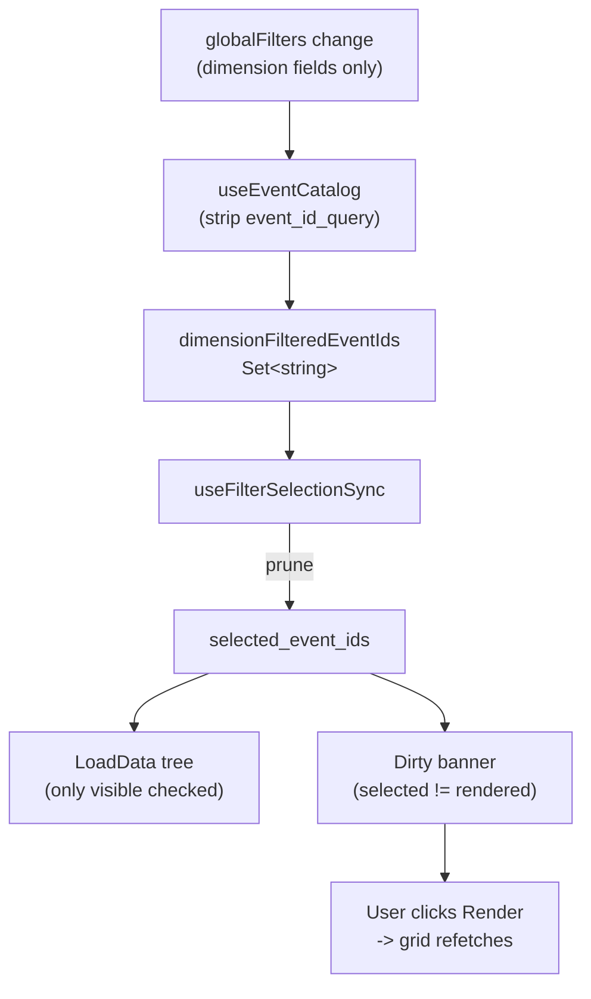

## Root cause

`[client/src/components/dashboard/side-panel/LoadDataSection.tsx](client/src/components/dashboard/side-panel/LoadDataSection.tsx)` toggle handlers (lines 34-53) append/remove from `dataState.selected_event_ids` based only on the user's click, never reconciling with the currently-visible event set. When a global filter hides previously-checked events, those IDs persist in the session. On Render, `[client/src/components/dashboard/plot-grid/PlotGrid.tsx](client/src/components/dashboard/plot-grid/PlotGrid.tsx)` (lines 146-159) sends the entire `selected_event_ids` to the backend, so the hidden events come back as plotted curves.

There is currently **no place** in the codebase that intersects `selected_event_ids` with the dimension-filter-passing event set. The fix introduces exactly that intersection.

## Contract (per user decisions)

1. `selected_event_ids` always equals "currently visible (after dimension filters) AND checked".
2. When a dimension filter changes, `selected_event_ids` is pruned to the new whitelist immediately.
3. `rendered_event_ids` and the grid are **left alone** until the user clicks Render. The existing dirty banner is the user-facing signal that the grid is stale.
4. Clearing the filter does NOT bring previously-pruned IDs back.
5. The Event-ID search box (`event_id_query`) is a find/highlight tool, **not** a pruning trigger.

## Why we don't prune `rendered_event_ids` here

The dirty banner already handles this state for free:

```92:110:client/src/lib/session/session-sync.ts
export function hasUnrenderedSelection(
  selectedEventIds: string[],
  renderedEventIds: string[],
): boolean {
  if (selectedEventIds.length === 0 && renderedEventIds.length === 0) {
    return false;
  }
  const selectedSet = new Set(selectedEventIds);
  const renderedSet = new Set(renderedEventIds);
  if (selectedSet.size !== renderedSet.size) {
    return true;
  }
  for (const id of selectedSet) {
    if (!renderedSet.has(id)) {
      return true;
    }
  }
  return false;
}
```

After pruning `selected_event_ids`, `selected != rendered`, so the "Selection changed — click Render" banner in `PlotGrid.tsx` (lines 349-358) automatically appears. On Render, `PlotGrid.tsx` line 152 sets `rendered_event_ids = current selection` and `startSequentialFetch` calls `clearCachedPlots()` (`[client/src/hooks/use-sequential-plot-data.ts](client/src/hooks/use-sequential-plot-data.ts)` line 42), so the new fetch is for the pruned selection only — the bug is fixed.

This keeps `PlotGrid.tsx` and the `plotCacheRef` memo untouched.

## Design



### Where the whitelist comes from

`event_id_query` is currently sent to the server inside `requestFilters` in `[client/src/hooks/use-event-catalog.ts](client/src/hooks/use-event-catalog.ts)` (lines 23-40). Since `useAllEvents` already caps at 500 results, doing the substring match client-side is cheap and gives us a single source of truth:

- The query sent to `useAllEvents` will exclude `event_id_query`.
- `useEventCatalog` returns:
  - `dimensionFilteredEventIds` — set of IDs from the server response (before search), used as the pruning whitelist.
  - `events` — server response filtered client-side by the substring search; this is what feeds the tree.

## Changes

### 1. `[client/src/hooks/use-event-catalog.ts](client/src/hooks/use-event-catalog.ts)`

Strip `event_id_query` before sending to the server; expose a separate `dimensionFilteredEventIds` set and apply substring matching client-side.

```ts
const requestFilters = useMemo<GlobalFilters>(() => {
  const next: GlobalFilters = {};
  Object.entries(globalFilters).forEach(([field, selectedRaw]) => {
    if (field === 'event_id_query') return;
    if (!allowedFilterFields.has(field)) return;
    if (Array.isArray(selectedRaw)) next[field] = selectedRaw;
  });
  return next;
}, [globalFilters, allowedFilterFields]);

const { allEvents, isLoading, error, refetch } = useAllEvents(requestFilters);

const dimensionFilteredEventIds = useMemo(
  () => new Set(allEvents.map((e) => e.event_id)),
  [allEvents],
);

const searchQuery = (globalFilters.event_id_query ?? '').trim().toLowerCase();
const events = useMemo(
  () => searchQuery
    ? allEvents.filter((e) => e.event_id.toLowerCase().includes(searchQuery))
    : allEvents,
  [allEvents, searchQuery],
);

return { events, allVisibleEvents: events, dimensionFilteredEventIds, isLoading, error, refetch };
```

### 2. New hook `client/src/hooks/use-filter-selection-sync.ts`

Reactive prune effect, mounted once at the dashboard level. Only touches `selected_event_ids`.

```ts
export function useFilterSelectionSync() {
  const { isSessionReady, dataState, updateDataState } = useFilterState();
  const { dimensionFilteredEventIds, isLoading } = useEventCatalog();
  const lastWhitelistRef = useRef<Set<string> | null>(null);

  useEffect(() => {
    if (!isSessionReady || isLoading) return;
    if (lastWhitelistRef.current === dimensionFilteredEventIds) return;
    lastWhitelistRef.current = dimensionFilteredEventIds;

    const sel = dataState.selected_event_ids;
    const prunedSel = sel.filter((id) => dimensionFilteredEventIds.has(id));
    if (prunedSel.length !== sel.length) {
      updateDataState({ selected_event_ids: prunedSel });
    }
  }, [isSessionReady, isLoading, dimensionFilteredEventIds, dataState.selected_event_ids, updateDataState]);
}
```

Guards:

- Wait for `isSessionReady && !isLoading` so the initial mount (before catalog returns) doesn't wipe the persisted selection.
- Compare set identity via `lastWhitelistRef` to only run once per catalog refresh.

### 3. Mount the sync hook

Add `useFilterSelectionSync()` once in `[client/src/components/dashboard/DashboardContent.tsx](client/src/components/dashboard/DashboardContent.tsx)` so it runs whenever the dashboard is mounted (covers all tabs that share the side panel).

### 4. Documentation

- Append a decision-log entry to `[docs/decisions/log.md](docs/decisions/log.md)` describing the new contract: "`selected_event_ids` is scoped to currently-visible (dimension-filtered) events; the grid stays as-is until Render is clicked; `event_id_query` is a find tool and does not prune."
- If a tracked task ID applies, mark it DONE in `[docs/master-build-plan.md](docs/master-build-plan.md)`.

## Out of scope (flagged, not changed)

- `[client/src/components/dashboard/plot-grid/PlotGrid.tsx](client/src/components/dashboard/plot-grid/PlotGrid.tsx)` — no changes; the existing dirty banner + Render flow handles the stale grid.
- `pinnedEventIds` (`[client/src/stores/pinned-events-store.ts](client/src/stores/pinned-events-store.ts)`) — pins are independent of filters; not touched unless requested.
- `CurveSelector` (`curveVisibility`) — separate concept (per-curve hide on already-rendered plots), not affected.

## Verification (success criteria)

1. With no filter, select events A, B, C → Render. All three plot.
2. Apply a program filter that excludes A → `selected_event_ids` becomes [B, C], the tree shows only filter-passing events with B and C still checked, and the "Selection changed — click Render" banner appears. The grid still shows A, B, C from the previous render.
3. Click Render → backend is called with [B, C] only (no A in payload), grid replaces curves with just B and C.
4. Clear the filter → tree shows all events again, but A is NOT re-checked.
5. Type "A" in the Event-ID search box → tree shrinks to events whose ID contains "A", but `selected_event_ids` is unchanged and the dirty banner does not appear; B and C remain on the grid.
6. On page reload with persisted session, no events are wiped before the catalog finishes loading.
