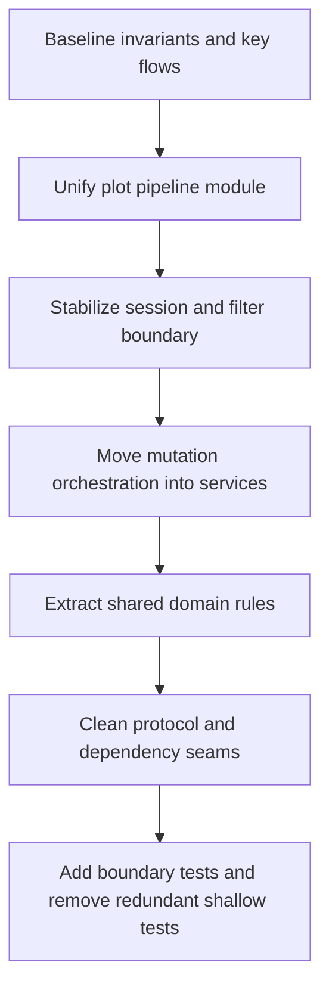

# Architecture Cleanup Plan (Frontend + Backend)

## Goal

Create deeper modules with narrower public interfaces so behavior is verified at boundaries instead of across many fragile seams.

## Priority Clusters

1. **Plot data pipeline unification (frontend)**
  - Consolidate duplicate fetch/decode/cache orchestration currently split across:
    - [client/src/hooks/use-lazy-plot-fetch.ts](/data/home/tkodippili/Desktop/localTest_Analysis_DashboardV3/Dashboard/client/src/hooks/use-lazy-plot-fetch.ts)
    - [client/src/hooks/use-sequential-plot-data.ts](/data/home/tkodippili/Desktop/localTest_Analysis_DashboardV3/Dashboard/client/src/hooks/use-sequential-plot-data.ts)
    - [client/src/lib/utils/decode-worker-client.ts](/data/home/tkodippili/Desktop/localTest_Analysis_DashboardV3/Dashboard/client/src/lib/utils/decode-worker-client.ts)
    - [client/src/stores/render-store.ts](/data/home/tkodippili/Desktop/localTest_Analysis_DashboardV3/Dashboard/client/src/stores/render-store.ts)
  - New deep module owns request lifecycle, decode, cache write policy, and cancellation semantics.
2. **Session/filter synchronization boundary (frontend)**
  - Refactor session sync behavior behind a narrow interface around:
    - [client/src/hooks/use-session.ts](/data/home/tkodippili/Desktop/localTest_Analysis_DashboardV3/Dashboard/client/src/hooks/use-session.ts)
    - [client/src/hooks/use-filter-state.ts](/data/home/tkodippili/Desktop/localTest_Analysis_DashboardV3/Dashboard/client/src/hooks/use-filter-state.ts)
  - Preserve external behavior while removing implicit coupling to storage and query cache internals.
3. **Router-service-store layering repair (backend)**
  - Move business mutation orchestration out of router and into service boundaries for:
    - [server/routers/dashboard.py](/data/home/tkodippili/Desktop/localTest_Analysis_DashboardV3/Dashboard/server/routers/dashboard.py)
    - [server/services/query.py](/data/home/tkodippili/Desktop/localTest_Analysis_DashboardV3/Dashboard/server/services/query.py)
    - [server/storage/database.py](/data/home/tkodippili/Desktop/localTest_Analysis_DashboardV3/Dashboard/server/storage/database.py)
  - Router should validate/request-map; services should own mutate/audit/cache invalidation sequences.
4. **Domain rule deduplication (backend)**
  - Remove duplicated weight range logic by extracting one shared domain module used by both:
    - [server/routers/dashboard.py](/data/home/tkodippili/Desktop/localTest_Analysis_DashboardV3/Dashboard/server/routers/dashboard.py)
    - [server/services/ingestion.py](/data/home/tkodippili/Desktop/localTest_Analysis_DashboardV3/Dashboard/server/services/ingestion.py)
5. **Protocol and dependency boundary cleanup (backend)**
  - Either wire protocol-driven dependencies end-to-end or delete stale abstractions:
    - [server/protocols.py](/data/home/tkodippili/Desktop/localTest_Analysis_DashboardV3/Dashboard/server/protocols.py)
    - [server/dependencies.py](/data/home/tkodippili/Desktop/localTest_Analysis_DashboardV3/Dashboard/server/dependencies.py)

## Execution Sequence

## Validation Strategy

- Frontend boundary tests for:
  - plot request/decode/cache lifecycle
  - cancellation and cache eviction invariants
  - session update debounce/coalescing and recovery semantics
- Backend boundary tests for:
  - metadata mutation path including audit and cache invalidation
  - shared weight bucket derivation behavior
  - service boundaries using temp/in-memory DB fixtures where possible
- Keep existing API contracts stable in phase 1; isolate risky behavior shifts behind test coverage first.

## Documentation Updates Required

- Update task statuses in [docs/master-build-plan.md](/data/home/tkodippili/Desktop/localTest_Analysis_DashboardV3/Dashboard/docs/master-build-plan.md).
- Append architecture decisions in [docs/decisions/log.md](/data/home/tkodippili/Desktop/localTest_Analysis_DashboardV3/Dashboard/docs/decisions/log.md).
- Add implementation notes for each non-trivial cleanup task under [docs/tasks/](/data/home/tkodippili/Desktop/localTest_Analysis_DashboardV3/Dashboard/docs/tasks/).

