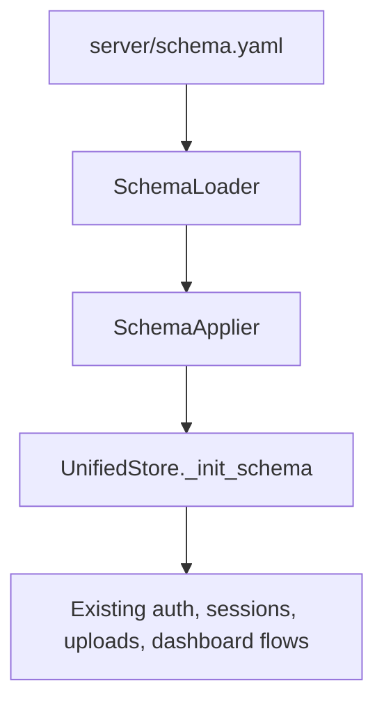

# Schema DDL Ownership Refactor

## Status Snapshot (2026-05-15)

- Completed:
  - Declared schema registry normalization in `server/schema.yaml`.
  - Shared schema application path via `SchemaLoader` + `SchemaApplier`.
  - `UnifiedStore._init_schema()` delegation for DDL.
  - `MigrationRunner` consistency for initial schema application.
  - Schema doctor/report classifications in migration diff:
    - `OK`
    - `MISSING`
    - `TYPE_MISMATCH`
    - `DRIFT`
- Still deferred:
  - Data backfill extraction out of `_init_schema()`.
  - Repository extraction from `UnifiedStore`.
  - Any route/service/frontend refactor tied to storage decomposition.

## Resolved Direction

Keep `server/schema.yaml` as the schema registry path, but normalize its shape so sequences, tables, columns, constraints, and indexes are declared by name. Move all current DDL facts out of `server/storage/database.py::_init_schema()` in one implementation task, using vertical TDD cycles.

Schema ownership and doctor reporting are now in place. Next work should keep runtime behavior stable while separating structural schema actions from row-mutating data backfills.

## Files To Target

- `server/schema.yaml`: expand from partial dim-table schema into the full DDL registry and normalize the structure.
- `server/storage/schema_loader.py`: parse the normalized registry and generate DDL for sequences, tables, table constraints, additive columns, and indexes.
- `server/storage/schema_applier.py`: new small module that applies idempotent DDL statements to an existing DuckDB connection.
- `server/storage/database.py`: keep `UnifiedStore` as connection owner/facade, but shrink `_init_schema()` so it delegates DDL to the applier and keeps existing data backfills unchanged for this slice.
- `server/storage/migrations.py`: update it to use the same loader/applier path for initial schema application, without expanding scope into schema doctor work.
- `tests/server/storage/test_schema_initialization.py`: add behavior tests for fresh initialization and additive upgrade through public paths.
- `docs/database-schema.txt`: update the documented source of truth after schema ownership changes.
- `docs/master-build-plan.md`, `docs/tasks/{task-id}.md`, and `docs/decisions/log.md`: update only if this work is executed, following repo rules.

## Implementation Steps

1. Inventory current DDL in `UnifiedStore._init_schema()` and classify it as `sequence`, `table`, `table constraint`, `additive column`, `index`, or `data backfill`. The coding agent should not move `UPDATE` statements in this slice.

2. Write the first RED test through the public storage path: constructing `UnifiedStore(tmp_path / "dashboard.db")` creates all required tables and key indexes/sequences currently expected by app behavior.

3. Normalize `server/schema.yaml` and update `SchemaLoader` minimally so it can read named maps for sequences, tables, columns, constraints, and indexes. Preserve filter metadata behavior for `dim_event`.

4. Add `SchemaApplier.apply(conn)` that runs idempotent DDL in a deterministic order: sequences, tables, additive columns, indexes. Keep it deliberately small and DuckDB-focused.

5. Change `_init_schema()` to call `SchemaApplier` using the existing `write_connection()` transaction. Leave the existing data backfill `UPDATE` statements in `_init_schema()` after DDL for now.

6. Add the second RED test for additive upgrade: create a partial old-style database, instantiate `UnifiedStore`, and assert missing declared columns are added without losing an existing row.

7. Update `MigrationRunner.apply_initial_schema()` to apply the same declared DDL path so migrations and startup no longer use separate schema generation behavior.

8. Run focused backend tests first, then the broader relevant pytest subset. Fix only regressions caused by this refactor.

## TDD Cycle Plan

Cycle 1: Fresh DB initialization
- RED: `UnifiedStore` on a temp DB should create representative tables from every category: `dim_event`, `users`, `sessions`, `upload_tasks`, `measurements_raw`, `custom_field_definitions`, `ingestion_artifacts`.
- GREEN: loader/applier creates all declared DDL.
- REFACTOR: simplify DDL generation while tests stay green.

Cycle 2: Additive upgrade
- RED: an existing DB with an older `users` or `sessions` table should receive a newly declared column without data loss.
- GREEN: schema applier emits/executes `ALTER TABLE ADD COLUMN IF NOT EXISTS` for declared additive columns.
- REFACTOR: make additive-column declarations explicit and readable.

Cycle 3: Migration path consistency
- RED: `MigrationRunner.apply_initial_schema()` and `UnifiedStore` should create the same declared table set for a fresh DB.
- GREEN: `MigrationRunner` delegates to the same applier.
- REFACTOR: remove duplicated generation paths where safe.

Cycle 4: Existing behavior smoke
- RED/GREEN as needed around existing public behavior if it regresses: admin bootstrap/user creation, session persistence, upload task table access, and query metadata tests.
- REFACTOR: keep `_init_schema()` short, but do not split repositories.

## Out Of Scope (for completed slices)

- No repository extraction from `UnifiedStore`.
- No SQLAlchemy, Alembic, ORM, or broad migration framework.
- No route/service/frontend refactor.
- No change to DuckDB connection lifecycle, locking, or shared-connection policy.
- No YAML-driven runtime behavior beyond schema facts.
- No data-backfill extraction yet; only keep existing backfills after declared DDL runs.

## Next Slices (documentation handoff)

1. Extract data backfills into a dedicated module (for example `server/storage/data_backfills.py`) and invoke it explicitly after schema apply.
2. Tighten startup ownership so schema mutation responsibility is centralized and easier to reason about in one path.
3. Begin repository extraction with lowest-risk domains first (`users`, then `sessions`) while keeping one shared DuckDB connection owner.

Each slice should preserve current behavior and add/adjust focused tests before moving to the next slice.

## Acceptance Criteria

- `server/schema.yaml` declares every sequence, table, additive column, table constraint, and index currently created in `UnifiedStore._init_schema()`.
- `UnifiedStore._init_schema()` no longer embeds raw `CREATE TABLE`, `CREATE SEQUENCE`, `ALTER TABLE ADD COLUMN`, or `CREATE INDEX` statements, except any temporary compatibility code explicitly justified in the task notes.
- Fresh temp DuckDB initialization still supports existing auth/session/upload/dashboard storage behavior.
- Existing data backfill behavior remains unchanged.
- `MigrationRunner` and `UnifiedStore` share the same schema application path.
- Backend tests for schema initialization and additive upgrade pass, along with existing affected server tests.
- `docs/database-schema.txt` reflects that `server/schema.yaml` is now the full declared schema registry.