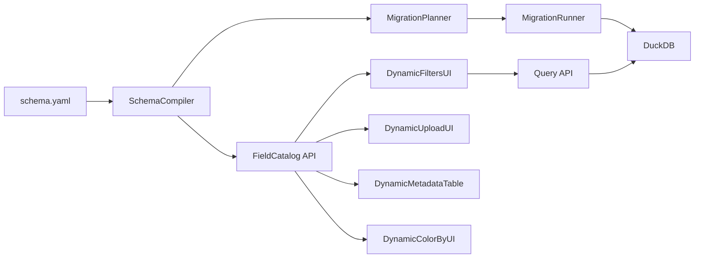

# Schema-Driven Metadata Architecture

## Goal

Make `schema.yaml` the operational source of truth for metadata fields, filter behavior, and UI configuration so most changes ship safely without frontend code edits.

## Confirmed design choices

- Frontend: fully dynamic runtime rendering from backend schema catalog.
- Schema evolution: full automatic evolution (including renames/type changes/backfills), with guardrails.

## Current coupling to remove

- Backend still hardcodes filter semantics and router query params in places like [server/routers/dashboard.py](server/routers/dashboard.py), [server/utils/boolean_filters.py](server/utils/boolean_filters.py), [server/utils/weight_filters.py](server/utils/weight_filters.py), and [server/storage/database.py](server/storage/database.py).
- Frontend still has fixed field contracts in [client/src/types/api.ts](client/src/types/api.ts), [client/src/lib/api/upload.ts](client/src/lib/api/upload.ts), [client/src/stores/color-selection-store.ts](client/src/stores/color-selection-store.ts), and metadata-specific UI assumptions in database/dashboard pages.

## Target architecture

## Implementation plan

1. **Create a schema compiler layer on backend**
  - Extend [server/storage/schema_loader.py](server/storage/schema_loader.py) to emit a normalized `FieldCatalog` model with:
    - stable `field_id` and `storage_key`
    - `data_type`, `filter_kind`, `display_name`, `short_label`, ordering
    - UI capabilities (`filterable`, `uploadable`, `editable`, `color_groupable`, `table_visible`)
    - evolution metadata (`aliases`, `deprecated`, rename/type migration hints)
  - Keep this as the single runtime object for API, query validation, and UI metadata.
2. **Introduce automatic migration planning + execution**
  - Add planner/runner under [server/storage/migrations.py](server/storage/migrations.py) (or sibling module) to diff current DB schema vs compiled schema and apply ordered operations.
  - Support: add/drop/rename/type changes/backfills with transaction-safe checkpoints and `_schema_metadata` revision logs.
  - Move hardcoded `ALTER TABLE` drift out of [server/storage/database.py](server/storage/database.py) into generated migration steps.
  - Add startup policy in [server/main.py](server/main.py): fail-fast or safe-mode on risky migration conflicts.
3. **Unify backend filter/query behavior around catalog**
  - Refactor query/filter handling in [server/services/query.py](server/services/query.py) and [server/routers/dashboard.py](server/routers/dashboard.py) to accept generic filter maps validated against `FieldCatalog` instead of enumerated query params.
  - Replace hardcoded boolean/range mappings with catalog-driven semantics (retire static maps in [server/utils/boolean_filters.py](server/utils/boolean_filters.py) and [server/utils/weight_filters.py](server/utils/weight_filters.py)).
  - Align upload facets and metadata projections in [server/routers/upload.py](server/routers/upload.py) to catalog flags.
4. **Publish a schema catalog contract for clients**
  - Add endpoint(s) from [server/routers/dashboard.py](server/routers/dashboard.py) (or dedicated schema router):
    - `GET /api/v1/schema/catalog`
    - `GET /api/v1/schema/revision`
  - Include revision hash so clients can invalidate caches and reconcile persisted filters safely.
5. **Convert frontend to runtime-driven metadata UI**
  - Replace fixed field lists/types with catalog-backed rendering in:
    - [client/src/components/dashboard/side-panel/GlobalFilters.tsx](client/src/components/dashboard/side-panel/GlobalFilters.tsx)
    - [client/src/app/database/page.tsx](client/src/app/database/page.tsx)
    - [client/src/app/database/edit/page.tsx](client/src/app/database/edit/page.tsx)
    - [client/src/components/upload/UploadDataSection.tsx](client/src/components/upload/UploadDataSection.tsx)
    - [client/src/stores/color-selection-store.ts](client/src/stores/color-selection-store.ts)
  - Shift client models in [client/src/types/api.ts](client/src/types/api.ts) toward a dynamic attributes bag + catalog interpretation.
  - Make filter/session persistence key off stable `field_id`/`storage_key` with alias resolution during schema updates.
6. **Safety, compatibility, and rollout controls**
  - Add migration dry-run endpoint/logging and startup summary of planned operations.
  - Add compatibility layer for renamed fields (alias map) and automatic persisted-state remap.
  - Add integration tests for: schema change -> migration -> filter options -> UI rendering -> upload/edit/query correctness.
7. **Documentation and governance updates**
  - Update [docs/database-schema.txt](docs/database-schema.txt) with new schema metadata/evolution keys.
  - Record architecture decisions in [docs/decisions/log.md](docs/decisions/log.md).
  - Add task notes for this implementation in [docs/tasks/](docs/tasks/) and update [docs/master-build-plan.md](docs/master-build-plan.md).

## Rollout strategy

- Phase A: catalog endpoint + dynamic read-only UI surfaces.
- Phase B: query/upload/edit paths use catalog validation.
- Phase C: auto-migration for additive + rename paths.
- Phase D: type-change/backfill automation with guarded rollout and dry-run enforcement.

## Success criteria

- Adding a new metadata/filter field in `schema.yaml` appears automatically in filter/upload/edit/table/coloring UI after backend restart (or schema reload), with no frontend code edits.
- Renaming a field preserves existing saved filters/sessions through alias migration.
- Existing DB instances converge to target schema through automatic migration plan with audit trail and test coverage.

