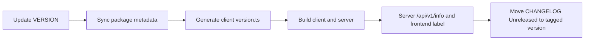

# Unified Versioning And Changelog Plan

## Current Gaps To Fix

- Root `VERSION` is already treated as source-of-truth in runtime paths, but metadata files are out of sync (`client/package.json` differs from `VERSION`).
- Client build-time env in `[/data/home/tkodippili/Desktop/localTest_Analysis_DashboardV3/Dashboard/client/next.config.ts](/data/home/tkodippili/Desktop/localTest_Analysis_DashboardV3/Dashboard/client/next.config.ts)` still reads `package.json.version`, which can drift from `VERSION`.
- Frontend currently shows `client/server` versions in `[/data/home/tkodippili/Desktop/localTest_Analysis_DashboardV3/Dashboard/client/src/components/layout/VersionLabel.tsx](/data/home/tkodippili/Desktop/localTest_Analysis_DashboardV3/Dashboard/client/src/components/layout/VersionLabel.tsx)`, but release process is not enforcing synchronized bumps.

## Target Strategy (Single Product Version + Single Root Changelog)

- Keep one canonical version in `[/data/home/tkodippili/Desktop/localTest_Analysis_DashboardV3/Dashboard/VERSION](/data/home/tkodippili/Desktop/localTest_Analysis_DashboardV3/Dashboard/VERSION)`.
- Keep one release log in `[/data/home/tkodippili/Desktop/localTest_Analysis_DashboardV3/Dashboard/CHANGELOG.md](/data/home/tkodippili/Desktop/localTest_Analysis_DashboardV3/Dashboard/CHANGELOG.md)`.
- Treat `client/package.json` and `server/pyproject.toml` version fields as mirrored release metadata that must be auto-synced from `VERSION`.

## Implementation Steps

1. Add a root release script (e.g., `scripts/release-version.*`) that takes a semver and atomically updates:
  - `[/data/home/tkodippili/Desktop/localTest_Analysis_DashboardV3/Dashboard/VERSION](/data/home/tkodippili/Desktop/localTest_Analysis_DashboardV3/Dashboard/VERSION)`
  - `[/data/home/tkodippili/Desktop/localTest_Analysis_DashboardV3/Dashboard/client/package.json](/data/home/tkodippili/Desktop/localTest_Analysis_DashboardV3/Dashboard/client/package.json)`
  - `[/data/home/tkodippili/Desktop/localTest_Analysis_DashboardV3/Dashboard/server/pyproject.toml](/data/home/tkodippili/Desktop/localTest_Analysis_DashboardV3/Dashboard/server/pyproject.toml)`
2. Update client build config to consume root `VERSION` (or generated version artifact) instead of `package.json.version` in `[/data/home/tkodippili/Desktop/localTest_Analysis_DashboardV3/Dashboard/client/next.config.ts](/data/home/tkodippili/Desktop/localTest_Analysis_DashboardV3/Dashboard/client/next.config.ts)`.
3. Keep runtime display path unchanged but validate it end-to-end:
  - Client: `[/data/home/tkodippili/Desktop/localTest_Analysis_DashboardV3/Dashboard/client/src/config/version.ts](/data/home/tkodippili/Desktop/localTest_Analysis_DashboardV3/Dashboard/client/src/config/version.ts)`, `[/data/home/tkodippili/Desktop/localTest_Analysis_DashboardV3/Dashboard/client/src/hooks/use-app-info.ts](/data/home/tkodippili/Desktop/localTest_Analysis_DashboardV3/Dashboard/client/src/hooks/use-app-info.ts)`
  - Server: `[/data/home/tkodippili/Desktop/localTest_Analysis_DashboardV3/Dashboard/server/__init__.py](/data/home/tkodippili/Desktop/localTest_Analysis_DashboardV3/Dashboard/server/__init__.py)`, `[/data/home/tkodippili/Desktop/localTest_Analysis_DashboardV3/Dashboard/server/routers/info.py](/data/home/tkodippili/Desktop/localTest_Analysis_DashboardV3/Dashboard/server/routers/info.py)`
4. Define a release checklist in docs (bump version, update changelog, regenerate artifacts, smoke check version label + `/api/v1/info`, tag release).
5. Add lightweight CI guard to fail if `VERSION`, `client/package.json`, and `server/pyproject.toml` versions diverge.

## Verification

- `VERSION`, `client/package.json`, and `server/pyproject.toml` report identical semver.
- Frontend header shows expected `clientVersion/serverVersion` after build.
- `/api/v1/info` returns the same server version as backend app metadata.
- `CHANGELOG.md` includes release entry for the new version.

