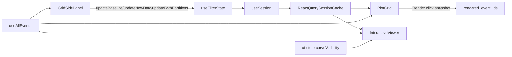

# Unify Grid/Interactive Filtering State

## Current Flow (Junior-Friendly)

Filtering today is split across session state, UI stores, and component-local derivations:

- **Selection state (persisted):** `useFilterState()` reads/writes session-backed partition state and rendered snapshot:
  - [client/src/hooks/use-filter-state.ts](client/src/hooks/use-filter-state.ts)
  - [client/src/hooks/use-session.ts](client/src/hooks/use-session.ts)
- **Grid filter UI mutates selections (not `global_filters`):**
  - [client/src/components/dashboard/side-panel/GlobalFilters.tsx](client/src/components/dashboard/side-panel/GlobalFilters.tsx)
  - [client/src/components/dashboard/side-panel/BaselinePartition.tsx](client/src/components/dashboard/side-panel/BaselinePartition.tsx)
  - [client/src/components/dashboard/side-panel/NewDataPartition.tsx](client/src/components/dashboard/side-panel/NewDataPartition.tsx)
- **Event source split:**
  - `useAllEvents()` fetches all events and is heavily used in grid/filter views
    - [client/src/hooks/use-all-events.ts](client/src/hooks/use-all-events.ts)
  - `useEvents()` fetches API-filtered subsets but is used mainly by interactive side panel selector
    - [client/src/hooks/use-events.ts](client/src/hooks/use-events.ts)
- **Grid render snapshot:** selection is copied into `rendered_event_ids` only when clicking Render
  - [client/src/components/dashboard/DashboardContent.tsx](client/src/components/dashboard/DashboardContent.tsx)
  - [client/src/components/dashboard/plot-grid/PlotGrid.tsx](client/src/components/dashboard/plot-grid/PlotGrid.tsx)
- **Interactive visibility is separate store state (`curveVisibility`)** and combines with selected IDs:
  - [client/src/components/dashboard/interactive-viewer/InteractiveViewer.tsx](client/src/components/dashboard/interactive-viewer/InteractiveViewer.tsx)
  - [client/src/stores/ui-store.ts](client/src/stores/ui-store.ts)

## Key Problems Causing Complexity

- Filter logic and selection logic are mixed in `GlobalFilters` (checkboxes directly mutate `selected_event_ids`).
- Grid and interactive each recompute similar derived mappings (`selectedVersions`, `eventFilterValueMap`, selected new-data IDs).
- Visibility is split across multiple places (`selected_event_ids`, `curveVisibility`, pinned mode), so “what is visible now?” has no single owner.
- There is duplicated partition-sync logic (`derivePartitionState` in component vs reusable utility in [client/src/lib/utils/partition-sync.ts](client/src/lib/utils/partition-sync.ts)).

## Proposed Single-Store Target

Create one Zustand store focused on **selection/filter result state** for both layouts:

- New store: [client/src/stores/dashboard-selection-store.ts](client/src/stores/dashboard-selection-store.ts)
- Store owns:
  - `baselineSelectedIds`, `newDataSelectedIds`
  - `filteredBaselineIds`, `filteredNewDataIds` (or one merged `filteredSelectedIds` + partition maps)
  - `renderedEventIds` (mirrored from session)
  - derived selectors: `allSelectedIds`, `allFilteredSelectedIds`, `visibleInteractiveIds`
- Store actions:
  - `toggleEvent`, `batchSetEvents`, `setSelectionFromFilterValue`, `clearSelections`
  - `setRenderedSnapshot`, `applyCurveVisibility`, `getPartitionStateFromSelection`
- Session sync stays as persistence layer (through `useSession`), but components read/write through the single store API.

## Implementation Plan (Safe, Incremental)

### Phase 1: Introduce Store Without Behavior Changes

- Add `dashboard-selection-store` with pure selection/filter-result state + selectors.
- Reuse [client/src/lib/utils/partition-sync.ts](client/src/lib/utils/partition-sync.ts) for normalized partition derivation; remove duplicated derivation patterns from components.
- Add a small adapter in `useFilterState` so existing callers still work while internally delegating to new store actions.

### Phase 2: Move Grid Side-Panel Logic to Single Store

- Refactor Baseline/NewData partition components to call store actions instead of bespoke local selection logic.
- Refactor GlobalFilters to use centralized filter-selection actions (still current semantics: checkboxes mutate selected IDs).
- Keep API contracts unchanged so no backend changes required.

### Phase 3: Unify Grid + Interactive Consumption

- Update `PlotGrid` and `InteractiveViewer` to consume shared derived selectors from the single store.
- Move duplicated derived computations into store selectors/utils used by both components.
- Keep `curveVisibility` in UI store initially, but route `visibleInteractiveIds` composition through the new selection store selector.

### Phase 4: Optional Final Consolidation

- Optionally absorb `curveVisibility` from `ui-store` into `dashboard-selection-store` to fully centralize “selected + filtered + visible”.
- Keep pinned mode in its own persisted store unless you explicitly want that merged too.

## Validation Checklist

- Selection toggles in both partitions still match previous UI behavior.
- Global filter checkbox behavior remains identical after refactor (no semantic change yet).
- Render button still snapshots selected IDs to `rendered_event_ids` and re-render indicator works.
- Interactive view shows the same visible curves for same selection + visibility toggles.
- No regressions in side panel tab switching (`grid` ↔ `interactive`).

## Follow-up (After Unification)

If you later want cleaner semantics from [docs/theory/filtering.md](docs/theory/filtering.md), you can do a second pass:

- use `global_filters` for filter intent,
- keep `selected_event_ids` for manual selection only,
- move matching entirely server-side through `/dashboard/events`.

