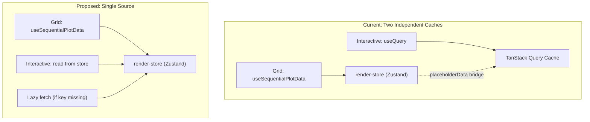

# Unify Plot Data Cache: render-store as Single Source of Truth

## Problem

The grid and interactive views use **different caching strategies** with different lifetimes:

- **Grid**: Zustand `render-store` (no TTL, lives indefinitely in-memory)
- **Interactive**: TanStack Query (`staleTime=5s`, `gcTime=20s`)

When the user switches from interactive to grid for >20 seconds and returns, TanStack garbage-collects the interactive cache entry, causing the plot to go blank while the grid still shows data. Additionally, pinned events persist in `sessionStorage` across refresh while plot data does not, creating a zombie state.

## Agreed Design Decisions

| Decision               | Choice                                                        |
| ---------------------- | ------------------------------------------------------------- |
| Single data source     | `render-store` (Zustand) for both grid and interactive        |
| Interactive resolution | Same as grid (both use server LTTB 5000 pts)                  |
| Visibility toggles     | Filter locally from store, no re-fetch                        |
| Missing plot key       | Lazy fetch into render-store on demand                        |
| Page refresh           | Blank slate -- user re-renders (current behavior, acceptable) |
| Pins on refresh        | Clear pins (align with plot data lifetime)                    |
| Pins on new render     | Always clear (current behavior, keep)                         |
| TanStack for plot data | Remove entirely                                               |
| Tab visibility abort   | Remove (let fetches complete even when tab is hidden)         |

## Memory Analysis

- LTTB resolution: 5,000 pts/curve, 8 bytes/pt = 40 KB/curve
- 8 plot keys x 100 events = ~32 MB (well within browser limits)
- `MAX_CACHED_PLOTS = 10` already accommodates all 8 plot keys

## Architecture Change

## Changes

### 1. InteractiveViewer.tsx -- Read from render-store instead of useQuery

Remove the `useQuery` call entirely. Replace with:

- Read `cachedPlots.get(selectedPlotKey)` from `render-store`
- If the key exists, use it directly (same `curveFromCachedData` transform already exists)
- If the key is missing, trigger a lazy fetch (see step 3)
- Track loading state locally (via the lazy fetch hook or a simple `useState`)

Remove imports of `buildInteractivePlotBinaryQueryKey`, `fetchInteractivePlotBinaryData`, `INTERACTIVE_QUERY_STALE_MS`, `INTERACTIVE_QUERY_GC_MS`, and `useQuery`.

Remove `cachedBinaryData`, `isSelectionMatchingRendered`, and the `placeholderData` bridge -- no longer needed.

### 2. PlotGrid.tsx -- Remove prefetch on expand

In `handleExpand`, remove the `queryClient.prefetchQuery(...)` call. The data is already in `render-store.cachedPlots` from the grid fetch. Just set `selectedPlotKey` and switch tabs.

Remove the `useQueryClient()` hook and related imports.

### 3. Add lazy fetch capability to render-store or a new hook

Create a small function (or extend [use-sequential-plot-data.ts](client/src/hooks/use-sequential-plot-data.ts)) that:

- Checks if `cachedPlots.has(plotKey)`
- If not, fetches that single plot key via `dashboardApi.getSVGPlotDataBinary` and writes into `render-store.updateCachedPlot`
- Tracks its own loading/error state

This handles the edge case where the user navigates to interactive view before rendering the grid.

### 3b. Remove `visibilitychange` abort handler

In [use-sequential-plot-data.ts](client/src/hooks/use-sequential-plot-data.ts), remove the `useEffect` that listens for `visibilitychange` and aborts in-flight fetches. Fetches should complete even when the browser tab goes hidden.

### 4. Clear pinned events on page load (align lifetime)

In the Zustand `persist` config for [pinned-events-store.ts](client/src/stores/pinned-events-store.ts), add an `onRehydrate` callback that clears the store. This way the store structure survives for the middleware to work, but state is always cleared on mount (fresh page load). Alternatively, call `clearAllPinned()` from a top-level effect in the dashboard layout.

### 5. Delete interactive-plot-query.ts

[client/src/lib/api/interactive-plot-query.ts](client/src/lib/api/interactive-plot-query.ts) becomes dead code. Delete it.

### 6. No server-side changes needed

- The binary endpoint (`/dashboard/plots/data/binary`) is unchanged
- Server-side `SimpleCache` is unaffected (binary path is already uncached server-side)
- `Cache-Control: public, max-age=600` on the HTTP response remains useful for browser-level caching of identical requests

## Risks and Mitigations

- **No automatic background refetch**: Since plot data is treated as immutable after ingestion, this is acceptable. If data changes, the user re-renders.
- **Lazy fetch loading UX**: The interactive view will need a loading spinner when lazy-fetching a missing plot key. The same `LoadingState` component already exists in `InteractiveViewer.tsx`.
- **Memory**: 8 plots x 100 events = ~32 MB. Acceptable. The `MAX_CACHED_PLOTS` cap provides a safety net.

