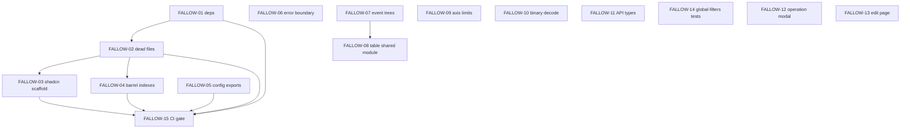

# Fallow Frontend Audit — Agent Issue Handoff

Static analysis of `client/` using [Fallow v2.89.0](https://github.com/fallow-rs/fallow) (`npx fallow --format markdown`).

**Audit date:** 2026-06-08  
**Scope:** `Dashboard/client/src` (24,623 LOC, 1,632 functions)  
**Total findings:** 193 dead-code issues · 31 clone groups (7.5% duplication) · 137 complexity hotspots

## What Fallow reports

Fallow is deterministic codebase intelligence for TypeScript/JavaScript. It does **not** use AI to invent findings. Relevant categories for this handoff:

| Category | What it means |
|----------|---------------|
| **Dead code** | Unused files, exports, types, and npm dependencies with zero references |
| **Duplication** | Clone families — repeated logic blocks across files (suffix-array detection) |
| **Complexity / health** | Cyclomatic, cognitive, and CRAP scores; maintainability index; refactor targets |
| **Architecture** | Circular deps, boundary violations (none found in this audit) |
| **Vital signs** | Aggregate health: dead-file %, dead-export %, unused deps |

Full raw output is captured in [00_AUDIT_SUMMARY.md](./00_AUDIT_SUMMARY.md).

## Issue breakdown

Issues are vertical slices sized for AFK coding agents. Each file in `issues/` follows the repo's to-issues template.

| ID | Title | Type | Effort | Blocked by |
|----|-------|------|--------|------------|
| [FALLOW-01](./issues/FALLOW-01-remove-unused-npm-dependencies.md) | Remove unused npm dependencies | AFK | Low | — |
| [FALLOW-02](./issues/FALLOW-02-delete-unused-files.md) | Delete confirmed unused files | AFK | Low | — |
| [FALLOW-03](./issues/FALLOW-03-prune-dead-shadcn-scaffold.md) | Prune 100%-dead shadcn scaffold files | AFK | Low | FALLOW-02 |
| [FALLOW-04](./issues/FALLOW-04-remove-unused-barrel-indexes.md) | Remove unused barrel `index.ts` modules | AFK | Low | FALLOW-02 |
| [FALLOW-05](./issues/FALLOW-05-prune-dead-config-exports.md) | Prune dead config module exports | AFK | Low | — |
| [FALLOW-06](./issues/FALLOW-06-extract-shared-route-error-boundary.md) | Extract shared route error boundary | AFK | Low | — |
| [FALLOW-07](./issues/FALLOW-07-unify-event-tree-components.md) | Unify hierarchical event tree components | AFK | High | — |
| [FALLOW-08](./issues/FALLOW-08-extract-database-table-shared-module.md) | Extract database/inspect-damage table shared module | AFK | High | FALLOW-07 |
| [FALLOW-09](./issues/FALLOW-09-deduplicate-chart-axis-limits.md) | Deduplicate chart axis limit calculation | AFK | Medium | — |
| [FALLOW-10](./issues/FALLOW-10-deduplicate-binary-decode-paths.md) | Deduplicate binary decode worker/main-thread code | AFK | Medium | — |
| [FALLOW-11](./issues/FALLOW-11-consolidate-api-upload-types.md) | Consolidate duplicated API/upload type shapes | AFK | Medium | — |
| [FALLOW-12](./issues/FALLOW-12-refactor-database-operation-modal.md) | Refactor DatabaseOperationModal complexity | AFK | High | — |
| [FALLOW-13](./issues/FALLOW-13-refactor-database-edit-page.md) | Refactor database edit page complexity | AFK | High | — |
| [FALLOW-14](./issues/FALLOW-14-add-global-filters-utils-tests.md) | Add global-filters utils test coverage | AFK | Low | — |
| [FALLOW-15](./issues/FALLOW-15-add-fallow-ci-gate.md) | Add Fallow audit CI gate with baselines | HITL | Medium | FALLOW-01–05 |

## Recommended execution order



**Phase 1 — quick wins (low risk):** FALLOW-01, 02, 05, 06, 14  
**Phase 2 — structural dedup (medium risk):** FALLOW-07, 08, 09, 10, 11  
**Phase 3 — complexity hotspots (higher touch):** FALLOW-12, 13  
**Phase 4 — guardrails:** FALLOW-15 (after baseline cleanup)

## Agent instructions

1. Pick one issue file from `issues/`.
2. Read acceptance criteria and verify with `npx fallow` from `client/`.
3. Run existing client tests: `npm test` (or project test command).
4. Do not widen scope beyond the issue's acceptance criteria.
5. For shadcn partial dead exports (sidebar, dropdown-menu, etc.), **do not delete** unless the entire file is unused — only files marked 100% dead in FALLOW-02/03.

## Verification command

```bash
cd client
npx fallow --format markdown
npx fallow health --score --targets
```
