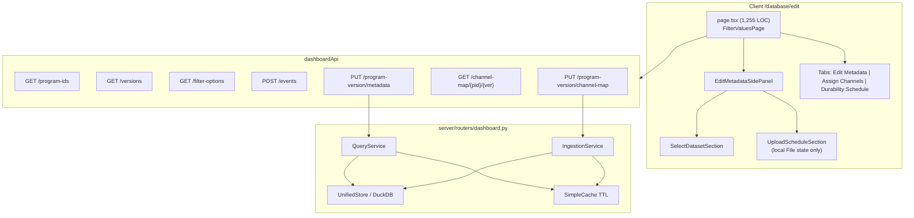
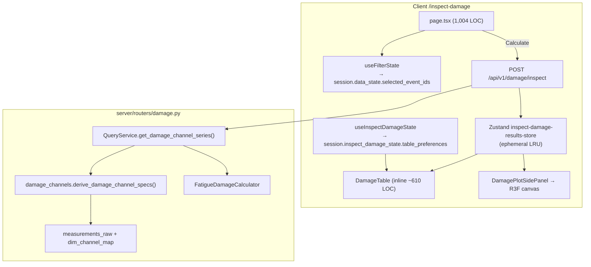

# Software Architecture Review

**Repository:** [tabesink/analysis-dashboard](https://github.com/tabesink/analysis-dashboard.git)  
**Scope:** Edit Metadata route (`/database/edit`) end-to-end; Inspect Damage route (`/inspect-damage`) and damage calculation pipeline  
**Review date:** 2026-06-08  
**Reviewer stance:** Senior software architect — fitness for maintainability, security boundaries, and refactor readiness  
**Tools used:** Source inspection, GitNexus (`analysis-dashboard` index), subagent exploration

---

## 1. Executive Summary

The **Edit Metadata** and **Inspect Damage** routes are **functionally complete** but **architecturally immature**. Both routes center on **1,000+ line god page components** that mix orchestration, domain logic, and presentation. Server-side damage calculation and metadata writes are well-tested in isolation; client integration and route-level decomposition lag behind.

| Area | Verdict | Top risk |
|------|---------|----------|
| Edit Metadata — metadata save | Production-ready | 1,255-line page; API auth gap on batch metadata PUT |
| Edit Metadata — channel map | Production-ready | Duplicated `FIXED_CHANNEL_MAP_PLOTS` constant (client + server) |
| Edit Metadata — schedule upload | UI shell only (intentional) | Split UX: side panel staging vs empty Durability tab |
| Inspect Damage — calculation | Production-ready | No server cache; full recompute per request |
| Inspect Damage — display | Production-ready | Fragmented state; results lost on refresh |
| Cross-cutting | Moderate debt | Channel key contracts duplicated client/server |

**Recommended refactor sequence:** (1) extract feature modules and hooks from both god pages, (2) close security boundary gaps, (3) introduce shared domain contracts for channel maps and damage channels, (4) wire schedule upload backend when PRD iteration 2 lands.

---

## 2. Codebase Architecture Map

### 2.1 Stack assumptions

| Layer | Technology |
|-------|------------|
| Frontend | Next.js App Router, React 19, TanStack Query, Zustand, Tailwind v4 + shadcn |
| Backend | FastAPI, DuckDB (`UnifiedStore`), Pydantic models |
| Auth | JWT httpOnly cookies; `CurrentUserDep` / `WriteUserDep` guards |
| Damage engine | `py-fatigue` (Palmgren–Miner, DNVGL-RP-C203/2016 Curve C) |
| Session | Server `sessions` table + client `localStorage`/`sessionStorage` sync |

### 2.2 Edit Metadata — request/data flow



**Adjacent (not on Edit Metadata route):** CSV/RSP upload via `server/routers/upload.py` → `IngestionService.ingest()` on the Database page. Pending artifacts without channel maps are completed on Edit Metadata's **Assign Channels** tab.

### 2.3 Inspect Damage — request/data flow



### 2.4 Damage calculation pipeline (server)

For each requested `event_id`:

1. Load `dim_channel_map` rows for the event's program/version.
2. `derive_damage_channel_specs()` maps **8 plot definitions → 12 canonical channels** (4 component groups × XYZ).
3. For each spec: resolve raw channel name (direct or legacy `col_N` pattern matching).
4. Query `measurements_raw` ordered by timestamp.
5. `FatigueDamageCalculator.calculate_channel()`:
   - Rainflow cycle counting (`mean_bin_width=100`, `range_bin_width=100`)
   - S–N curve: DNVGL-RP-C203/2016, Air, Curve C, slopes (3, 5)
   - Palmgren–Miner damage sum
   - Minimum 3 finite samples required
6. Return `DamageInspectResponse { channels[], rows[] }` with per-cell `status`: `ok` | `invalid` | `unavailable` | `error`.

**Channel derivation contract** (must stay aligned across client 3D plot):

| Group | XY plot | XZ plot | Keys |
|-------|---------|---------|------|
| Ball joint | `bj_xy_force_plot` | `bj_xz_force_plot` | `bj_x_force`, `bj_y_force`, `bj_z_force` |
| Shock | `shock_xy_force_plot` | `shock_xz_force_plot` | `shock_x_force`, `shock_y_force`, `shock_z_force` |
| Bushing F | `bushing_f_xy_force_plot` | `bushing_f_xz_force_plot` | `bushing_f_x_momt`, `bushing_f_y_momt`, `bushing_f_z_momt` |
| Bushing R | `bushing_r_xy_force_plot` | `bushing_r_xz_force_plot` | `bushing_r_x_momt`, `bushing_r_y_momt`, `bushing_r_z_momt` |

Axis mapping: X from XY `x_channel`; Y from XY `y_channel`; Z from XZ `y_channel`.

---

## 3. Strengths

### Edit Metadata

- **Dirty-field save model** is sound: only changed fields are sent; mixed-value semantics (some events null, some populated) are handled explicitly in `buildProgramVersionDraftValues`.
- **Side panel extraction** (`EditMetadataSidePanel`, `SelectDatasetSection`, `UploadScheduleSection`) matches Database route patterns and provides clear insertion points for schedule backend wiring.
- **Server ownership enforcement** on batch metadata update checks `uploaded_by_user_id` per event; status updates are admin-only; derived weight ranges applied server-side.
- **Channel map save** correctly uses `WriteUserDep` + `user_can_edit_program_version`; reprocesses pending ingestion artifacts.
- **Cache invalidation** is coordinated: server TTL groups (`EVENTS`, `PROGRAM_IDS`, `VERSIONS`) plus broad client React Query invalidation on save.

### Inspect Damage

- **Calculation layer is well isolated**: `fatigue_damage.py`, `damage_channels.py`, `query.py` series loader are unit-tested with golden values.
- **Legacy channel-map resolver** handles `col_N` generic names via LCA pattern matching — important for historical data.
- **3D plot pure functions** (`build-inspect-damage-plot-rows`, `build-damage-plot-matrix`, `damage-plot-layout`) are tested separately from WebGL.
- **Table preferences** persist to server session with debounced sync and tree-expansion merge logic.
- **Event selection** correctly lives in shared `data_state.selected_event_ids` (dashboard + inspect damage share selection).

### Cross-cutting

- Pydantic models at API boundaries; parameterized DuckDB queries.
- Audit logging on batch metadata writes.
- GitNexus indexes key flows: `handleSave` / `handleSaveChannelMap` in edit page; `inspect_damage` router; `save_channel_map_and_process_artifacts` ingestion chain.

---

## 4. Findings by Severity

### Critical

*None identified.* No data-loss or auth-bypass paths found in reviewed flows. Ownership checks exist at service layer even where route guards are weak.

### High

#### H-01 — Edit Metadata god page (1,255 LOC)

**Evidence:** `client/src/app/database/edit/page.tsx` — default export `FilterValuesPage` owns auth guards, 15+ `useState` hooks, 6 `useQuery` hooks, draft builders, three tab UIs, save/reset/copy/paste, channel map editor, and cache invalidation.

**Why it matters:** Any change to metadata form, channel map, or schedule tab requires editing a single file. Test surface is impractical. Violates 2025 App Router guidance: route files should orchestrate, not implement ([Feature-Sliced Design Next.js guide](https://feature-sliced.design/blog/nextjs-app-router-guide), [Cadence scale structure](https://cadence.withremote.ai/blog/structure-nextjs-project-scale)).

**Fix:** Vertical slice under `client/src/features/edit-metadata/`:
- `useMetadataDraft(programId, version)` — draft/baseline/dirty/copy-paste
- `useChannelMapEditor(programId, version)` — query + draft + save mutation
- `MetadataFieldsTab`, `ChannelMapTab`, `DurabilityScheduleTab` — presentational
- Page becomes ~80 LOC composition shell

**Effort:** Medium (2–3 days). **Risk if deferred:** Schedule backend wiring will compound page complexity.

---

#### H-02 — Inspect Damage god page (1,004 LOC)

**Evidence:** `client/src/app/inspect-damage/page.tsx` contains `InspectDamagePage`, `DamageLoadDataPanel` (~90 LOC), and `DamageTable` (~610 LOC) inline. `DamageTable` alone has 6+ `useState`, 5+ `useEffect` for preference hydration.

**Why it matters:** Table preference sync logic is fragile (refs: `expansionInitializedRef`, `preferencesHydrated`, `expansionTreeHydratedRef`). No component-level tests. GitNexus process `proc_48_damagetable` shows tight coupling to `saveSessionBackup`.

**Fix:** Extract to `client/src/features/inspect-damage/`:
- `DamageLoadDataPanel.tsx`
- `DamageResultsTable.tsx` + `useDamageTablePreferences()`
- `useDamageInspectMutation()` wrapping calculate + cache policy
- Page ~100 LOC

**Effort:** Medium. **Risk if deferred:** 3D plot and table feature additions will diverge further.

---

#### H-03 — Metadata PUT missing `WriteUserDep`

**Evidence:**

```529:534:server/routers/dashboard.py
@router.put("/program-version/metadata", response_model=ProgramVersionMetadataUpdateResponse)
async def update_program_version_metadata(
    request: ProgramVersionMetadataUpdateRequest,
    query_service: QueryServiceDep,
    current_user: CurrentUserDep,
```

Channel map PUT uses `WriteUserDep`; batch metadata uses `CurrentUserDep` only. Read-only authenticated users are blocked in UI (`canWrite` guard) but could call the API directly.

**Why it matters:** Defense-in-depth violation. `AGENTS.md` checklist requires auth guard on all write endpoints.

**Fix:** Change dependency to `WriteUserDep`. Service-layer ownership check remains as second line.

**Effort:** Low (minutes). **Risk:** Low — service layer already enforces ownership for non-admins.

---

#### H-04 — Duplicated domain constants (channel maps + damage channels)

**Evidence:**
- `FIXED_CHANNEL_MAP_PLOTS` in `client/src/app/database/edit/page.tsx` (lines 64–73) and `server/services/ingestion.py` (lines 31+)
- `DAMAGE_CHANNELS` in `client/src/features/inspect-damage-3d/lib/damage-channel-axis.ts` and `_GROUPS` in `server/services/damage_channels.py`

**Why it matters:** Adding a plot or damage channel requires synchronized edits in 2–4 files. Drift causes silent calculation failures or validation rejections on save.

**Fix options (pick one):
1. **Server as source of truth:** expose `GET /api/v1/dashboard/channel-map-schema` and `GET /api/v1/damage/channel-schema`; client renders dynamically.
2. **Shared codegen:** generate TypeScript constants from `server/schema.yaml` or a `domain/contracts.yaml`.
3. **Minimum:** single `shared/channel-map-contract.ts` imported by client; server imports same list via code generation or mirrored test assertion.

**Effort:** Medium. **Risk if deferred:** High on any channel-map schema change.

---

### Medium

#### M-01 — Schedule upload UX is split and unwired

**Evidence:**
- `UploadScheduleSection` holds local `File` state; `onExtract` / `isExtracting` props exist but page never passes handlers.
- `Durability Schedule` tab is an empty placeholder (lines 1240–1247 in edit page).
- PRD (`prd.md`) explicitly scopes UI-only iteration — this is **expected**, not a bug.

**Why it matters:** Future backend work must choose: side-panel Extract vs tab editor vs both. Current split may confuse users and implementers.

**Fix:** Document decision in ADR before backend iteration. Wire `onExtract` stub or hide Extract button until API exists. Populate Durability tab or remove tab until ready.

**Effort:** Low (UX decision) + Medium (backend).

---

#### M-02 — No client tests for edit-metadata or inspect-damage pages

**Evidence:** Zero `*.test.*` under `client/src/components/edit-metadata/`. No tests for `DamageTable`, `DamageLoadDataPanel`, `DamageEventTree` components. PRD planned `FileDropZone` / `UploadScheduleSection` tests — not implemented.

**Why it matters:** Refactor of god pages has no safety net. Preference hydration regressions are likely.

**Fix:** Behavior tests for:
- `UploadScheduleSection`: ghosted when disabled, `.sch` filter, `selectionKey` reset
- `useMetadataDraft`: mixed-value baseline semantics
- `DamageTable`: preference round-trip, calculate → cell render

**Effort:** Medium.

---

#### M-03 — Edit Metadata uses manual fetch + invalidate vs `useMutation`

**Evidence:** `handleSave` and `handleSaveChannelMap` call `dashboardApi.*` directly with `toast.loading` and manual `queryClient.invalidateQueries` (6–7 keys each).

**Why it matters:** Inconsistent with Inspect Damage (`useMutation` for calculate). No retry, no mutation-level error typing, harder to test.

**Fix:** `useUpdateProgramVersionMetadata()` and `useSaveChannelMap()` hooks with centralized invalidation keys (typed cache-tag pattern per modern Next.js guidance).

**Effort:** Low.

---

#### M-04 — Inspect Damage results are ephemeral; calculate clears entire cache

**Evidence:**
- `useInspectDamageResultsStore` — in-memory LRU (max 10), not persisted to session.
- `onSuccess` calls `clearCachedDamageResults()` then `setCachedResult()` — LRU never accumulates history.
- Page refresh loses all calculated damage.

**Why it matters:** Users must recalculate after refresh. Changing selection shows empty channel cells until recalculate with no stale-data warning.

**Fix options:
1. Persist last result hash + timestamp in session; show "results stale" banner when selection changes.
2. Key cache by selection; don't clear unrelated entries.
3. Server-side damage result cache (expensive; consider async job for large selections).

**Effort:** Low–Medium.

---

#### M-05 — No server-side cache on damage inspect

**Evidence:** `POST /damage/inspect` recomputes from `measurements_raw` every request. Plot data endpoints use 10-min TTL cache; damage does not.

**Why it matters:** Large multi-event selections are CPU-heavy (rainflow per channel per event = up to 12 × N calculations).

**Fix:** Cache keyed by `(event_id, channel_key, measurements_checksum)` or precompute damage at ingestion time into `dim_event` or a `damage_results` table.

**Effort:** Medium–High.

---

#### M-06 — Inspect Damage state fragmentation + legacy field drift

**Evidence:**
| Concern | Location |
|---------|----------|
| Event selection | `session.data_state.selected_event_ids` |
| Table prefs | `session.inspect_damage_state.table_preferences` |
| Damage values | Zustand (ephemeral) |
| 3D version filter | Local state in `DamagePlotSidePanel` |
| Legacy unused field | `inspect_damage_state.selected_event_ids` (server model still has it; client ignores) |

`INSPECT_DAMAGE_TABLE_PREFS_STORAGE_KEY` and `parseInspectDamageTablePreferences` exist but are unused — dead localStorage path.

**Why it matters:** Session merge tests (`test_boundary_regressions.py`) still exercise legacy `selected_event_ids` on `inspect_damage_state`, diverging from client behavior.

**Fix:** Remove legacy field from server model + migration; document single source of truth in `CONTEXT.md`. Delete unused localStorage helpers or wire them intentionally.

**Effort:** Low–Medium.

---

#### M-07 — `filter-options` not invalidated after metadata save on Edit Metadata

**Evidence:** Metadata save invalidates `program-version-events`, `datasets`, `event-catalog`, `all-events`, `versions`, `program-ids` — but not `filter-options`. Database upload/delete paths do invalidate filter options.

**Why it matters:** New metadata values may not appear in dropdown options until cache expiry (1h stale time on `useFilterOptions`).

**Fix:** Add `queryClient.invalidateQueries({ queryKey: ['filter-options'] })` to `handleSave`.

**Effort:** Trivial.

---

#### M-08 — Channel map GET has no ownership filter

**Evidence:** `GET /channel-map/{program_id}/{version}` returns map + CSV preview for any authenticated user.

**Why it matters:** Low sensitivity (column indexes, not raw measurements), but inconsistent with write ownership model.

**Fix:** Optional read guard mirroring `user_can_edit_program_version` or document as intentionally global read for analysts.

**Effort:** Low.

---

### Low

#### L-01 — Duplicated `SelectionMetadata` type

Defined in both `page.tsx` and `SelectDatasetSection.tsx`. Extract to `types/edit-metadata.ts`.

#### L-02 — Repeated `isStatusField` checks in edit page

Same predicate in save, copy, clear, and render paths (~5 occurrences). Extract helper.

#### L-03 — `FilterValuesPage` export name vs route label

Component is `FilterValuesPage` on `/database/edit`. Rename to `EditMetadataPage` for navigability.

#### L-04 — Inspect Damage 3D plot silently caps at 300 cells

`MAX_RENDERED_CELLS = 300` in plot layout — no user-visible truncation warning.

#### L-05 — Router tests cover 1 of 12 damage channels

`test_damage_router.py` asserts only `bj_x_force`. Service tests cover all 12; router integration coverage is thin.

#### L-06 — GitNexus impact analysis returned zero upstream for god pages

`FilterValuesPage` and `update_program_version_metadata` showed `impactedCount: 0` — index may under-link Next.js default exports. Manual trace required for refactors; re-index after major moves.

---

## 5. Prioritized Improvement Plan

### Top 3 (do first)

| Priority | Item | Outcome | Effort |
|----------|------|---------|--------|
| **1** | H-03 — Add `WriteUserDep` to metadata PUT | Closes auth boundary gap | ~30 min |
| **2** | H-01 — Extract `edit-metadata` feature module | Enables schedule backend + FALLOW-13 without touching 1,255-line file | 2–3 days |
| **3** | H-04 — Shared channel-map / damage-channel contract | Prevents client/server drift on next schema change | 1–2 days |

### Phase 2 (after top 3)

| Item | Outcome |
|------|---------|
| H-02 — Extract `inspect-damage` feature module | Testable table + calculate wiring |
| M-02 — Client behavior tests for extracted modules | Refactor safety net |
| M-04 — Stale damage results UX | Clearer selection vs. results state |
| M-07 — Invalidate `filter-options` on metadata save | Immediate dropdown freshness |

### Phase 3 (performance + backend)

| Item | Outcome |
|------|---------|
| M-01 — Schedule upload backend + UX decision (tab vs side panel) | Complete durability workflow per PRD iteration 2 |
| M-05 — Damage result caching or precompute at ingestion | Scale for large selections |
| M-06 — Remove legacy `inspect_damage_state.selected_event_ids` | Session model clarity |

---

## 6. Low-risk vs High-risk Changes

### Low-risk (safe to do incrementally)

- H-03: `WriteUserDep` on metadata PUT
- M-07: Add `filter-options` invalidation
- L-01–L-03: Type renames, helper extraction
- Extract `UploadScheduleSection` tests (no production behavior change)
- Hide unwired Extract button until API exists

### High-risk (needs tests + careful rollout)

- Splitting `page.tsx` files without behavior tests (H-01, H-02)
- Changing `FIXED_CHANNEL_MAP_PLOTS` without contract sync (H-04)
- Moving damage calculation to ingestion-time precompute (M-05) — invalidates existing tests and data expectations
- Removing legacy session fields (M-06) — may affect saved sessions in production DB
- Server-side damage caching — stale results if measurements updated after channel map reprocess

---

## 7. Architectural Decisions to Document

Record these in `docs/decisions/log.md` before or during refactor:

| ID | Decision needed |
|----|-----------------|
| ADR-EM-01 | **Schedule upload surface:** side-panel Extract only, Durability tab editor only, or both? |
| ADR-EM-02 | **Channel map contract ownership:** server schema endpoint vs shared codegen vs test-asserted mirror |
| ADR-EM-03 | **Edit Metadata feature boundary:** does `features/edit-metadata` own channel map tab or separate `features/channel-map`? |
| ADR-ID-01 | **Damage results persistence:** ephemeral calculate-only vs session-persisted vs DB-materialized |
| ADR-ID-02 | **Damage inspect caching:** on-demand with TTL vs precompute at ingestion |
| ADR-ID-03 | **Deprecate `inspect_damage_state.selected_event_ids`:** migration plan for existing sessions |
| ADR-ID-04 | **Stale results UX:** banner when `selected_event_ids` changes but cache key differs |

---

## 8. Refactor Blueprint (for FALLOW-13 / schedule iteration 2)

### Edit Metadata target structure

```
client/src/features/edit-metadata/
├── index.ts
├── EditMetadataPage.tsx          # thin route wrapper (re-export from app/)
├── components/
│   ├── EditMetadataSidePanel.tsx # (move from components/edit-metadata)
│   ├── MetadataFieldsTab.tsx
│   ├── ChannelMapTab.tsx
│   └── DurabilityScheduleTab.tsx
├── hooks/
│   ├── use-metadata-draft.ts
│   ├── use-channel-map-editor.ts
│   └── use-program-version-selection.ts
├── lib/
│   ├── build-program-version-draft.ts
│   └── metadata-field-helpers.ts
└── types.ts
```

### Inspect Damage target structure

```
client/src/features/inspect-damage/
├── index.ts
├── components/
│   ├── DamageLoadDataPanel.tsx
│   ├── DamageResultsTable.tsx
│   └── InspectDamageLayout.tsx
├── hooks/
│   ├── use-damage-inspect-mutation.ts
│   ├── use-damage-table-preferences.ts
│   └── use-damage-results.ts      # cache policy + stale detection
└── lib/                           # move from lib/inspect-damage-*
```

### Server additions for schedule iteration 2 (out of scope today)

- `POST /api/v1/dashboard/program-version/schedule` — stream `.sch`, parse, associate with program/version
- Ownership: same as metadata batch (`user_can_edit_program_version`)
- Cache invalidation: `EVENTS`, `PROGRAM_IDS`, `VERSIONS` + any new schedule dimension tables
- Reuse `upload.py` task patterns or artifact storage from `ingestion_artifacts`

---

## 9. Test Coverage Matrix

| Module | Server tests | Client tests | Gap |
|--------|-------------|--------------|-----|
| Fatigue calculation | ✅ Golden value | — | — |
| Damage channel derivation | ✅ 12 channels + legacy | ✅ 3D plot utils | Router: 1/12 channels |
| Metadata batch update | ✅ Ownership, weights | ❌ | Router PUT untested |
| Channel map save/reprocess | ✅ Pending artifacts | ❌ | — |
| Edit metadata UI | — | ❌ | All components |
| Inspect damage page/table | — | ❌ | God component |
| Session prefs | ✅ Boundary regression | ✅ Hook tests | Legacy field drift |
| Schedule upload UI | — | ❌ | PRD planned, not built |

---

## 10. GitNexus Analysis Notes

**Repository:** `analysis-dashboard`

| Query | Notable processes / symbols |
|-------|----------------------------|
| Edit Metadata flow | `handleSave`, `handleSaveChannelMap` (edit page); `save_channel_map_and_process_artifacts` (ingestion); `get_channel_map_editor`, `save_program_version_channel_map` (dashboard router) |
| Inspect Damage flow | `InspectDamagePage` → `saveSessionBackup`; `inspect_damage` router; `FatigueDamageCalculator.calculate_channel`; `updateInspectDamageState` → session merge |
| Impact: `update_program_version_metadata` | 0 upstream in index (likely index gap — manual trace shows caller: dashboard router only) |
| Impact: `FilterValuesPage` | 0 upstream (Next.js default export linking limitation) |

**Recommendation:** Re-run `gitnexus analyze` after feature extraction so impact analysis reflects new module boundaries.

---

## 11. Research Consulted

| Source | Relevance |
|--------|-----------|
| [Feature-Sliced Design — Next.js App Router guide](https://feature-sliced.design/blog/nextjs-app-router-guide) | Route files as thin orchestrators; features own hooks and client boundaries |
| [Cadence — Structure Next.js for scale](https://cadence.withremote.ai/blog/structure-nextjs-project-scale) | Feature folders own server+client; `app/` is routing-only |
| [vibecodex — Next.js decomposition principles](https://github.com/yerdaulet-damir/vibecodex) | 200–400 LOC caps; typed cache invalidation; `useMutation` for writes |
| [Next.js 15 Server Components guide (Pavan Rangani)](https://blogs.pavanrangani.com/nextjs-15-app-router-server-components-production/) | Explicit caching, Suspense streaming, minimal client boundaries |
| Repo `docs/brainstorm/12_schedule_upload_clientside/prd.md` | Schedule upload UI-only scope and future backend alignment |
| Repo `AGENTS.md` | Security checklist, multi-user ownership, cache invalidation requirements |

---

## 12. Key File Index

| Path | LOC | Role |
|------|-----|------|
| `client/src/app/database/edit/page.tsx` | 1,255 | Edit Metadata god orchestrator |
| `client/src/components/edit-metadata/*` | ~300 | Side panel modules (partial extraction) |
| `client/src/app/inspect-damage/page.tsx` | 1,004 | Inspect Damage god orchestrator |
| `client/src/features/inspect-damage-3d/` | ~15 files | 3D plot (well-factored) |
| `client/src/hooks/use-inspect-damage-state.ts` | 85 | Table prefs ↔ session |
| `client/src/stores/inspect-damage-results-store.ts` | ~60 | Ephemeral damage cache |
| `server/routers/dashboard.py` | ~1,364 | Metadata + channel-map endpoints |
| `server/routers/damage.py` | 85 | Damage inspect endpoint |
| `server/services/fatigue_damage.py` | 103 | Palmgren–Miner engine |
| `server/services/damage_channels.py` | 282 | 12-channel derivation |
| `server/services/query.py` | ~797 | Metadata writes + damage series loader |
| `server/services/ingestion.py` | ~944 | Channel map validation + artifact reprocess |

---

*This document is intended as input for FALLOW-13 (edit page refactor), schedule upload backend iteration, and Inspect Damage maintainability work. Update findings as refactors land.*
