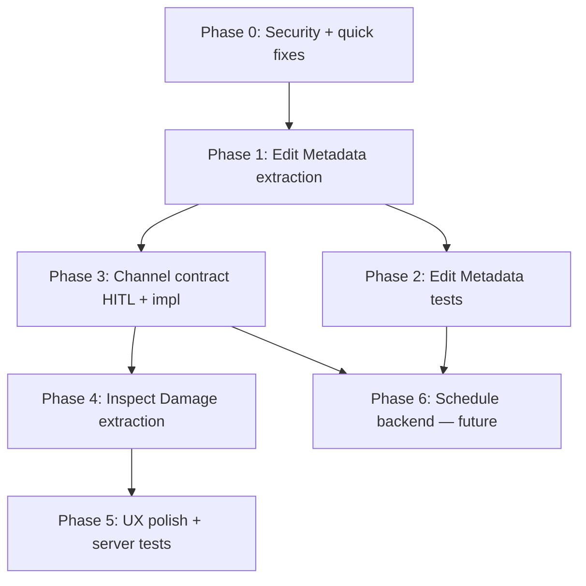

# Refactor Plan: Edit Metadata + Inspect Damage

**Package:** `12_schedule_upload_clientside`  
**Parent review:** [edit_metadata_page_reivew.md](./edit_metadata_page_reivew.md)  
**Related PRD:** [prd.md](./prd.md) (schedule UI shell — iteration 1 complete)  
**Related Fallow issue:** [FALLOW-13](../11_fallow_frontend_report_TODO/issues/FALLOW-13-refactor-database-edit-page.md)  
**Created:** 2026-06-08  
**Audience:** AFK coding agents, junior developers, tech lead reviewers

---

## Goal

Decompose two god-page routes (`/database/edit`, `/inspect-damage`) into testable feature modules **without changing user-visible behavior**, then close security and contract gaps so schedule-upload backend work (iteration 2) can land safely.

**Success definition:** Each route's `page.tsx` is a thin composer under **150 LOC**; no production regression; Fallow CRAP on edit page drops below 30 (FALLOW-13 criterion).

---

## How to use this plan

| Role | Action |
|------|--------|
| **Agent / junior dev** | Read [Agent handoff](#agent-handoff-instructions) → pick one issue from [`issues/`](./issues/) → implement only that slice → verify → update docs |
| **Tech lead** | Review phase order; resolve HITL issues before unblocking dependents |
| **PM** | Track by `REF-12-XX` IDs; Phase 6 is explicitly out of scope until Phase 1–3 complete |

**Do not** implement multiple issues in one PR unless they are explicitly marked as mergeable (none are).

---

## Phase overview



| Phase | Theme | Issues | Type mix | Est. effort |
|-------|-------|--------|----------|-------------|
| **0** | Close auth gap; trivial client fixes | REF-12-01, 02, 03 | AFK | 0.5 day |
| **1** | Edit Metadata feature module | REF-12-04 … 09 | AFK | 3–4 days |
| **2** | Edit Metadata behavior tests | REF-12-10 | AFK | 0.5 day |
| **3** | Shared channel-map contract | REF-12-11, 12 | HITL + AFK | 1–2 days |
| **4** | Inspect Damage feature module | REF-12-13 … 17 | AFK | 3–4 days |
| **5** | Stale UX, session cleanup, router tests | REF-12-18, 19, 20 | AFK + HITL | 1–2 days |
| **6** | Schedule upload backend | REF-12-21, 22 | HITL + AFK | TBD |

---

## Issue index

| ID | Title | Type | Phase | Blocked by |
|----|-------|------|-------|------------|
| [REF-12-01](./issues/REF-12-01-metadata-put-write-guard.md) | Add WriteUserDep to metadata PUT + router test | AFK | 0 | — |
| [REF-12-02](./issues/REF-12-02-filter-options-invalidation.md) | Invalidate filter-options after metadata save | AFK | 0 | — |
| [REF-12-03](./issues/REF-12-03-edit-metadata-shared-types.md) | Extract shared edit-metadata types and helpers | AFK | 0 | — |
| [REF-12-04](./issues/REF-12-04-metadata-draft-lib.md) | Extract program-version draft builders + unit tests | AFK | 1 | REF-12-03 |
| [REF-12-05](./issues/REF-12-05-metadata-draft-hooks.md) | Add use-program-version-selection + use-metadata-draft | AFK | 1 | REF-12-04 |
| [REF-12-06](./issues/REF-12-06-metadata-save-mutation.md) | Add useUpdateProgramVersionMetadata mutation hook | AFK | 1 | REF-12-05 |
| [REF-12-07](./issues/REF-12-07-metadata-fields-tab.md) | Extract MetadataFieldsTab component | AFK | 1 | REF-12-06 |
| [REF-12-08](./issues/REF-12-08-channel-map-hooks.md) | Add use-channel-map-editor + save mutation | AFK | 1 | REF-12-03 |
| [REF-12-09](./issues/REF-12-09-channel-map-tab.md) | Extract ChannelMapTab component | AFK | 1 | REF-12-08 |
| [REF-12-10](./issues/REF-12-10-thin-edit-page.md) | Thin edit page + feature module layout | AFK | 1 | REF-12-07, REF-12-09 |
| [REF-12-11](./issues/REF-12-11-schedule-upload-tests.md) | UploadScheduleSection + FileDropZone behavior tests | AFK | 2 | REF-12-10 |
| [REF-12-12](./issues/REF-12-12-channel-contract-adr.md) | ADR: channel-map + damage channel contract | HITL | 3 | REF-12-10 |
| [REF-12-13](./issues/REF-12-13-channel-schema-endpoint.md) | Server channel schema endpoint + client consumption | AFK | 3 | REF-12-12 |
| [REF-12-14](./issues/REF-12-14-damage-inspect-mutation.md) | Extract use-damage-inspect-mutation + fix cache policy | AFK | 4 | REF-12-13 |
| [REF-12-15](./issues/REF-12-15-damage-load-panel.md) | Extract DamageLoadDataPanel component | AFK | 4 | — |
| [REF-12-16](./issues/REF-12-16-damage-table-prefs-hook.md) | Extract use-damage-table-preferences from DamageTable | AFK | 4 | — |
| [REF-12-17](./issues/REF-12-17-damage-results-table.md) | Extract DamageResultsTable component | AFK | 4 | REF-12-16 |
| [REF-12-18](./issues/REF-12-18-thin-inspect-damage-page.md) | Thin inspect-damage page composer | AFK | 4 | REF-12-14, REF-12-15, REF-12-17 |
| [REF-12-19](./issues/REF-12-19-stale-damage-banner.md) | Stale damage results banner on selection change | AFK | 5 | REF-12-18 |
| [REF-12-20](./issues/REF-12-20-session-legacy-cleanup.md) | Deprecate inspect_damage_state.selected_event_ids | HITL | 5 | REF-12-18 |
| [REF-12-21](./issues/REF-12-21-router-test-expansion.md) | Expand damage + metadata router integration tests | AFK | 5 | REF-12-01 |
| [REF-12-22](./issues/REF-12-22-schedule-upload-adr.md) | ADR: schedule upload UX surface | HITL | 6 | REF-12-11, REF-12-13 |
| [REF-12-23](./issues/REF-12-23-schedule-upload-api.md) | Schedule upload API vertical slice | AFK | 6 | REF-12-22 |

---

## Recommended execution order

**Parallel tracks after Phase 0:**

- **Track A (Edit Metadata):** 04 → 05 → 06 → 07 → (08 → 09 in parallel with 05–07) → 10 → 11
- **Track B (Inspect Damage):** 15 → 17 can start during Phase 1; 14 waits for 13; 18 merges both
- **Track C (Contract):** 12 (human) → 13 → unblocks 14

**Minimum path to unblock schedule backend:** Phase 0 + Phase 1 (through REF-12-10) + REF-12-12 + REF-12-22.

---

## Agent handoff instructions

### Before you start

1. Read this file and your assigned issue under `issues/`.
2. Read [edit_metadata_page_reivew.md](./edit_metadata_page_reivew.md) §4 findings relevant to your issue ID.
3. Read `AGENTS.md` security checklist if touching server routes.
4. **Do not** read the entire 1,255-line `page.tsx` unless your issue requires it — use GitNexus or ripgrep to find symbols.

### While implementing

| Rule | Detail |
|------|--------|
| **Scope** | One `REF-12-XX` issue per PR. No drive-by refactors. |
| **Behavior** | Zero user-visible changes unless the issue says otherwise. |
| **Style** | Match surrounding code. No new abstractions beyond what the issue specifies. |
| **Server writes** | Verify cache invalidation (`server/utils/cache.py`) and ownership checks. |
| **Client saves** | Prefer `useMutation` over manual `fetch` + `invalidateQueries` when introducing new hooks. |
| **Tests** | Add behavior tests when the issue includes them. Do not add trivial assertion tests. |

### Verification (run from repo root)

```bash
# Server (if touched)
uv run pytest tests/server/ -q --tb=short

# Client (if touched)
cd client && npm test -- --runInBand 2>/dev/null || npm test
cd client && npm run build

# Complexity (after Phase 1 complete)
cd client && npx fallow health --score --targets 2>/dev/null | rg "database/edit" || true
```

### After completing an issue

1. Mark acceptance criteria checkboxes in the issue file (in your PR description, not committed unless team prefers).
2. Append a one-line decision to `docs/decisions/log.md` **only if** you made an architectural choice not already covered by an ADR.
3. For non-trivial work, add `docs/tasks/REF-12-XX.md` implementation notes.
4. Update `docs/master-build-plan.md` if a tracked task ID exists for this work.
5. **Do not** close FALLOW-13 until REF-12-10 acceptance criteria match FALLOW-13 criteria.

### Suggested Cursor skills

| Situation | Skill |
|-----------|-------|
| Extracting hooks/components | `engineering/tdd` — write behavior test first where specified |
| Unexpected regression | `engineering/diagnose` |
| Unfamiliar module | `zoom-out` or GitNexus `query` |
| Publishing to GitHub Issues | `engineering/to-issues` (tech lead only) |

### GitNexus commands (optional)

```bash
# Re-index after large moves
npx gitnexus analyze

# Before editing a symbol
# MCP: gitnexus impact({ target: "handleSave", direction: "upstream", repo: "analysis-dashboard" })
```

---

## Target end state

### `client/src/features/edit-metadata/`

```
edit-metadata/
├── index.ts
├── components/
│   ├── EditMetadataSidePanel.tsx    # moved from components/edit-metadata
│   ├── SelectDatasetSection.tsx
│   ├── UploadScheduleSection.tsx
│   ├── MetadataFieldsTab.tsx
│   ├── ChannelMapTab.tsx
│   └── DurabilityScheduleTab.tsx    # stub until REF-12-23
├── hooks/
│   ├── use-program-version-selection.ts
│   ├── use-metadata-draft.ts
│   ├── use-update-program-version-metadata.ts
│   ├── use-channel-map-editor.ts
│   └── use-save-channel-map.ts
├── lib/
│   ├── build-program-version-draft.ts
│   └── metadata-field-helpers.ts
└── types.ts
```

### `client/src/app/database/edit/page.tsx`

```tsx
// Target: import EditMetadataPage from '@/features/edit-metadata'
// and re-export as default — under 20 lines
```

### `client/src/features/inspect-damage/`

```
inspect-damage/
├── index.ts
├── components/
│   ├── InspectDamageLayout.tsx
│   ├── DamageLoadDataPanel.tsx
│   └── DamageResultsTable.tsx
├── hooks/
│   ├── use-damage-inspect-mutation.ts
│   ├── use-damage-table-preferences.ts
│   └── use-damage-results.ts
└── lib/                             # re-export or move inspect-damage-table-preferences
```

### `client/src/features/inspect-damage-3d/`

Unchanged — already well-factored. Import from inspect-damage page only.

---

## Out of scope (this plan)

- FALLOW-07/08 event-tree unification (separate package; REF-12-17 may benefit but must not block on it)
- Server-side damage precompute or caching (noted in review §M-05; future package)
- Replacing DuckDB or auth model
- Visual redesign of Edit Metadata forms

---

## Publishing to GitHub Issues (tech lead)

When ready to track in `tabesink/Dashboard`:

1. Create a parent issue: **"REF-12: Edit Metadata + Inspect Damage refactor"**
2. Publish child issues using the body from each `issues/REF-12-XX.md` file.
3. Label AFK issues `ready-for-agent`; HITL issues `ready-for-human`.
4. Link blocked-by relationships using GitHub issue references.

Use skill: `engineering/to-issues`.

---

## Changelog

| Date | Change |
|------|--------|
| 2026-06-08 | Initial plan from architecture review |
