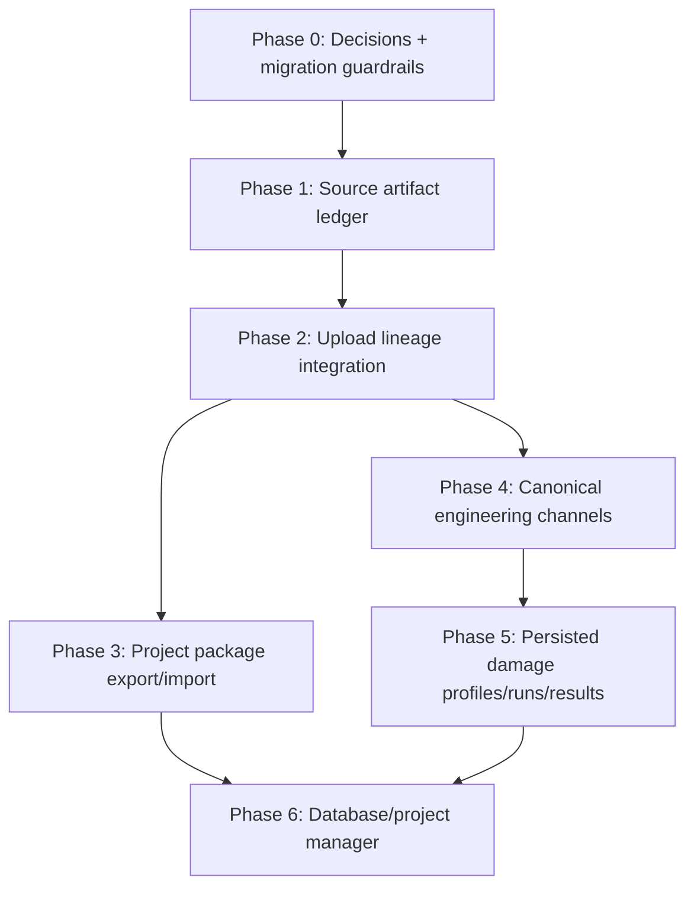

# Implementation Plan: Database Improvement Roadmap

**Package:** `13_database_improvement`  
**Related PRD:** [prd.md](./prd.md)  
**Related architecture:** [architecture-design.md](./architecture-design.md)  
**Created:** 2026-06-09  
**Audience:** Tech leads, AFK coding agents, reviewers

---

## Goal

Add source-of-truth storage, transfer portability, canonical channel lineage, and persisted damage results without destabilizing the current upload, dashboard, and admin export/import workflows.

**Success definition:** New uploads have recoverable source artifacts and lineage; project export/import can round-trip those artifacts with checksum validation; damage calculations can be persisted and traced to source/profile/channel inputs; legacy load-data workflows continue working until explicitly deprecated.

## Phase Overview



| Phase | Theme | Issue range | Risk |
|-------|-------|-------------|------|
| 0 | Human decisions and schema guardrails | DB-13-01 .. 03 | Medium |
| 1 | Source artifact service and tables | DB-13-04 .. 08 | Medium |
| 2 | Ingestion lineage for all uploads | DB-13-09 .. 13 | High |
| 3 | Project-package export/import | DB-13-14 .. 19 | High |
| 4 | Canonical channel model | DB-13-20 .. 24 | High |
| 5 | Persisted damage results | DB-13-25 .. 31 | High |
| 6 | Admin database/project manager | DB-13-32 .. 37 | High |

## Issue Index

| ID | Title | Type | Phase | Blocked by |
|----|-------|------|-------|------------|
| DB-13-01 | Resolve source retention and project-transfer decisions | HITL | 0 | - |
| DB-13-02 | ADR: source artifacts live outside DuckDB behind portable artifact URIs | HITL | 0 | DB-13-01 |
| DB-13-03 | Migration test harness for additive schema rollout | AFK | 0 | - |
| DB-13-04 | Add source-file and source-artifact schema tables | AFK | 1 | DB-13-02 |
| DB-13-05 | Add ingestion-run and event-source-link schema tables | AFK | 1 | DB-13-04 |
| DB-13-06 | Implement artifact URI resolver and path-safety tests | AFK | 1 | DB-13-02 |
| DB-13-07 | Implement source artifact service with checksum writes | AFK | 1 | DB-13-06 |
| DB-13-08 | Add best-effort lineage backfill for existing events | AFK | 1 | DB-13-05 |
| DB-13-09 | Store original uploaded artifact for successful CSV uploads | AFK | 2 | DB-13-07 |
| DB-13-10 | Store original and canonical artifacts for successful RSP uploads | AFK | 2 | DB-13-09 |
| DB-13-11 | Route pending channel-map retention through source artifact service | AFK | 2 | DB-13-07 |
| DB-13-12 | Snapshot channel maps used during ingestion | AFK | 2 | DB-13-05 |
| DB-13-13 | Link dim_event rows to ingestion lineage and source artifacts | AFK | 2 | DB-13-09, DB-13-12 |
| DB-13-14 | Define project package manifest schema and validators | AFK | 3 | DB-13-04 |
| DB-13-15 | Add project export mode including source artifacts | AFK | 3 | DB-13-14, DB-13-13 |
| DB-13-16 | Add checksum verification for package import validation | AFK | 3 | DB-13-14 |
| DB-13-17 | Import project package into staging database/artifact store | AFK | 3 | DB-13-15, DB-13-16 |
| DB-13-18 | Add export/import audit events for packages | AFK | 3 | DB-13-15, DB-13-17 |
| DB-13-19 | Keep legacy load-data export/import compatibility tests | AFK | 3 | DB-13-17 |
| DB-13-20 | ADR: canonical 21-channel taxonomy and units | HITL | 4 | DB-13-01 |
| DB-13-21 | Add dim_channel and event_channel_map schema | AFK | 4 | DB-13-20 |
| DB-13-22 | Bridge existing dim_channel_map into canonical channel mappings | AFK | 4 | DB-13-21 |
| DB-13-23 | Update ingestion to populate canonical event channel maps | AFK | 4 | DB-13-13, DB-13-21 |
| DB-13-24 | Add query service for canonical channel series | AFK | 4 | DB-13-23 |
| DB-13-25 | Add damage_profile, damage_run, and damage_result schema | AFK | 5 | DB-13-24 |
| DB-13-26 | Persist default notebook-equivalent fatigue profile | AFK | 5 | DB-13-25 |
| DB-13-27 | Create damage run service with lineage hash validity | AFK | 5 | DB-13-25 |
| DB-13-28 | Store damage results by event/channel/profile/run | AFK | 5 | DB-13-27 |
| DB-13-29 | Update inspect damage API to reuse persisted valid results | AFK | 5 | DB-13-28 |
| DB-13-30 | Add background damage run endpoints | AFK | 5 | DB-13-28 |
| DB-13-31 | Update Inspect Damage UI for cached/stale/running states | AFK | 5 | DB-13-29, DB-13-30 |
| DB-13-32 | ADR: database/project manager activation semantics | HITL | 6 | DB-13-17 |
| DB-13-33 | Add database/project registry schema | AFK | 6 | DB-13-32 |
| DB-13-34 | Add admin project list/create/clone APIs | AFK | 6 | DB-13-33 |
| DB-13-35 | Add import-as-new-project flow | AFK | 6 | DB-13-34 |
| DB-13-36 | Add explicit activate/switch workflow with cache invalidation | AFK | 6 | DB-13-35 |
| DB-13-37 | Add admin database manager UI | AFK | 6 | DB-13-34, DB-13-36 |

## Phase Details

### Phase 0: Decisions + Migration Guardrails

Resolve the high-impact product decisions before changing schema:

- Does every source artifact get retained indefinitely, or is retention policy configurable?
- Is `case` required now, or can it be introduced as nullable until workflows mature?
- Is the first transfer format table-based Parquet plus artifacts, a full DuckDB snapshot plus artifacts, or both?
- Which exact 21 canonical damage channels are in scope?
- Should saved filters/analysis views travel with project exports?

Verification:

- ADR or decision-log entry exists for source artifact storage.
- Migration tests can run against an existing minimal DB and current schema.
- No implementation starts on runtime database switching before activation semantics are decided.

### Phase 1: Source Artifact Ledger

Add the database and filesystem foundation without changing upload semantics yet.

Expected changes:

- Schema additions for source files, artifacts, ingestion runs, and event source links.
- Artifact URI resolver.
- Artifact service for immutable writes and checksum calculation.
- Best-effort backfill marking existing event lineage as partial when original bytes are not available.

Verification:

- Unit tests reject unsafe artifact URIs and path traversal.
- Schema doctor/diff accepts new additive tables.
- Existing upload/export/import tests still pass.
- Backfill does not fabricate source truth for historical events without original artifacts.

### Phase 2: Upload Lineage Integration

Wire all new uploads into the source artifact model.

Expected changes:

- CSV upload stores original bytes.
- RSP upload stores original bytes plus converted canonical CSV.
- Pending channel-map uploads use the same artifact service.
- Channel-map snapshots are created at ingestion time.
- Event rows link to source lineage.

Verification:

- Successful CSV upload creates source_file, original source_artifact, ingestion_run, and event_source_link.
- Successful RSP upload creates original and canonical artifacts.
- Pending upload has source lineage even before channel map completion.
- Existing cache invalidation and ownership rules still apply.

### Phase 3: Project Package Export/Import

Add a new transfer mode while preserving legacy load-data portability.

Expected changes:

- Manifest schema and validation.
- Project export packages source tables and artifacts.
- Import verifies checksums and references before staging.
- Import logs audit events.
- Legacy load-data export/import remains available or remains covered by compatibility tests.

Verification:

- Round-trip package test imports database rows and artifact bytes.
- Missing artifact fails validation before activation.
- Corrupt checksum fails validation.
- Package with absolute/path-traversal artifact path fails validation.
- Existing load-data export tests are updated only when the legacy contract intentionally changes.

### Phase 4: Canonical Engineering Channels

Separate engineering analysis channels from plot maps.

Expected changes:

- Canonical channel registry.
- Event channel map with source column, unit, scale, and sign convention.
- Bridge from existing plot channel maps for backwards compatibility.
- Query service for canonical event/channel series.

Verification:

- Existing plot rendering still uses plot map data.
- Damage channel resolution can use canonical channels without inferring from plot keys.
- Legacy generic channel names have deterministic migration/bridge behavior.
- Tests cover at least the current 12 damage channels and the intended 21-channel taxonomy.

### Phase 5: Persisted Damage Profiles, Runs, and Results

Promote damage inspection from on-demand UI calculation to reproducible analysis records.

Expected changes:

- Damage profile table seeded with current notebook-equivalent defaults.
- Damage run service computes input lineage hash.
- Damage results persisted by run/event/channel.
- Inspect endpoint returns persisted valid results where available.
- Background run endpoints support long calculations.
- UI distinguishes valid, missing, stale, running, unavailable, and error cells.

Verification:

- Repeated inspect request reuses valid persisted results.
- Changed profile settings produce a new run or stale status.
- Changed source/channel-map lineage invalidates or bypasses old results.
- Existing synchronous endpoint contract remains usable during transition.

### Phase 6: Admin Database/Project Manager

Turn portability into a safer project lifecycle.

Expected changes:

- Named database/project registry.
- Admin APIs to list, create blank, clone, import as new, and activate.
- Activation flow pauses writes, closes/switches store safely, clears caches, and forces clients to refresh.
- UI shows active database/project and available projects.

Verification:

- Import-as-new does not replace the active project.
- Activation requires explicit admin action and logs audit details.
- Failed activation leaves the previous active DB readable.
- Cache invalidation occurs after activation.

## Agent Handoff Rules

1. Implement one `DB-13-XX` slice per PR unless the tech lead explicitly groups adjacent schema-only tasks.
2. Before editing server symbols, run GitNexus impact analysis for the exact function/class being changed.
3. For database changes, read `docs/database-schema.txt` and update it alongside `server/schema.yaml`.
4. For write paths, verify ownership checks, audit logging, and cache invalidation.
5. Do not remove legacy export/import behavior unless the issue explicitly says to deprecate it.
6. Do not introduce direct arbitrary `.db` upload/switch behavior.
7. Treat source artifacts as immutable once linked to an ingestion run.

## Verification Commands

Run from repo root as applicable:

```bash
uv run pytest tests/server/services/test_ingestion_service_status.py -q --tb=short
uv run pytest tests/server/services/test_export_service.py -q --tb=short
uv run pytest tests/server/services/test_damage_query_service.py -q --tb=short
uv run pytest tests/server/routers/test_export_router.py -q --tb=short
```

For client-visible database manager or damage UI work:

```bash
cd client && npm test -- --runInBand 2>/dev/null || npm test
cd client && npm run build
```

## Documentation Updates Required During Implementation

- Update `docs/master-build-plan.md` with a tracked phase once this roadmap is accepted.
- Update `docs/database-schema.txt` for every schema change.
- Append to `docs/decisions/log.md` for source storage, canonical channel taxonomy, package format, and database activation semantics.
- Add `docs/tasks/DB-13-XX.md` implementation notes for non-trivial tasks.
