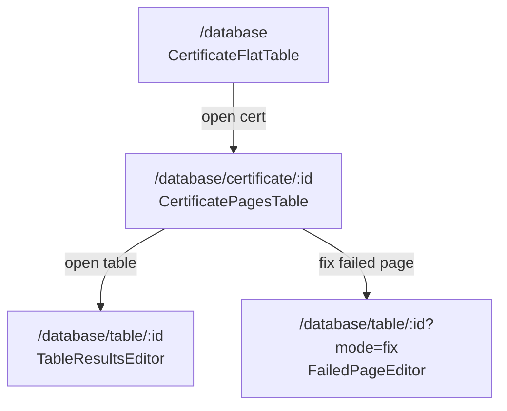

# Architecture — Table UI Systems

## Overview

The canartdb-ui database module uses a **three-screen navigation funnel** plus **two edit surfaces**:



| Route | Component | Paradigm | CRUD |
|-------|-----------|----------|------|
| `/database` | `CertificateFlatTable` | Flex flat | Batch delete certificates |
| `/database/certificate/[id]` | `CertificatePagesTable` | Flex 2-level tree | Navigate only (no inline edit) |
| `/database/table/[id]` | `TableResultsEditor` | Handsontable | Edit cells, add/remove rows, batch save |
| `/database/table/[id]?mode=fix` | `FailedPageEditor` | Handsontable | Edit CSV rows, commit to server |

Layout on list and certificate screens: **side panel (upload) + table card** in a horizontal flex row (`h-[calc(100vh-7rem)]`).

---

## Layer diagram

```
┌─────────────────────────────────────────────────────────┐
│  Page (route) — URL state, selection, mutations         │
├─────────────────────────────────────────────────────────┤
│  Table component — presentation only, callback props    │
├─────────────────────────────────────────────────────────┤
│  Hooks — React Query (useCertificateHierarchy, etc.)    │
├─────────────────────────────────────────────────────────┤
│  API client — databaseApi.* typed fetch wrappers        │
├─────────────────────────────────────────────────────────┤
│  Types — database.ts interfaces                         │
└─────────────────────────────────────────────────────────┘
```

**Rule:** Table components never call `fetch` directly. Pages own mutations; components emit events.

---

## Paradigm A — Flex tables (Workbench style)

### Shared building blocks

| Piece | Role |
|-------|------|
| `flexFor(basis)` | CSS flex shorthand for proportional column growth |
| `ColumnResizeHandle` | Drag-to-resize on header cells |
| `widthForValues()` | Heuristic initial column width from content |
| `columnWidthOverrides` state | User resize overrides keyed by column id |

### CertificateFlatTable (1 level)

- **Rows:** one certificate per row
- **Features:** checkbox batch select, sortable headers, pagination footer, delete toolbar
- **Navigation:** first column is a link button → certificate detail

### CertificatePagesTable (2 levels)

- **Level 1 (group):** Page row with metadata in data columns
- **Level 2 (leaf):** Table links; data columns intentionally empty
- **Lazy load:** `usePageTables(pageId)` runs only when page is expanded
- **Failed pages:** single leaf row → fix mode route

Indent and border rules come from `reference/database-table-skill/tokens.md`.

---

## Paradigm B — Handsontable editors

### TableResultsEditor (standard edit)

```
Server GET /tables/:id/results
        ↓
  tableQuery.data.rows (source of truth)
        ↓
  User edits → onRowsChange → local editorRows + hasUserEditedRows flag
        ↓
  diffRows(original, active) → BatchChange[]
        ↓
  PUT /certificates/:id/results-batch
```

Key behaviors:

- **Read-only columns:** `READ_ONLY_FIELDS` set → `columns: [{ readOnly: true }]`
- **Numeric normalization:** empty string → `null`; invalid → `null`
- **Row CRUD:** context menu `row_above`, `row_below`, `remove_row`
- **Reset:** discard local buffer, refetch from server

### FailedPageEditor (fix mode)

- Loads raw CSV via `getPageCsvContent`
- Maps header to canonical columns + optional `__extra_*` drift columns
- **Validation:** per-cell errors → `htInvalid` class; extras block commit
- **Column delete guard:** only `__extra_*` removable via context menu
- **Commit:** POST structured rows + page metadata

---

## Data contracts (summary)

See `reference/canartdb-ui/src/types/database.ts` for full shapes.

| Type | Used by |
|------|---------|
| `CertificateSummary` | Flat table rows |
| `PageSummary` | Group rows in pages table |
| `TableSummary` | Leaf rows (lazy loaded) |
| `TableResultRow` | Spreadsheet rows |
| `BatchChange` | Save diff payload |
| `RawCsvPayload` | Fix-mode CSV load |
| `CommitFailedPageRequest` | Fix-mode save |

---

## URL state conventions

| Param | Page | Purpose |
|-------|------|---------|
| `page`, `rows` | `/database` | Pagination |
| `sortBy`, `sortDir` | `/database` | Sort |
| `expandedPageIds` | certificate detail | Comma-separated page IDs; absent = all expanded |
| `mode=fix` | table detail | Switch to FailedPageEditor |
| `certificateId`, `pageNumber`, `failureKind` | table fix mode | Commit context |

Preserving query string across navigation keeps pagination/sort when drilling down and back.

---

## Query cache keys

```ts
['database', 'certificates', query]           // list
['database', 'certificates', id, 'pages']    // pages
['database', 'pages', pageId, 'tables']      // tables (lazy)
['database', 'tables', tableId, 'results']   // spreadsheet data
['database', 'pages', pageId, 'csv-content', tableNumber]
```

Invalidate `['database']` prefix after mutations.

---

## Pick your variant

| Target app need | Ship |
|-----------------|------|
| Admin list with delete + drill-down | Flat table only |
| Nested browse (project → task) | 2-level hierarchy template |
| Dense numeric grid editing | Handsontable editor only |
| Full canartdb parity | All routes + both paradigms |

For 3-level hierarchy (Program → Version → Event), start from `reference/database-table-skill/templates/HierarchicalTable.three-level.tsx` instead of `CertificatePagesTable`.
