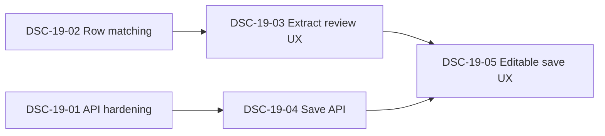

# Durability Schedule Implementation — Issue Index

**PRD:** [prd.md](./prd.md)  
**Handoff:** [HANDOFF.md](./HANDOFF.md)  
**Parent work:** DB14-06 (DONE), DEC-078

GitHub CLI (`gh`) is not available in some agent environments. Issues are filed locally under `issues/` using the same body template as GitHub Issues. When `gh` is available, publish each file to `tabesink/Dashboard` with label `ready-for-agent`.

## Dependency graph



## Issues

| ID | Title | Type | Blocked by | File |
|----|-------|------|------------|------|
| DSC-19-01 | Schedule attach/read API hardening | AFK | None | [issues/DSC-19-01-api-hardening.md](./issues/DSC-19-01-api-hardening.md) |
| DSC-19-02 | v2 notebook row matching module | AFK | None | [issues/DSC-19-02-row-matching.md](./issues/DSC-19-02-row-matching.md) |
| DSC-19-03 | Extract-to-review vertical slice | AFK | DSC-19-02 | [issues/DSC-19-03-extract-review-ux.md](./issues/DSC-19-03-extract-review-ux.md) |
| DSC-19-04 | PUT save schedule edits API | AFK | DSC-19-01 | [issues/DSC-19-04-save-api.md](./issues/DSC-19-04-save-api.md) |
| DSC-19-05 | Editable table and save UX | AFK | DSC-19-03, DSC-19-04 | [issues/DSC-19-05-editable-save-ux.md](./issues/DSC-19-05-editable-save-ux.md) |

## Suggested implementation order

1. DSC-19-01 and DSC-19-02 in parallel  
2. DSC-19-03 and DSC-19-04 in parallel  
3. DSC-19-05 last (completes the PRD)

## Publish to GitHub (when `gh` is available)

```bash
for f in docs/brainstorm/19_durability_sch_impl/issues/DSC-19-*.md; do
  title=$(head -1 "$f" | sed 's/^# //')
  gh issue create --title "$title" --body-file "$f" --label ready-for-agent
done
```

Adjust titles if GitHub rejects `#` prefixes in the first heading.
