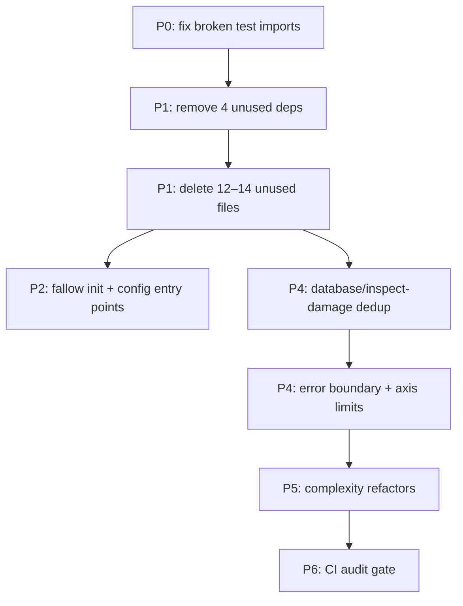

# Fallow Client v1 — Triage

Prioritized action plan from the 2026-06-12 baseline. Each item includes verdict, risk, and recommended action.

**Legend:** ✅ act · ⚠️ investigate · 🚫 suppress/config · ⏸ defer

---

## P0 — Fix real breakage (do first)

| ID | Finding | Verdict | Action |
|----|---------|---------|--------|
| P0-1 | `DurabilitySchedulePanel.test.tsx` imports missing `DamageValidationReportSummary` | ✅ **confirmed bug** | Component file does not exist. Fix test mock path or restore/move the component. |
| P0-2 | `channel-map-save.test.ts` imports missing `@/features/edit-metadata/lib/channel-map-save` | ✅ **confirmed bug** | Module does not exist; `saveProgramVersionChannelMap` has no implementation in `src/`. Delete orphaned test or implement/wire the module. |

These are the only **unresolved import** findings. They indicate broken tests, not Fallow false positives.

---

## P1 — Quick wins (low risk, high confidence)

### Unused npm dependencies (4)

| Package | Verdict | Notes |
|---------|---------|-------|
| `@hookform/resolvers` | ✅ remove | Zero imports in `src/` |
| `react-hook-form` | ✅ remove | Zero imports in `src/` |
| `zod` | ✅ remove | Zero imports in `src/` |
| `canvas-confetti` | ✅ remove | Listed in `package.json` only; no `src/` usage |

**Action:** `npm uninstall @hookform/resolvers react-hook-form zod canvas-confetti` from `client/`, then `npm test`.

### Unused files (14) — delete whole files

| File | Verdict | Notes |
|------|---------|-------|
| `src/components/ui/avatar.tsx` | ✅ delete | 100% dead shadcn scaffold |
| `src/components/ui/button-group.tsx` | ✅ delete | 100% dead shadcn scaffold |
| `src/components/ui/pagination.tsx` | ✅ delete | 100% dead shadcn scaffold |
| `src/components/ui/sheet.tsx` | ✅ delete | 100% dead shadcn scaffold |
| `src/components/ui/radio-group.tsx` | ✅ delete | Only self-references; no app imports |
| `src/components/layout/NavDocuments.tsx` | ✅ delete | Zero imports |
| `src/lib/utils/partition-sync.ts` | ⚠️ verify | Grep for dynamic import before delete |
| `src/components/blocks/dialog/index.ts` | ✅ delete | Barrel with no consumers |
| `src/components/dashboard/index.ts` | ✅ delete | Unused barrel |
| `src/components/layout/index.ts` | ✅ delete | Unused barrel |
| `src/lib/chart-utils/index.ts` | ✅ delete | Unused barrel |
| `src/lib/utils/index.ts` | ✅ delete | Unused barrel |
| `src/stores/index.ts` | ✅ delete | Unused barrel |
| `src/types/index.ts` | ✅ delete | Unused barrel |

**Action:** Delete confirmed files in one PR slice; run `npm test` and `npx fallow dead-code --unused-files`.

### Test-only production dependency

| Package | Verdict | Action |
|---------|---------|--------|
| `react-dom` | ⚠️ investigate | Next.js apps typically need `react-dom` at runtime. Likely Fallow false positive — **do not move** without confirming Next standalone build still works. |

---

## P2 — Config / codegen exports (suppress, don't delete blindly)

These modules have high dead-export % but may be consumed by codegen scripts:

| File | Dead % | Verdict | Action |
|------|-------:|---------|--------|
| `src/config/filters.ts` | 86% | 🚫 config | Check `scripts/generate-filters.js` consumers; add `.fallowrc.json` `entry` or `fallow-ignore` |
| `src/config/settings.ts` | 63% | 🚫 config | Check `scripts/generate-settings.js` |
| `src/config/version.ts` | 67% | 🚫 config | Check `scripts/generate-version.js` |

**Action:** Run `npx fallow init` and tune `entry` / `ignorePatterns` before pruning config exports.

---

## P3 — Partial shadcn dead exports (medium risk)

Files still imported but with many unused sub-exports:

| File | Dead % | Unused exports | Verdict |
|------|-------:|---------------:|---------|
| `dropdown-menu.tsx` | 67% | 10 | ⏸ defer — keep file, prune only if confirmed unused |
| `sidebar.tsx` | 50% | 12 | ⏸ defer |
| `select.tsx` | 50% | 5 | ⏸ defer |
| `color-picker.tsx` | 75% | 9 | ⚠️ investigate — may be partially adopted |

**Rule:** Do **not** delete these files. Only remove individual exports after grep confirms zero usage.

---

## P4 — Duplication (structural, medium–high effort)

Grouped by ROI. Overlaps with [FALLOW-06..11](../11_fallow_frontend_report_TODO/README_INDEX.md) from the prior audit.

| Priority | Family / area | Lines | Verdict | Suggested slice |
|----------|---------------|------:|---------|-----------------|
| 1 | `database/page.tsx` ↔ `inspect-damage/page.tsx` | 164 | ✅ act | Extract shared table-page hooks/helpers (9 clone groups in current branch) |
| 2 | Route `error.tsx` (3 files) | 18 | ✅ act | Shared error boundary component |
| 3 | `HierarchicalEventTree` ↔ `DatabaseEventTree` | 494 | ⏸ defer | Large refactor; high test surface |
| 4 | Progress panels (`derived-data`, `scope-delete`, `upload`) | 59–118 | ⚠️ investigate | Extract shared `PhaseStep` / progress shell |
| 5 | `ScopeDeleteOperationModal` ↔ `UploadOperationModal` | 192 | ⏸ defer | Operation-modal family |
| 6 | `PlotGrid` ↔ `scales` axis limits | 35 | ✅ act | Extract `calculateAxisLimits` shared helper |
| 7 | `binary-decoder.ts` ↔ worker | 51 | ✅ act | Share decode path |
| 8 | `api.ts` ↔ `upload.ts` types | 41 | ✅ act | Consolidate upload API types |
| 9 | `edit-metadata` test duplication | 65+ | ⏸ defer | Test helpers only; lower product impact |

**Changed-branch note:** All 9 inherited duplication groups in `fallow audit` are database ↔ inspect-damage — good first dedup target for the active branch.

---

## P5 — Complexity hotspots (higher touch)

| File | Top offender | CRAP | Verdict | Action |
|------|--------------|-----:|---------|--------|
| `DatabaseOperationModal.tsx` | `renderImportProgress` (CC 72) | 1191.7 | ⏸ defer | Extract render helpers; keep behavior identical |
| `DatabaseSwitchDialog.tsx` | component (CC 37) | 41.6 | ⚠️ investigate | Smaller than modal; moderate win |
| `SelectDatasetSection.tsx` | component (CC 23) | 552.0 | ⏸ defer | Edit-metadata flow |
| `database/page.tsx` | `DatabasePage` (906 LOC) | 156.0 | ⚠️ investigate | Dedup with inspect-damage may reduce complexity |
| `inspect-damage/page.tsx` | `DamageTable` (683 LOC) | 110.0 | ⚠️ investigate | Split table sub-component |
| `PlotGrid.tsx` / `scales.ts` | axis limit fns (cog 38) | 240.0 | ✅ act | Tie to P4-6 dedup slice |
| `global-filters/utils.ts` | 2 complex untested fns | — | ✅ act | Add tests before modifying (Fallow untested-risk target) |

**P5 progress (2026-06-12):**

- ✅ Added focused tests for `src/lib/chart-utils/scales.ts` to lock axis-limit behavior.
- ✅ Added focused tests for `src/components/dashboard/side-panel/global-filters/utils.ts` (filter normalization, chip building, and counts).
- ✅ Reduced branching complexity in `src/components/upload/DatabaseSwitchDialog.tsx` by extracting list rendering and primary-action button logic into local helper components without changing props/contracts.

**Removed since prior audit:** `database/edit/page.tsx` (`FilterValuesPage`, CC 68) no longer in top hotspots — likely already refactored.

---

## P6 — Duplicate export names (low urgency)

| Symbol | Locations | Verdict | Action |
|--------|-----------|---------|--------|
| `DamageCalculationScope` | cache + store | ✅ done | Store now imports canonical type from cache module |
| `MetadataDialogSection` | lib + store | ✅ done | Store now imports canonical type from metadata-sections lib |
| `UploadProgressPhase` | types + hook | ✅ done | Moved canonical type to `src/types/upload.ts`; feature+hook import from there |

No runtime breakage, but confusing for imports. Fix when touching those modules.

**P6 progress (2026-06-12):**

- ✅ Consolidated all three duplicate export names to one canonical definition each.
- ✅ Updated call sites/imports without changing runtime behavior.

---

## P7 — Barrel / feature index dead re-exports

Many unused exports are **re-exports** in feature `index.ts` files (charts, edit-metadata, upload, shared). These are often intentional public API surfaces.

| Area | Verdict | Action |
|------|---------|--------|
| `src/components/charts/index.ts` | ✅ done | Audited consumers; treated as intentional public barrel; suppressed via `.fallowrc` ignore pattern |
| `src/components/edit-metadata/index.ts` | ✅ done | Audited consumers; treated as feature public API; suppressed via `.fallowrc` ignore pattern |
| `src/components/upload/index.ts` | ✅ done | Audited consumers; treated as feature public API; suppressed via `.fallowrc` ignore pattern |
| `src/components/shared/index.ts` | ✅ done | Audited consumers; kept as shared public API surface (no blanket suppression) |

Prefer `.fallowrc.json` rule tuning (`unused-exports: warn`) over mass deletion.

**P7 progress (2026-06-12):**

- ✅ Confirmed active barrel consumers for charts/upload/shared paths in app code.
- ✅ Added targeted barrel `ignorePatterns` in `client/.fallowrc.json` to reduce dead re-export noise without deleting API surface.
- ✅ Cleared introduced dead-code findings from this slice by removing accidental unused type re-exports.
- ✅ Restored changed-code audit to pass (`npx fallow audit --format json --quiet` → `verdict: pass`, introduced counts all zero).

---

## Recommended execution order



## Acceptance checks per slice

```bash
cd client
npx fallow --format markdown        # full baseline count should drop
npx fallow audit --format markdown  # should stay pass on active branch
npm test
```

## What we are NOT doing in v1

- No aggressive barrel/API pruning from `unused-exports` findings; config suppression is preferred for intentional public surfaces
- No CI gate added (see [FALLOW-15](../11_fallow_frontend_report_TODO/issues/FALLOW-15-add-fallow-ci-gate.md))
- No broad baseline cleanup outside prioritized slices (P0–P7)
