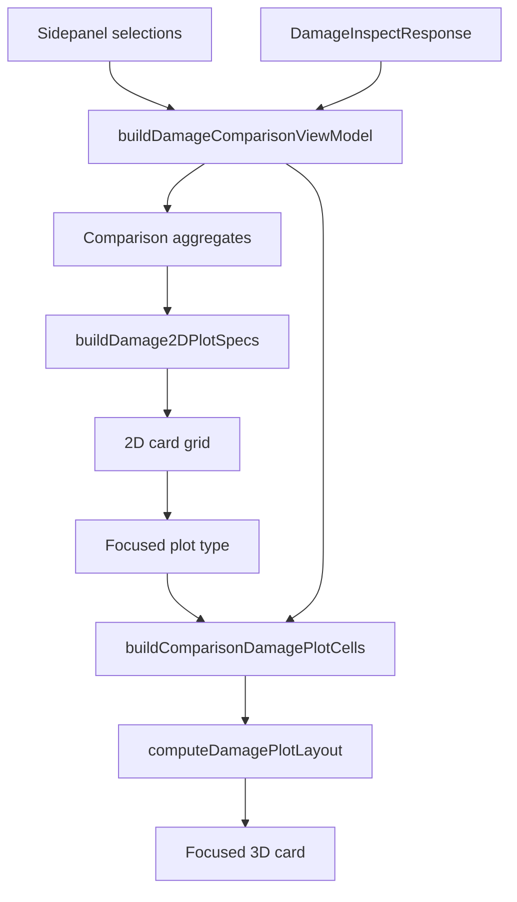

# PRD-35 Implementation Map

This is the shared technical truth for PRD-35 agents. Every implementation issue should read this file, the PRD, and `HANDOFF.md` before editing.

## Mission

Upgrade Inspect Damage plotting from a single 3D view with an overlay rail into a 2D-first card layout:

- Four 2D cards render together in the main plot area.
- One focused 3D card reuses the existing Three.js path.
- Sidepanel owns Reference/Target selection, selected plot channels, and value mode.
- The plot area owns only local plot display controls, currently the subtle Normal/Log damage scale toggle and the focused 3D card selection.

## Resolved Product Decisions

- Show all four 2D plot types together.
- Keep one focused 3D card, not one 3D card per plot type.
- Remove the current overlay plot rail.
- Move channel selection below Target Load Data in the Inspect Damage sidepanel.
- Keep value mode in the sidepanel Plot Inputs section.
- Remove version slicing from PRD-35.
- Enforce one Reference program/version scope and one Target program/version scope.
- Allow multiple selected events within each selected scope.
- Put the Normal/Log damage scale toggle inside the plot area as a subtle shared control.
- Implement signed absolute delta first; add the delta metric toggle later.

## Current Code Anchors

| Area | File | Notes |
|------|------|-------|
| Inspect Damage route shell | `client/src/app/inspect-damage/page.tsx` | Sidepanel + central table/plot tab composition |
| Comparison state | `client/src/types/damage-comparison.ts` | Persisted Reference/Target selections, channel keys, value mode |
| Comparison state helpers | `client/src/lib/damage-comparison-state.ts` | Defaults, merge, prune, derived program/version scope |
| View model | `client/src/features/inspect-damage/lib/build-damage-comparison-view-model.ts` | Empty states, selection summary, aggregate input |
| Aggregates | `client/src/features/inspect-damage/lib/build-damage-comparison-aggregates.ts` | Canonical comparison tables |
| 3D cells | `client/src/features/inspect-damage-3d/lib/build-comparison-damage-plot-cells.ts` | Existing plot-type to 3D cell conversion |
| 3D layout | `client/src/features/inspect-damage-3d/lib/damage-plot-layout.ts` | Existing Three.js layout model |
| 3D view | `client/src/features/inspect-damage-3d/components/DamagePlotView.tsx` | Current single plot area and overlay rail wiring |
| Overlay rail | `client/src/features/inspect-damage-3d/components/DamagePlotOverlayControls.tsx` | Remove from final PRD-35 UI |
| Dashboard card chrome | `client/src/components/charts/SVGPlotCard.tsx` | Source for shared `PlotCardShell` behavior |

## Target State Model

`DamageComparisonState` remains the source of persisted analysis selections.

Required PRD-35 additions:

```ts
type DamageComparisonState = {
  reference: { selected_event_ids: string[] };
  target: { selected_event_ids: string[] };
  selected_channel_keys: string[];
  value_mode: 'absolute' | 'normalized';
  aggregation_event_scope: 'selected_only' | 'all_in_program_version';
};
```

Do not persist computed plot data in session. Do not add version slice state.

Focused 3D plot type and damage scale can start as local UI state unless implementation discovers an existing route preference pattern that is cheaper to reuse.

## One-Scope Invariant

The route compares one Reference program/version scope to one Target program/version scope.

Allowed:

```text
Reference: Program A / V1 / events 1, 2, 3
Target:    Program B / V2 / events 8, 9
```

Not allowed within one side:

```text
Reference: Program A / V1 / event 1 + Program A / V2 / event 2
Target:    Program B / V2 / event 8
```

Recommended behavior:

- The first selected event in a Reference or Target tree establishes that side's active program/version scope.
- Additional selections in the same side must belong to that same scope.
- Selecting a different program/version should either clear that side and select the new scope, or show an explicit confirmation. Use the simpler clear-and-select behavior unless user feedback says confirmation is needed.
- Empty state should make missing Reference, missing Target, or mixed-scope rejection understandable.

## Target Data Flow



## 2D Spec Contract

Prefer one spec builder entry point that can build all card specs together:

```ts
type Damage2DChartKind =
  | 'grouped-bar'
  | 'heatmap'
  | 'program-version-bar'
  | 'diverging-bar';

type Damage2DPlotSpec = {
  plotType: DamagePlotType;
  chartKind: Damage2DChartKind;
  title: string;
  subtitle: string;
  xCategories: string[];
  yScale: {
    mode: DamagePlotScaleMode;
    domain: [number, number];
    tickFormat: 'linear' | 'log' | 'percent' | 'ratio';
  };
  series: Array<{
    id: string;
    label: string;
    color: string;
    values: number[];
    flags?: Array<'low_reference' | 'excluded'>;
  }>;
  legend: Array<{
    label: string;
    color: string;
    role: 'reference' | 'target' | 'delta' | 'magnitude';
  }>;
  warnings: string[];
  emptyState: { title: string; description: string } | null;
};
```

Invariants:

- The spec builder reads aggregate outputs only.
- The spec builder never recomputes fatigue damage.
- Selected channels are respected in every spec.
- Absolute/normalized value mode has the same meaning across 2D and 3D.
- Log scale uses `log10(1 + value)` consistently across 2D and 3D.
- Low-reference rows are flagged for percent/ratio metrics, not rendered as misleading extremes.

## UI Shape

Sidepanel:

```text
+-----------------------------+
| Filter Data                 |
|-----------------------------|
| Reference Load Data         |
|   one program/version scope |
|-----------------------------|
| Target Load Data            |
|   one program/version scope |
|-----------------------------|
| Plot Inputs                 |
|   Channels                  |
|   [BJ] [Shock] [Bush F] ... |
|   Value [Absolute][Norm.]   |
+-----------------------------+
```

Main plot area:

```text
+--------------------------------------------------------------------------+
| Damage comparison                                             [Normal Log]|
|                                                                          |
| +----------------------+ +----------------------+                         |
| | 2D Cumulative Ch.    | | 2D Absolute Event    |                         |
| +----------------------+ +----------------------+                         |
| +----------------------+ +----------------------+                         |
| | 2D Program/Version   | | 2D Delta vs Ref      |                         |
| +----------------------+ +----------------------+                         |
| +--------------------------------------------------------------------+   |
| | Focused 3D card                                                     |   |
| +--------------------------------------------------------------------+   |
+--------------------------------------------------------------------------+
```

## Renderer Rules

- 2D grouped bar: cumulative damage by channel.
- 2D heatmap: absolute damage by event.
- 2D program/version card: Reference selected scope versus Target selected scope.
- 2D diverging bar: signed absolute target delta first.
- Focused 3D: existing 3D renderer for the focused plot type.

Only one Three.js canvas should be mounted in the main layout.

## Non-Goals

- Backend damage API changes.
- Fatigue damage recalculation changes.
- New persisted plot data.
- Per-card channel/value-mode controls.
- One 3D card per plot type.
- Version slice controls.
- Mixed program/version selections within one side.
- Dashboard route plotting changes.
- Full export workflow.
- Large folder rename as a prerequisite.

## Issue Order

1. `PU-35-00` Documentation baseline.
2. `PU-35-01` One-scope sidepanel selection enforcement. **DONE (2026-06-15)**
3. `PU-35-02` Sidepanel Plot Inputs. **DONE (2026-06-15)**
4. `PU-35-03` Shared plot card shell. **DONE (2026-06-15)**
5. `PU-35-04` Shared damage scale toggle and transform. **DONE (2026-06-15)**
6. `PU-35-05` Cumulative-by-channel 2D spec. **DONE (2026-06-15)**
7. `PU-35-06` Cumulative-by-channel 2D renderer. **DONE (2026-06-15)**
8. `PU-35-07` 2D card grid plus focused 3D card. **DONE (2026-06-15)**
9. `PU-35-08` Absolute-by-event heatmap. **DONE (2026-06-15)**
10. `PU-35-09` Program/version comparison card. **DONE (2026-06-15)**
11. `PU-35-10` Signed delta card. **DONE (2026-06-15)**
12. `PU-35-11` Delta metric toggle. **DONE (2026-06-15)**
13. `PU-35-12` Polish, empty states, accessibility. **NEXT**

## Verification Strategy

- Unit-test pure data/spec builders first.
- Component-test sidepanel Plot Inputs and plot-card routing.
- Keep SVG renderer tests high level: labels, roles, tooltips, warnings, and rendered categories.
- Run focused frontend tests after each issue.
- Run GitNexus `detect_changes()` before commits that include code changes.
