# Architecture Audit — Grid Layout Plot Generation

Senior-engineer review of Dashboard grid plot generation (backend + frontend) with implications for Inspect Damage 2D/3D plot cards.

**Scope:** Read-only audit. No functionality changes. Findings inform PRD-35 implementation.

---

## Executive summary

The codebase runs **two parallel plotting architectures**:

| Path | Status | Frontend usage |
|------|--------|----------------|
| **Client SVG** via `/plots/data/binary` | **Active** (P11-01) | `PlotGrid`, `InteractiveViewer` |
| **Server matplotlib** via `/render-grid`, `/render-interactive`, `/click-query` | Implemented (P4-02), **dead** | None |

Inspect Damage has a **mature client-only categorical pipeline** (view model → aggregates → cells → layout → Three.js) that is architecturally closer to what PRD-35 needs than the Dashboard line-curve path — but it lacks Dashboard card chrome, SVG renderers, and progressive loading patterns.

---

## Clean architecture breakdown

### Layer 1 — Data acquisition

| Concern | Dashboard (active) | Dashboard (legacy) | Inspect Damage |
|---------|-------------------|-------------------|----------------|
| Source | DuckDB `measurements_lttb` | Same | `DamageInspectResponse` (already loaded) |
| API | `POST /plots/data/binary` | `POST /render-grid` (NDJSON PNG) | No plot API; client aggregates |
| Fetch pattern | 8 sequential HTTP, 1 plot_key each | 1 HTTP, all keys, sync matplotlib | `useMemo` on view model |
| Cache | None (binary); JSON path cached but broken | `SimpleCache` 600s TTL | Session-persisted comparison state |
| Limits | `max_events_per_query` enforced | **Not enforced** on render endpoints | `MAX_RENDERED_CELLS = 300` cap |

### Layer 2 — Transform / normalization

| Concern | Dashboard | Inspect Damage |
|---------|-----------|----------------|
| Raw → render model | `BinaryCurveData` → `SVGPlotCurvesData` → `Curve[]` | `RawFacts` → `Aggregates` → `DamagePlotCell[]` |
| Plot key / type | Static 8 keys from `settings.yaml` | 4 plot types (`DamagePlotType`) |
| Filtering | Pinned mode, curve visibility | Channel selection, version slice, value mode |
| Axis envelope | Per-plot + group sync (`bjShock` / `bushing`) | `computeDamagePlotLayout` (3D bar scale) |
| Testability | Limited unit tests on decode/scales | Strong aggregate + cell builder tests |

### Layer 3 — Presentation

| Concern | Dashboard grid | Dashboard interactive | Inspect Damage 3D |
|---------|---------------|----------------------|-------------------|
| Shell | `SVGPlotCard` | Canvas in `Card` | Custom border card + overlay rail |
| Renderer | `SVGPlot` (`renderMode="grid"`) | `InteractiveCanvasPlot` | `DamagePlotCanvas` (Three.js) |
| Progressive load | Per-card spinner | Lazy fetch single key | Instant (in-memory) |
| Empty/loading/error | Unified in `SVGPlotCard` | Ad-hoc in `InteractiveViewer` | Split between view model + inline |
| Legend | Per-curve colors | Hover tooltip | `DamagePlotColorLegend` |

### Target architecture for PRD-35

```
InspectDamageResponse (already loaded)
        ↓
buildDamageComparisonViewModel()
        ↓
buildComparisonDamagePlotCells()     ← existing (3D cells)
        ↓
buildDamage2DPlotSpec()            ← NEW: plot-type → 2D spec
        ↓
PlotCardShell (reuse SVGPlotCard chrome)
        ↓
Renderer strategy: SVG2D | Three3D
```

Plot type and visualization mode stay **orthogonal**. Aggregation layer is **canonical**; renderers are **pluggable**.

---

## Critical problem areas

### P0 — Correctness

1. **`_get_events_metadata_bulk` missing** — `QueryService._fetch_plot_data` calls it on cache miss; method is undefined. Breaks JSON plot path (`/plot-data`, `/plots/data`, legacy render endpoints). Active binary path bypasses it.

2. **Scale mismatch (legacy)** — `PlotImageService._get_valid_xy` divides by 1000; client SVG uses raw DB values. If `/render-grid` were re-enabled, axes would disagree with live UI.

3. **`renderVersion` dead field** — Declared in `render-store` for cache invalidation but never read or incremented.

### P1 — Performance bottlenecks

1. **N sequential HTTP requests** — 8 plots × concurrency 1 (`MAX_CONCURRENT_PLOT_FETCHES`). Each sends full `event_ids` with one `plot_key`. API supports multiple keys; client does not use it.

2. **Full cache wipe every render** — `clearCachedPlots()` at fetch start; no diff/incremental update.

3. **Blocking matplotlib in async generator** — `/render-grid` runs sync pandas + matplotlib on the event loop.

4. **Binary path uncached** — Every render hits DuckDB; JSON cache exists but is broken and unused by active path.

5. **SVG path rebuild** — `PlotGrid.plotCacheRef` helps derived cache, but resets on tab unmount.

6. **Interactive point materialization** — `getCurvePoints` builds full `Point[]` from Float32Arrays (memory spike).

### P2 — Scalability risks

| Risk | Dashboard | Damage |
|------|-----------|--------|
| Event count growth | Linear payload per request × 8 | 3D capped at 300 cells; 2D heatmap preferred for dense views |
| Plot count growth | `MAX_CACHED_PLOTS = 10` FIFO eviction | Single plot area today |
| Multi-worker cache | In-memory `SimpleCache`, no cross-process sharing | N/A (client-only) |
| No virtualization | All 8 grid cards always mounted | Single canvas |

### P3 — Maintainability

1. **Duplicated curve transform** — `PlotGrid` and `InteractiveViewer` both map `SVGPlotCurvesData` → `Curve[]` with different pinned semantics (filter vs grey-out).

2. **Dual caches** — `render-store.cachedPlots` (raw) + `PlotGrid.plotCacheRef` (derived `PlotInfo`).

3. **Duplicated selection/dirty logic** — `hasUnrenderedSelection` in multiple modules; `useFilterSelectionSync` exported but never mounted.

4. **Static plot keys** — `settings.yaml` → codegen; no runtime discovery from channel map.

5. **Broken prop wiring** — `DashboardPage` passes `columns` to `PlotGrid` but `DashboardTabs` renders tabs without props.

6. **Session restore gap** — `rendered_event_ids` persist; `cachedPlots` do not. User must re-click Render after reload.

7. **Parallel config types** — `PlotAxisSettings`, `ColorGroupingConfig` duplicated in `server/models/dashboard.py` and `server/services/plot_image.py`.

8. **Folder naming drift** — Damage code lives under `inspect-damage-3d` but will serve 2D too (PRD acknowledges future rename).

---

## Bad architecture decisions (ranked)

| # | Decision | Why it's problematic | Severity |
|---|----------|---------------------|----------|
| 1 | Two rendering stacks (client SVG + server matplotlib) | Dual maintenance, scale mismatch, dead code | High |
| 2 | Sequential per-plot HTTP when API supports batch | 8× latency, 8× DB query potential | High |
| 3 | Curve transform duplicated across grid/interactive | Divergent pinned semantics, bug surface | Medium |
| 4 | Render trigger via global `isRendering` flag | Implicit coupling between toolbar and `PlotGrid` effect | Medium |
| 5 | Damage overlay controls embedded in plot view | Hard to reuse card grid layout from Dashboard | Medium |
| 6 | 3D-only module naming | Confusing ownership for 2D work | Low |
| 7 | `render-grid` documented as SSE but returns NDJSON | Operator confusion | Low |

---

## Duplicate logic inventory

| Logic | Locations |
|-------|-----------|
| `SVGPlotCurvesData` → `Curve[]` | `PlotGrid.tsx`, `InteractiveViewer.tsx` |
| Series → DataFrame flattening | `render_grid`, `render_interactive`, `click_query` (server) |
| `plot_key.split("_vs_")` axis labels | Server router helpers |
| LTTB fetch + groupby | `get_plot_data`, `get_plot_data_binary` |
| `hasUnrenderedSelection` | `session-sync.ts`, `resolve-dashboard-workspace.ts`, `use-filter-state.ts` |
| Axis limit calculation | `calculateAxisLimits` (curves) vs `computeDamagePlotLayout` (cells) — similar intent, different inputs |
| Log scale transform | `DamagePlotView` inline `log10(1+x)` — should be shared utility for 2D/3D |

---

## Refactoring strategies (quality-only, no behavior change)

See [REFACTORING_STRATEGIES.md](./REFACTORING_STRATEGIES.md) for detailed patterns. Summary:

1. **Extract `usePlotCurves` hook** — single transform from raw API data to `Curve[]`.
2. **Batch binary fetch** — one request with all `plot_keys`; partition client-side.
3. **Extract `PlotCardShell`** — generalize `SVGPlotCard` chrome for damage 2D/3D.
4. **Unify log scale** — `transformDamageScale(value, mode)` shared by 2D and 3D.
5. **Fix `_get_events_metadata_bulk`** — implement or remove JSON cache path dead code.
6. **Deprecate matplotlib endpoints** — document as legacy; gate behind flag if exports need them.
7. **Session restore hook** — auto re-fetch when `rendered_event_ids` present but cache empty.
8. **Renderer strategy interface** — `svg-grid | canvas-interactive | svg-categorical | three-damage`.

---

## Improved production-grade patterns (reference implementations)

These are **target shapes** for future slices — not implemented in this audit.

### Shared plot data source interface

```typescript
interface PlotDataSource<TCell, TSpec> {
  readonly cells: readonly TCell[];
  readonly spec: TSpec | null;
  readonly isLoading: boolean;
  readonly errors: Readonly<Record<string, string>>;
  readonly emptyState: { title: string; description: string } | null;
  fetch(scope: unknown): void;
  abort(): void;
}
```

### 2D damage spec builder (PRD-35 core module)

```typescript
interface Damage2DPlotSpec {
  plotType: DamagePlotType;
  chartKind: 'grouped-bar' | 'heatmap' | 'diverging-bar' | 'program-version-bar';
  title: string;
  subtitle: string;
  xDomain: string[];
  yDomain: number[];
  series: Array<{ id: string; label: string; color: string; values: number[] }>;
  warnings: string[];
  legend: Array<{ label: string; color: string }>;
}

function buildDamage2DPlotSpec(input: {
  viewModel: DamageComparisonViewModel;
  plotType: DamagePlotType;
  valueMode: DamagePlotValueMode;
  selectedChannelKeys: readonly string[];
  version: string | undefined;
  damageScaleMode: DamagePlotScaleMode;
}): Damage2DPlotSpec | null;
```

### Batch fetch (dashboard quality fix)

```typescript
// One DB round-trip, progressive UI via worker partition
const buffer = await dashboardApi.getSVGPlotDataBinary({
  event_ids: eventIds,
  plot_keys: ALL_PLOT_KEYS, // not [singleKey]
});
const grouped = await decodeBinaryPlotDataInWorker(buffer);
for (const plotKey of ALL_PLOT_KEYS) {
  updateCachedPlot(plotKey, toSVGPlotCurvesData(grouped.get(plotKey) ?? []));
}
```

---

## Priority matrix for PRD-35 implementation

| Priority | Work item | Rationale |
|----------|-----------|-----------|
| P0 | `buildDamage2DPlotSpec` + tests | Core PRD contract; first slice = cumulative by channel |
| P0 | `PlotCardShell` wrapping 2D renderer | Dashboard visual parity |
| P1 | Visualization mode toggle (2D default, 3D retained) | PRD orthogonal control |
| P1 | Shared log scale + low-reference guards in spec builder | Notebook parity |
| P2 | Extract `usePlotCurves` (dashboard debt) | Reduces future merge conflicts |
| P2 | Batch binary fetch (dashboard debt) | Independent perf win |
| P3 | Deprecate `/render-grid` | Reduce backend surface |
| P3 | Rename `inspect-damage-3d` → `inspect-damage-plots` | Clarity after 2D lands |

---

## Diagram — current vs target

```mermaid
flowchart TB
  subgraph today_dashboard [Dashboard Today]
    R[Render Button] --> SEQ[8 sequential binary fetches]
    SEQ --> CACHE[render-store.cachedPlots]
    CACHE --> TRANS[PlotGrid curve transform]
    TRANS --> CARD[SVGPlotCard + SVGPlot]
  end

  subgraph today_damage [Inspect Damage Today]
    VM[buildDamageComparisonViewModel] --> CELLS[buildComparisonDamagePlotCells]
    CELLS --> LAYOUT[computeDamagePlotLayout]
    LAYOUT --> THREE[DamagePlotCanvas 3D]
  end

  subgraph target [PRD-35 Target]
    VM2[View Model] --> CELLS2[Cell Builder]
    CELLS2 --> SPEC[buildDamage2DPlotSpec NEW]
    CELLS2 --> LAYOUT2[3D Layout existing]
    SPEC --> SHELL[PlotCardShell]
    LAYOUT2 --> SHELL
    SHELL --> R2D[SVG Categorical Renderer]
    SHELL --> R3D[Three.js Renderer]
  end
```


