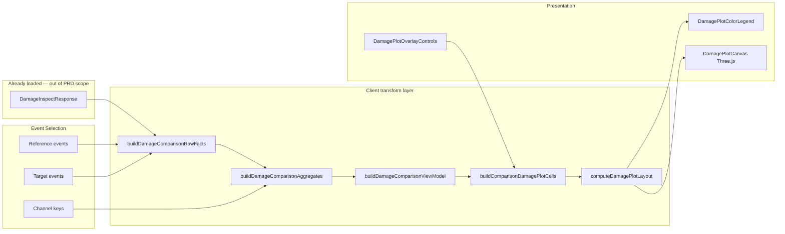

# Inspect Damage Plot — Current State

How Inspect Damage plotting works today and what must change for PRD-35 (2D-first + retained 3D).

---

## Current pipeline



**Key property:** No network call on plot type / scale change. All transforms are synchronous `useMemo` over already-loaded inspect-damage results. This matches PRD requirement #33.

---

## Entry point

`client/src/app/inspect-damage/page.tsx` composes:
- Event selection panels (Reference / Target)
- `InspectDamageCentralTabSwitcher` (table vs plot)
- `DamagePlotView` (central plot area)

State: `DamageComparisonState` in session (`client/src/lib/damage-comparison-state.ts`)

---

## Layer 1 — View model

**File:** `client/src/features/inspect-damage/lib/build-damage-comparison-view-model.ts`

**Output:** `DamageComparisonViewModel`

```typescript
{
  inspectEventIds: string[];
  emptyState: { code, title, description } | null;
  selectionSummary: { referenceEventCount, targetEventCount, channelCount, valueMode };
  subtitleText: string;
  legendText: string;
  aggregates: DamageComparisonAggregateOutput | null;
}
```

**Empty state codes:**
- `missing_reference_events`
- `missing_target_events`
- `missing_channels`
- `missing_damage_response`
- `missing_usable_damage`

**Tests:** `build-damage-comparison-view-model.test.ts` — good prior art for PRD-35 empty-state tests.

---

## Layer 2 — Aggregates (canonical comparison data)

**File:** `client/src/features/inspect-damage/lib/build-damage-comparison-aggregates.ts`

**Tables produced:**

| Table | Use |
|-------|-----|
| `program_version` | Cumulative by program/version plot |
| `event_channel` | Absolute by event, cumulative by channel |
| `channel` | Per-dataset channel totals |
| `channel_delta` | Target Δ vs Reference |

**Value modes:**
- `absolute` → `selected_value` from `absolute_damage`
- `normalized` → `selected_value` from `normalized_damage`

**Guards:**
- `low_reference` flag on delta rows
- `low_reference_threshold` configurable (default in aggregates)

**Tests:** `build-damage-comparison-aggregates.test.ts` — PRD says preserve this layer; 2D spec builder consumes it.

---

## Layer 3 — Cell builder (3D render model)

**File:** `client/src/features/inspect-damage-3d/lib/build-comparison-damage-plot-cells.ts`

**Input:**

```typescript
{
  viewModel: DamageComparisonViewModel;
  plotType: DamagePlotType;
  selectedChannelKeys: readonly string[];
  version: string | undefined;
  channels: readonly DamageChannelDefinition[];
}
```

**Output:**

```typescript
{
  cells: DamagePlotCell[];
  channels: DamageChannelDefinition[];
  versions: string[];
  effectiveVersion: string | undefined;
  emptyMessage: string;
}
```

**Plot type → builder mapping:**

| `DamagePlotType` | Builder | Cell semantics |
|------------------|---------|----------------|
| `cumulative_by_channel` | `buildChannelTotalsCells` | 2 cells per channel (Ref/Target) |
| `absolute_by_event` | `buildEventChannelCells` | event × channel matrix |
| `cumulative_by_program_version` | `buildProgramVersionCells` | program/version rows |
| `target_delta_vs_reference` | `buildDeltaCells` | per-channel delta magnitude |

**Tests:** `build-comparison-damage-plot-cells.test.ts`

---

## Layer 4 — Layout (3D only)

**File:** `client/src/features/inspect-damage-3d/lib/damage-plot-layout.ts`

- Maps cells to Three.js bar positions/scales/colors
- Uses `getDamageColor` from `damage-color-scale.ts`
- Axes: X = channels, Z = events, Y = damage height

**Not suitable for 2D** — 2D needs separate layout/spec module per PRD.

---

## Layer 5 — View component

**File:** `client/src/features/inspect-damage-3d/components/DamagePlotView.tsx`

### Local display state (not in session)

```typescript
{
  plotType: DamagePlotType;
  version: string | undefined;
  damageScaleMode: 'linear' | 'log';
}
```

### Session-owned comparison state

```typescript
// DamageComparisonState
{
  reference: { selected_event_ids };
  target: { selected_event_ids };
  selected_channel_keys: string[];
  value_mode: 'absolute' | 'normalized';
}
```

### Render cap

```typescript
const MAX_RENDERED_CELLS = 300;
const renderedCells = cells.slice(0, MAX_RENDERED_CELLS);
const isCapped = cells.length > renderedCells.length;
```

Warning surfaced in `DamagePlotOverlayControls` when capped.

### Log scale

```typescript
displayState.damageScaleMode === 'log'
  ? renderedCells.map(cell => ({ ...cell, damage: Math.log10(1 + cell.damage) }))
  : renderedCells
```

**Gap:** Inline transform — should be extracted for 2D/3D parity (PRD #21).

### Layout structure

```
┌─────────────────────────────────────────────┐
│  [DamagePlotOverlayControls]  pl-60 rail    │
│  ┌─────────────────────────────────────┐    │
│  │     DamagePlotCanvas (3D)           │    │
│  │                    [ColorLegend]    │    │
│  └─────────────────────────────────────┘    │
└─────────────────────────────────────────────┘
```

- Single card with `rounded-md border bg-card`
- Left rail `pl-60` reserves 240px for controls
- **No `SVGPlotCard`** — different chrome from Dashboard

---

## Control rail

**File:** `client/src/features/inspect-damage-3d/components/DamagePlotOverlayControls.tsx`

Controls:
- Plot type (4 options from `DAMAGE_PLOT_TYPE_OPTIONS`)
- Value mode (absolute / normalized)
- Channel checkboxes
- Version slice
- Damage scale (linear / log)
- Cap warning when `isCapped`

**PRD gaps vs current:**
- No visualization mode toggle (2D vs 3D)
- Plot type may be dropdown-style — PRD wants direct rows with checkboxes
- Rail should stay visible in empty states (partially true today)

---

## Comparison vs Dashboard grid

| Dimension | Dashboard grid | Inspect Damage 3D |
|-----------|---------------|-------------------|
| Data source | Network (binary LTTB) | In-memory aggregates |
| Plot count | 8 fixed cards | 1 plot area |
| Card shell | `SVGPlotCard` | Custom border div |
| Renderer | SVG lines | Three.js bars |
| Progressive load | Per-card loading | Instant |
| Axis model | Continuous X/Y | Categorical channel × event |
| Color semantics | Per-event palette | Damage magnitude scale |
| Shared axes | Group sync (bjShock/bushing) | N/A |
| Render button | Explicit Render | Implicit (data already loaded) |
| Session restore | rendered_event_ids without cache | Comparison state persisted |
| Density guard | None | 300 cell cap |
| Test coverage | Decode/scales | Strong aggregate + cell tests |

---

## What PRD-35 adds (delta from current)

| Addition | Builds on |
|----------|-----------|
| `visualizationMode: '2d' | '3d'` | New state; 3D = current path |
| `buildDamage2DPlotSpec()` | `DamageComparisonViewModel` + aggregates |
| SVG categorical renderers | `SVGPlot` patterns (not line curves) |
| `PlotCardShell` from Dashboard | `SVGPlotCard` chrome |
| Visualization mode segmented control | `DamagePlotOverlayControls` |
| 2D default | `DamagePlotView` routing |
| Heatmap for `absolute_by_event` | New renderer; cells already exist |
| Semantic Ref/Target colors | Not Dashboard event colors |

---

## Recommended module layout (post-PRD)

```
client/src/features/inspect-damage-plots/   # rename from inspect-damage-3d
  lib/
    build-comparison-damage-plot-cells.ts   # existing — shared by 2D/3D
    build-damage-2d-plot-spec.ts            # NEW
    damage-plot-layout.ts                   # 3D only
    damage-color-scale.ts                   # shared magnitude scale
    damage-scale-transform.ts               # NEW — linear/log shared
    damage-plot-overlay-types.ts
  components/
    DamagePlotView.tsx                      # mode router
    DamagePlotControlRail.tsx               # extracted from overlay
    DamagePlot2DChart.tsx                   # NEW — SVG categorical
    DamagePlotCanvas.client.tsx             # existing 3D
    DamagePlotColorLegend.tsx
  __tests__/
    build-damage-2d-plot-spec.test.ts       # NEW
```

---

## Files to read for PRD-35

| Order | File | Why |
|-------|------|-----|
| 1 | `build-damage-comparison-aggregates.ts` | Canonical data — do not rework |
| 2 | `build-comparison-damage-plot-cells.ts` | Reuse for 3D; informs 2D spec shapes |
| 3 | `DamagePlotView.tsx` | Integration point for mode toggle |
| 4 | `SVGPlotCard.tsx` | Card chrome to reuse |
| 5 | `damage-plot-overlay-types.ts` | Plot type enum — extend with viz mode |
| 6 | `build-damage-comparison-view-model.test.ts` | Empty state test patterns |
