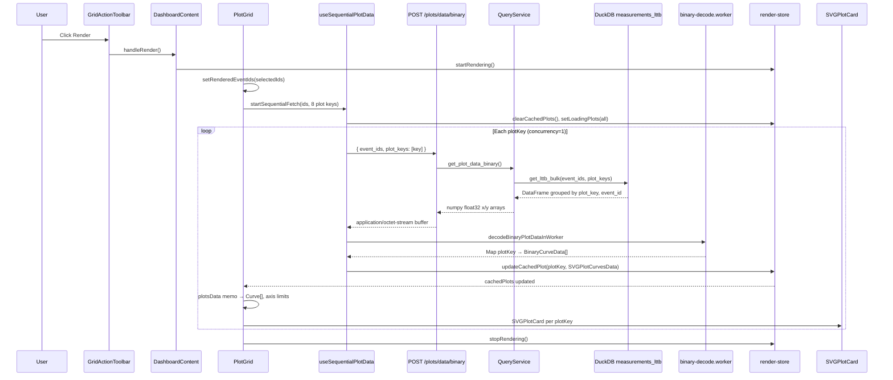

# Dashboard Grid Plot — End-to-End Data Flow

Complete trace of grid layout plot generation for Dashboard route. Covers **active client SVG path** and **legacy server matplotlib path**.

---

## Active path (what the UI uses today)

### Sequence



### Step reference

| Step | Module | Symbol | Notes |
|------|--------|--------|-------|
| 1. Selection | `use-filter-state.ts` | `allSelectedEventIds` | From session `data_state.selected_event_ids` |
| 2. Dirty flag | `use-filter-state.ts` | `hasUnrenderedChanges` | Compares selected vs `rendered_event_ids` |
| 3. Render trigger | `DashboardContent.tsx` | `handleRender` | Sets `isRendering=true`; clears pins/colors |
| 4. Snapshot | `PlotGrid.tsx` | `setRenderedEventIds` | Persists to server session |
| 5. Fetch orchestration | `use-sequential-plot-data.ts` | `startSequentialFetch` | Aborts prior fetch; clears cache |
| 6. API call | `plot-pipeline.ts` | `fetchAndDecodePlot` | One plot_key per request |
| 7. Decode | `decode-worker-client.ts` | `decodeBinaryPlotDataInWorker` | Worker pool + main-thread fallback |
| 8. Normalize | `plot-pipeline.ts` | `toSVGPlotCurvesData` | Empty `points[]`; arrays on curves |
| 9. Cache | `render-store.ts` | `updateCachedPlot` | FIFO eviction at 10 entries |
| 10. Transform | `PlotGrid.tsx` | `plotsData` useMemo | Filter pinned, color, sort, axis limits |
| 11. Group axes | `PlotGrid.tsx` | `groupAxisLimits` | `bjShock` vs `bushing` shared envelope |
| 12. Render | `SVGPlotCard.tsx` | → `SVGPlot` | `renderMode="grid"` |

### Plot keys (static, 8 total)

Source: `client/settings.yaml` → `scripts/generate-settings.js` → `config/settings.ts`

```
bj_xy_force_plot, bj_xz_force_plot
shock_xy_force_plot, shock_xz_force_plot
bushing_f_xy_force_plot, bushing_f_xz_force_plot
bushing_r_xy_force_plot, bushing_r_xz_force_plot
```

Labels/titles are **client-only**. Keys must match backend `channel_map` plot definitions.

### Grid layout

- CSS grid: `grid-cols-2|3|4` from `columns` prop (default 3)
- Gap: `gap-3`, padding `px-4 pt-2 pb-4`
- Card aspect: `aspect-4/3` in `SVGPlotCard`
- **Note:** `DashboardPage` passes `columns` via `componentProps` but `DashboardTabs` does not forward props — column control from page is ineffective

### Interactive mode (same data, different renderer)

| Aspect | Grid | Interactive |
|--------|------|-------------|
| Trigger | Render → 8 fetches | Reads cache; `useLazyPlotFetch` if missing |
| Renderer | `SVGPlot` | `InteractiveCanvasPlot` |
| Event IDs | `allSelectedEventIds` at render | `renderedEventIds` snapshot |
| Pinned | Filters out unpinned | Greys unpinned (`UNPINNED_GREY`) |
| Axis sync | Group sync via `plot-settings-store` | Per-plot only |
| Expand | Click card → `setSelectedPlotKey` + tab switch | — |

---

## Backend active path

### Endpoint

```
POST /api/v1/dashboard/plots/data/binary
Content-Type: application/json
Body: { "event_ids": string[], "plot_keys": string[] }
Response: application/octet-stream (binary Float32)
```

GET variant exists for backward compatibility (query params).

### Handler chain

```
dashboard.py::get_plot_data_binary_post
  → _build_binary_plot_data_response
    → enforce max_events_per_query (truncate)
    → query_service.get_plot_data_binary(event_ids, plot_keys)
    → struct.pack binary buffer
```

### `QueryService.get_plot_data_binary`

```python
# server/services/query.py
df = self.db.get_lttb_bulk(event_ids, plot_keys)
for (plot_key, event_id), group in df.groupby(["plot_key", "event_id"]):
    series.append({
        "event_id": event_id,
        "plot_key": plot_key,
        "x": group["x"].to_numpy(dtype=np.float32),
        "y": group["y"].to_numpy(dtype=np.float32),
    })
```

- **Not cached** (comment: "binary encoding is fast enough")
- **No event metadata** fetch (unlike broken JSON path)
- Single DuckDB query per request regardless of plot_key count in request

### Binary wire format

```
uint32  num_curves
per curve:
  uint16  event_id_len
  bytes   event_id (utf-8)
  uint16  plot_key_len
  bytes   plot_key (utf-8)
  uint32  num_points
  float32[num_points] x_values
  float32[num_points] y_values
```

Client decode: `client/src/lib/utils/binary-decode-core.ts`

### Response headers

```
Content-Type: application/octet-stream
Cache-Control: public, max-age=600
```

---

## Legacy path (server matplotlib — unused by frontend)

### `/render-grid`

```
POST /api/v1/dashboard/render-grid
→ QueryService.get_plot_data() [cached JSON, broken on miss]
→ Group by plot_key
→ PlotImageService.generate_grid_cell_image() per key
→ NDJSON stream (NOT SSE despite docstring)
```

**Stream event types:**

| type | payload |
|------|---------|
| `progress` | `{ current, total, plot_key }` |
| `plot_image` | `{ plot_key, image_base64, color_groups: [] }` |
| `complete` | `{ total_plots, render_time_ms, color_groups: [] }` |
| `error` | `{ message, plot_key? }` |

**Issues:**
- Sync matplotlib blocks async event loop
- All LTTB fetched before first image line
- `grid_columns`, `baseline_opacity` request fields ignored
- No `max_events_per_query` enforcement
- `color_groups` always empty in response

### `/render-interactive` and `/click-query`

Single-plot PNG generation for server-side hover. Frontend uses client-side `InteractiveCanvasPlot` + spatial grid instead.

---

## State model

### Persisted (server session)

```typescript
session.data_state.selected_event_ids: string[]
session.rendered_event_ids: string[]  // snapshot at Render click
```

### Ephemeral (Zustand)

```typescript
// render-store
isRendering: boolean
cachedPlots: Map<plotKey, SVGPlotCurvesData>
loadingPlots: Set<plotKey>
plotErrors: Record<plotKey, string>
selectedPlotKey: string | null

// plot-settings-store
syncState: Record<plotKey, boolean>  // axis group sync

// pinned-events-store, color-selection-store, ui-store
```

### Render lifecycle

```
Selection changes → hasUnrenderedChanges=true (amber banner)
User clicks Render → isRendering=true
PlotGrid effect → startSequentialFetch
Each plot completes → updateCachedPlot (progressive UI)
All done → stopRendering()
User clicks Stop → stopFetch + stopRendering
User clicks Clear → rendered_event_ids=[] → resetPlots if had data
```

### Session restore gap

After page reload:
- `rendered_event_ids` may be non-empty (from session)
- `cachedPlots` is empty (ephemeral)
- **No auto re-fetch** — grid shows empty/loading until user clicks Render

---

## Performance characteristics

| Metric | Current behavior | Theoretical optimum |
|--------|-----------------|---------------------|
| HTTP requests per render | 8 (sequential) | 1 (all plot_keys) |
| DB queries per render | 8 (one per request) | 1 |
| Decode invocations | 8 worker calls | 1 worker call |
| Payload format | Binary Float32 (~8× smaller than JSON) | Same |
| Server CPU | Minimal (I/O only) | Same |
| Client CPU | SVG path build per card | Batched decode amortizes overhead |

### Derived cache (`PlotGrid.plotCacheRef`)

Invalidates when:
- `streamedPlots` reference changes for plotKey
- `pinnedModeEnabled`, `pinnedSet`, `getCurveColor`, `eventVersionMap` change

Resets when:
- `PlotGrid` unmounts (tab switch away from grid)

Raw cache in `render-store` survives tab switch.

---

## Axis grouping logic

```typescript
// PlotGrid.tsx
type AxisGroup = 'bjShock' | 'bushing';

function getAxisGroup(plotKey: string): AxisGroup {
  return plotKey.startsWith('bushing_') ? 'bushing' : 'bjShock';
}
```

When ≥2 plots in a group have data:
1. Merge raw axis limits (min/max across plots)
2. Snap to step 1000 with 5000 headroom
3. Apply via `globalAxisLimits` when plot's sync toggle is on

Per-plot sync toggle: `plot-settings-store.toggleSync(plotKey)`

---

## Files to read first

| Priority | Path |
|----------|------|
| 1 | `client/src/components/dashboard/plot-grid/PlotGrid.tsx` |
| 2 | `client/src/hooks/use-sequential-plot-data.ts` |
| 3 | `client/src/lib/plot-pipeline.ts` |
| 4 | `client/src/components/charts/SVGPlotCard.tsx` |
| 5 | `client/src/stores/render-store.ts` |
| 6 | `server/routers/dashboard.py` (`_build_binary_plot_data_response`) |
| 7 | `server/services/query.py` (`get_plot_data_binary`) |
