# Database Import/Export Review Index

This folder documents the current load-data portability capability: exporting a ZIP from one system and importing that ZIP into another system while preserving the target system's users and admin configuration. It is written for operators who need a safe runbook and for junior developers who need context for future hardening.

## Read This First

1. `00_OVERVIEW.md` explains what exists today and what "source to target" means.
2. `01_OPERATOR_UI_WORKFLOW.md` describes the intended admin UI workflow: export `dashboard_export.zip` on the source system, then import it on the target system.
3. `02_OPERATOR_API_WORKFLOW.md` gives the API workflow for validation and automation.
4. `03_IMPLEMENTATION_AUDIT.md` maps the current client, server, storage, and test implementation.
5. `04_RISK_AND_DATA_SAFETY.md` captures destructive behavior, backup limits, security concerns, and operational safeguards.
6. `05_TEST_AND_TDD_EXECUTION_PLAN.md` defines behavior-first tests and red-green-refactor slices.
7. `06_JUNIOR_DEV_WORK_ORDER.md` turns the review into small implementation tasks.

## Current Bottom Line

The app has an admin-only Parquet ZIP export/import path behind `/api/v1/export/*`. The enabled UI lives in the Database page side panel and is rendered only for admins.

The server flow is not a merge. Import replaces target load data from a validated ZIP, but preserves target-local users, sessions, saved filters, audit history, and admin custom-field configuration. The live database file is copied to `dashboard.db.bak` before import, and the load-table replacement runs transactionally so failed imports leave target data readable.

## Source-To-Target Flow

```mermaid
flowchart LR
  sourceAdmin[SourceAdmin] --> sourcePage[DatabasePage]
  sourcePage --> exportApi[ClientExportApi]
  exportApi --> exportRouter[ExportRouter]
  exportRouter --> exportService[ExportService]
  exportService --> exportZip[dashboard_export_zip]
  exportZip --> targetAdmin[TargetAdmin]
  targetAdmin --> targetPage[DatabasePage]
  targetPage --> importApi[ClientImportApi]
  importApi --> importRouter[ImportEndpoints]
  importRouter --> importService[ExportServiceImport]
  importService --> store[UnifiedStore]
  store --> targetDb[targetDashboardDb]
```

## Key Code Paths

- Client side panel: `Dashboard/client/src/components/upload/DatabaseSidePanel.tsx`
- Client database buttons: `Dashboard/client/src/components/upload/DatabaseSection.tsx`
- Client modal orchestration: `Dashboard/client/src/hooks/use-database-operation.ts`
- Client API contract: `Dashboard/client/src/lib/api/export.ts`
- Server routes: `Dashboard/server/routers/export.py`
- Server background tasks and ZIP validation: `Dashboard/server/services/export.py`
- DuckDB export/import implementation: `Dashboard/server/storage/database.py`
- Sync version endpoint, separate from portability: `Dashboard/server/routers/sync.py`
- Current tests: `Dashboard/tests/server/routers/test_export_router.py`, `Dashboard/tests/server/services/test_export_service.py`

