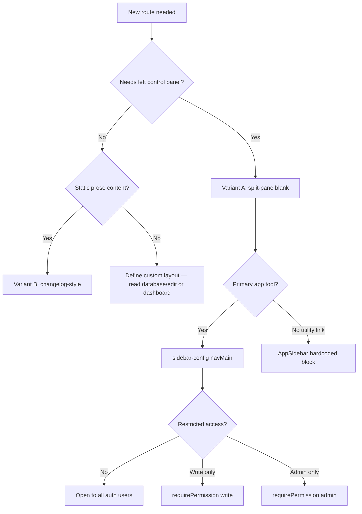

# Variants and Options

Not every route needs the default blank split-pane layout. Use this decision guide to pick the right variant before copying code.

---

## Layout variants

### A. Blank split-pane (default)

**When:** Tool pages that will have controls on the left and a workspace on the right — same family as Database, Edit Metadata, Inspect Damage.

**Copy from:** [`client/src/app/inspect-damage/page.tsx`](../../client/src/app/inspect-damage/page.tsx)

**Structure:**

```
SidePanelLayout (left, collapsible)  |  Card (right, main workspace)
```

**Key classes to preserve:**

- Outer: `flex-1 p-4 min-h-[calc(100vh-3.5rem)]`
- Row: `flex gap-0 h-[calc(100vh-7rem)]`
- Card: `rounded-r-lg rounded-l-none` (joins flush with left panel)
- Side panel width: `expandedWidth="w-[320px]"`

---

### B. Simple content page (no side panel)

**When:** Static docs, changelog-style prose, settings text, pages with no left control column.

**Copy from:** [`client/src/app/changelog/page.tsx`](../../client/src/app/changelog/page.tsx)

**Structure:**

```
<section> or <article> centered content
```

**Notes:**

- Changelog is a **server component** (no `'use client'`).
- No auth guard in the page itself — add one if the content is restricted.
- No `SidePanelLayout` or `Card` shell.

---

### C. Split-pane with inline side panel content

**When:** The side panel has substantial form content but you have not yet extracted a dedicated component.

**Copy from:** [`client/src/app/database/edit/page.tsx`](../../client/src/app/database/edit/page.tsx)

**Structure:** Same shell as variant A, but form fields live directly inside the `ScrollArea` rather than in a separate component file.

**When to extract:** Once the side panel exceeds ~100 lines or is reused, follow the `DatabaseSidePanel` pattern.

---

### D. Full workspace (toolbar + table/plots)

**When:** Main area needs a toolbar row and scrollable data view.

**Copy from:** [`client/src/app/database/page.tsx`](../../client/src/app/database/page.tsx)

**Adds on top of variant A:**

- Toolbar `div` with `border-b` above `CardContent`
- Data component inside `CardContent` (e.g. `DatabaseEventTree`)

---

## Sidebar nav placement

### Main nav (`sidebar-config.ts` — default)

**When:** Primary app tools (Database, Dashboard, Inspect Damage).

**How:** Add to `navMain` array in [`sidebar-config.ts`](../../client/src/config/sidebar-config.ts).

**Order:** Array index = visual top-to-bottom order in the sidebar.

---

### Lower sidebar (hardcoded in `AppSidebar.tsx`)

**When:** Utility links that sit below main nav but above footer — like Changelog.

**Copy from:** [`client/src/components/layout/AppSidebar.tsx`](../../client/src/components/layout/AppSidebar.tsx) — Changelog block (~lines 99–116).

**Trade-off:** Requires editing `AppSidebar.tsx` instead of config. Use sparingly for non-primary links.

---

## Access control variants

### Open to all authenticated users (default)

```typescript
{
  title: '{navTitle}',
  url: '/{routeSlug}',
  icon: {LucideIcon},
}
```

**Reference:** Inspect Damage entry in `sidebar-config.ts`.

---

### Write-gated

**When:** Only users with write permission (or admin) should access the tool.

```typescript
{
  title: '{navTitle}',
  url: '/{routeSlug}',
  icon: {LucideIcon},
  requirePermission: 'write',
  disabledTooltip: 'Read-only access — contact admin',
}
```

**Reference:** Database entry in `sidebar-config.ts`.

**Behavior:** Read-only users see a grayed icon, inert button, and `disabledTooltip` on hover.

**Important:** Frontend gating is UX only. When you add a backend, enforce permissions server-side too.

---

### Admin-gated

**When:** Only admins should access the tool.

```typescript
{
  title: '{navTitle}',
  url: '/{routeSlug}',
  icon: {LucideIcon},
  requirePermission: 'admin',
  disabledTooltip: 'Admin access required',
}
```

**Reference:** Settings uses a hardcoded admin check in `AppSidebar`, not `requirePermission` — prefer the config pattern for new main-nav items.

---

## App header variants

### Blank header (default for tool pages)

```typescript
'/{routeSlug}': undefined,
```

Top bar shows border + version label only. Matches Database, Dashboard, Inspect Damage.

---

### Named header

```typescript
'/{routeSlug}': 'My Tool Name',
```

Renders an `<h1>` in `SiteHeader`. Use when users benefit from a visible page title in the top bar.

---

## Side panel collapse state

### Local `useState` (recommended for new routes)

**Used by:** Database, Edit Metadata, Inspect Damage.

```typescript
const [sidePanelCollapsed, setSidePanelCollapsed] = useState(false);
```

Each page owns its collapse state independently.

---

### Global `useUIStore` (Dashboard only)

**Used by:** Dashboard via [`client/src/stores/ui-store.ts`](../../client/src/stores/ui-store.ts).

**Do not copy** unless you intentionally want collapse state shared with Dashboard or persisted globally.

---

## Auth variants

### Standard auth guard (recommended)

Redirect unauthenticated users to `/login`; show spinner while loading.

**Copy from:** [`inspect-damage/page.tsx`](../../client/src/app/inspect-damage/page.tsx).

---

### No client auth guard

**When:** Public content pages (Changelog) or pages where auth is enforced elsewhere.

**Risk:** Unauthenticated users can view the page shell. Only use when intentional.

---

## Decision tree



---

## Variant quick-reference table

| Variant | Layout | Nav | Access | Reference |
|---------|--------|-----|--------|-----------|
| **A** Blank split-pane | Side panel + Card | `sidebar-config` | Open | `inspect-damage/page.tsx` |
| **B** Simple content | Single column | Either | Varies | `changelog/page.tsx` |
| **C** Inline side panel | Side panel + Card | `sidebar-config` | Varies | `database/edit/page.tsx` |
| **D** Full workspace | Side panel + toolbar + Card | `sidebar-config` | Varies | `database/page.tsx` |
| **E** Lower nav item | Any | `AppSidebar` hardcoded | Varies | Changelog block in `AppSidebar.tsx` |
| **F** Named header | Any | Either | Varies | `header-config.ts` with string title |

For a new blank route, start with **Variant A + main nav + open access + blank header**. Deviate only when a row in this table matches your requirement.
