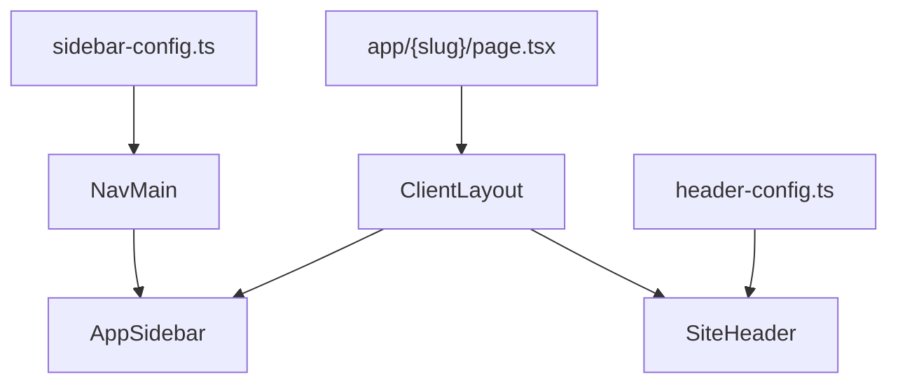

# Blank Route Template — Index

This folder is a reusable template for adding a **new blank route** to the Multimatic Workbench client. It is written for junior developers and coding agents who need to scaffold a page inside the existing app shell without guessing which files to touch.

A "blank route" means: sidebar nav icon, optional app header config, and an empty page layout ready for future content. No backend changes are required until the page needs API data.

## Read This First

1. [`01_OVERVIEW.md`](01_OVERVIEW.md) — What gets created, how the app shell wraps your page, naming conventions.
2. [`02_STEP_BY_STEP_CHECKLIST.md`](02_STEP_BY_STEP_CHECKLIST.md) — Copy-paste checklist with `{placeholders}` and a page template snippet.
3. [`03_REFERENCE_FILES.md`](03_REFERENCE_FILES.md) — Which existing files to open and what to copy from each.
4. [`04_VARIANTS.md`](04_VARIANTS.md) — Layout, permission, and nav placement options when the default is not enough.

## Minimum File Touch List (standard blank route)

For the default split-pane blank route, you only need to create or edit **three files**:

| Action | File |
|--------|------|
| **Create** | [`Dashboard/client/src/app/{routeSlug}/page.tsx`](../../client/src/app/inspect-damage/page.tsx) |
| **Edit** | [`Dashboard/client/src/config/sidebar-config.ts`](../../client/src/config/sidebar-config.ts) |
| **Edit** | [`Dashboard/client/src/config/header-config.ts`](../../client/src/config/header-config.ts) |

Canonical live example: the **Inspect Damage** route at `/inspect-damage`.

## How the pieces connect

- [`ClientLayout`](../../client/src/components/layout/ClientLayout.tsx) wraps every page except `/login` with the fixed sidebar and top header.
- [`sidebar-config.ts`](../../client/src/config/sidebar-config.ts) drives main nav icons via [`NavMain`](../../client/src/components/layout/NavMain.tsx).
- [`header-config.ts`](../../client/src/config/header-config.ts) sets the optional page title in [`SiteHeader`](../../client/src/components/layout/SiteHeader.tsx).
- Your new `page.tsx` is the only route-specific content file for a blank shell.

## Quick start (coding agents)

1. Collect inputs: `{routeSlug}`, `{navTitle}`, `{LucideIcon}`, `{navPosition}`, optional `{requirePermission}`, optional `{headerTitle}`.
2. Follow [`02_STEP_BY_STEP_CHECKLIST.md`](02_STEP_BY_STEP_CHECKLIST.md) in order.
3. Use [`inspect-damage/page.tsx`](../../client/src/app/inspect-damage/page.tsx) as the page copy source — do not invent layout classes.
4. Run through the verification checklist at the end of the step-by-step doc.
